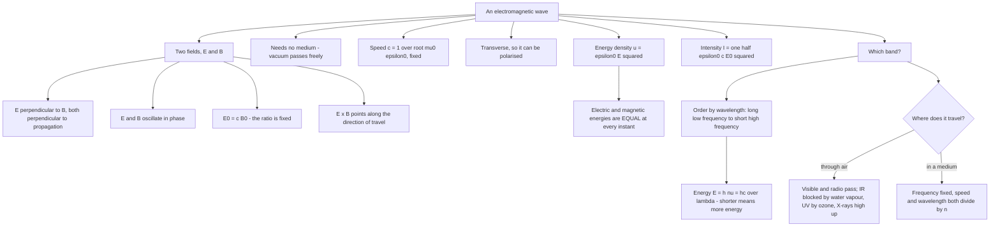

# EM Waves

A changing electric field makes a magnetic field, and a changing magnetic field makes an electric field. Maxwell showed that this is enough for the pair to keep each other going, forever, through empty space — no medium, no charges, nothing moving in advance to carry the disturbance. That is the whole content of this chapter, and everything else is a consequence: the speed is fixed, the two fields are locked at right angles and in a fixed size ratio, the waves are transverse, and the spectrum runs from radio waves to gamma rays with no gaps.

### 🟢 Lite — Quick Review (1h–1d)

**The five relations that define the topic**

| Relation | Meaning |
|---|---|
| $c = \dfrac{1}{\sqrt{\mu_0\varepsilon_0}} = 3.0 \times 10^8$ m s⁻¹ | speed in vacuum, fixed and universal |
| $E_0 = cB_0$ | the electric and magnetic amplitudes are locked in a fixed ratio |
| $E \perp B \perp \hat{k}$ | transverse wave, right-handed triad |
| $c = \nu\lambda$ | one frequency, one wavelength |
| $E = h\nu = \dfrac{hc}{\lambda}$ | photon energy, 4.136 × 10⁻¹⁵ eV·s × ν |

$\mu_0 = 4\pi\times 10^{-7}$ N A⁻² and $\varepsilon_0 = 8.854\times 10^{-12}$ F m⁻¹. Since the 2019 redefinition of the SI, $c$ is exact by definition and $\mu_0$ and $\varepsilon_0$ are measured quantities; the relation $c^2 = 1/(\mu_0\varepsilon_0)$ still holds to the precision of the measurements.

**The three defining properties**

1. **No medium is required.** EM waves cross a vacuum, which is why we can see stars billions of light years away.
2. **They are transverse.** E and B both oscillate perpendicular to the direction of travel, and a wave that is transverse can be polarised — a property no sound wave has.
3. **They carry energy, momentum and (through the field) nothing material.** The energy travels in the fields, not in a vibrating substance.

**The spectrum, in order**

| Region | Wavelength | Frequency | Notes |
|---|---|---|---|
| Radio | > 1 m | < 300 MHz | broadcasting, communication |
| Microwave | 1 mm – 1 m | 300 MHz – 300 GHz | radar, ovens, Wi-Fi, satellite |
| Infrared | 700 nm – 1 mm | 4 × 10¹⁴ – 4 × 10¹¹ Hz | remote sensing, thermal imaging, heating |
| Visible | 400 – 700 nm | 4.3 – 7.5 × 10¹⁴ Hz | human eye, VIBGYOR |
| Ultraviolet | 10 – 400 nm | 7.5 × 10¹⁴ – 3 × 10¹⁶ Hz | sterilisation, spectroscopy, ozone absorbs it |
| X-ray | 0.01 – 10 nm | 3 × 10¹⁶ – 3 × 10¹⁹ Hz | radiography, diffraction |
| Gamma | < 0.01 nm | > 3 × 10¹⁹ Hz | nuclear transitions, therapy |

Order the bands by remembering **longer wavelength means lower frequency, lower frequency means lower photon energy**. A gamma ray and a radio wave are the same wave; only the frequency differs.

**Energy ordering, worked once so you can repeat it**

$E = hc/\lambda$. For $\lambda = 700$ nm: $E = \dfrac{6.626\times 10^{-34}\times 3.0\times 10^8}{700\times 10^{-9}} = 2.84\times 10^{-19}$ J = 1.77 eV. For $\lambda = 400$ nm: $4.97\times 10^{-19}$ J = 3.10 eV. Visible light is a few electron-volts; a 100 eV soft X-ray has $\lambda = 12.4$ nm; a 1 MeV gamma ray has $\lambda = 1.24$ pm.

### 🟡 Standard — Regular Study (2d–2mo)

**Maxwell's four equations and what each one actually says**

- **Gauss's law for electricity:** $\oint \vec{E}\cdot d\vec{A} = \dfrac{q}{\varepsilon_0}$. Charge is the source of the electric field.
- **Gauss's law for magnetism:** $\oint \vec{B}\cdot d\vec{A} = 0$. No magnetic charge exists.
- **Faraday's law:** $\oint \vec{E}\cdot d\vec{l} = -\dfrac{d\Phi_B}{dt}$. A changing magnetic field creates a circulating electric field.
- **Ampère–Maxwell law:** $\oint \vec{B}\cdot d\vec{l} = \mu_0 I + \mu_0\varepsilon_0\dfrac{d\Phi_E}{dt}$. A current *and* a changing electric field both create a circulating magnetic field.

The first two are static statements; the second two are the dynamic ones, and they are what make waves possible. Faraday's law alone is enough to show that a changing magnetic field makes electric field lines that close on themselves. The last one is the one Maxwell had to *add* — and it is the one that changes everything.

**Displacement current — the term that made the whole chapter possible**

Consider a charging parallel-plate capacitor. There is conduction current $I$ in the wires but **no conduction current through the gap between the plates**. Take an Amperian surface that bulges out through that gap and you would get a different answer from one that stays in the wire — which is impossible, since Ampère's law must give the same result whichever surface you choose. Maxwell's resolution: the electric field between the plates is changing as the charge builds up, and that changing field counts as a current,

$$I_d = \varepsilon_0\frac{d\Phi_E}{dt}$$

The "displacement current" $I_d$ equals the conduction current $I$ in the wire, and the surface-independence of Ampère's law is restored. This is not a mathematical convenience — it is the mechanism by which a wave carries itself forward through empty space. A changing E field in one place creates a B field there, that B creates a changing E field a little further on, and the pattern propagates outward at a finite speed that turns out to be $c$.

**Hertz's experiment**

In 1887 Heinrich Hertz built an oscillator — a spark gap between two brass rods with a loop — which radiated on each spark. On the other side of his laboratory a resonant loop with a small gap detected it, and a spark jumped across that gap when the oscillator fired. Hertz then showed reflection, refraction, diffraction, interference and polarisation of these waves, and measured $\lambda$ and $c$ from a standing-wave pattern. He was not discovering new physics; he was confirming Maxwell's prediction that such waves must exist, and the unit of frequency is still named after him.

**Field geometry, phase and the fixed amplitude ratio**

E, B and the propagation direction $\hat{k}$ are mutually perpendicular and form a right-handed system: $\vec{E}\times\vec{B}$ points along $\vec{S}$, the direction the energy flows, and therefore along $\hat{k}$. Because the two fields arise from the same wave equation, they oscillate in phase — when E passes through zero, B does too. The ratio $E_0 = cB_0$ is not a coincidence; in a plane wave, the field and magnetic components satisfy $E_0/\varepsilon_0 = cB_0/\mu_0$, and using $c^2 = 1/(\mu_0\varepsilon_0)$ gives the stated relation. The consequence you should be able to state: a wave with a large electric field also has a large magnetic field, so you can never check one independently of the other.

**Energy in the wave**

The energy density in an electromagnetic wave is the sum of the electric and magnetic contributions,

$$u = \frac{1}{2}\varepsilon_0 E^2 + \frac{B^2}{2\mu_0} = \varepsilon_0 E^2$$

and because $B^2/(2\mu_0) = \varepsilon_0 E^2/2$ for a wave in vacuum, **the two contributions are always equal at every instant**. That is a special property of electromagnetic waves and a favourite conceptual question: in a wave, electric and magnetic field energies are equal, each carrying half the total. Multiply by $c$ to get the energy crossing unit area per second — the intensity:

$$I = \frac{1}{2}\varepsilon_0 c E_0^2 = \frac{cB_0^2}{2\mu_0}$$

**The Poynting vector**

$\vec{S} = \dfrac{1}{\mu_0}\vec{E}\times\vec{B}$ gives the energy flowing through unit area per second. Its direction is the direction of propagation, and its time-averaged value is the intensity above. This is the formal statement of "energy flows in the direction the wave is travelling", and it is also how a field can deliver energy without any material moving through the space.

**Propagation through a material**

In a medium of refractive index $n$, the speed drops to $v = c/n$ because the alternating field must repeatedly polarise the atoms it passes. The frequency **does not change** — the source sets it — so the wavelength shortens by the same factor: $\lambda = \lambda_0/n$. Getting that pair of facts straight is the whole of "refractive index". For glass, $n \approx 1.5$; for diamond, $n = 2.42$; for water, 1.33.

**Why some bands travel far and others do not**

The atmosphere is not transparent to everything. Water vapour and CO₂ absorb strongly in the infrared, which is why the infrared does not get through on a cloudy night and why greenhouse gases have such a large effect despite being a small fraction of the atmosphere. Ozone absorbs ultraviolet below about 300 nm — the ozone layer is what makes life on land possible. The X-ray band is absorbed high in the atmosphere, which is why X-ray telescopes must go above most of the air. Two windows come through to the ground almost unattenuated: the **radio** band and the **visible** band. Human vision evolved in the visible window, which is why almost no other animal shares it.

### 🔴 Extended — Deep Study (3mo+)

**Deriving the wave equation from Maxwell's equations**

Take Faraday's law, differentiate with respect to time: $\nabla\times\vec{E} = -\dfrac{\partial\vec{B}}{\partial t}$ becomes $\nabla\times\vec{E} = -\mu_0\varepsilon_0\dfrac{\partial^2\vec{B}}{\partial t^2}$. Take the curl of Ampère–Maxwell with no currents present: $\nabla\times\vec{B} = \mu_0\varepsilon_0\dfrac{\partial\vec{E}}{\partial t}$. Now use the vector identity $\nabla\times(\nabla\times\vec{E}) = \nabla(\nabla\cdot\vec{E}) - \nabla^2\vec{E}$ and Gauss's law, which says $\nabla\cdot\vec{E} = 0$ in charge-free space. Combining the two gives

$$\nabla^2\vec{E} = \mu_0\varepsilon_0\frac{\partial^2\vec{E}}{\partial t^2} = \frac{1}{c^2}\frac{\partial^2\vec{E}}{\partial t^2}$$

This is the wave equation, with a wave speed $1/\sqrt{\mu_0\varepsilon_0}$. Note what the derivation required: the displacement-current term. Remove it and the combination closes incorrectly and no wave equation appears at all.

**Radiation pressure**

A wave carries momentum, so a surface it strikes feels a force. For a perfectly absorbing surface, the momentum delivered per second per unit area is $I/c$; for a perfectly reflecting surface it is $2I/c$. The second case is worth a sanity check: a light pulse of energy $E$ carries momentum $E/c$, and reflection reverses that momentum, so the change is $2E/c$. Sunlight at the Earth's surface has $I \approx 1$ kW m⁻², giving a pressure of about $3.3 \times 10^{-6}$ N m⁻² on an absorbing surface — small, but real, and the basis of optical tweezers and proposed solar sails.

**Absorption and emission spectra — the spectroscopic signature**

Every atom absorbs and emits at a discrete set of frequencies set by its energy levels, $E = h\nu = hc/\lambda$. That means each element has a **line spectrum** with a pattern as characteristic as a fingerprint: sodium's doublet at 589.0 and 589.6 nm, hydrogen's Balmer series, potassium's 766.5 and 769.9 nm. Kirchhoff's three rules state it compactly: a hot *dense* body emits a continuous spectrum, a hot *thin* gas emits bright lines, and a cool gas in front of a hot source absorbs at the same lines, producing dark lines. The dark lines Fraunhofer saw in the solar spectrum are absorption by the cooler gas in the Sun's outer atmosphere, and identifying them in 1859 gave helium its name. This is the experimental evidence for Bohr's quantised levels, and it is where the wave description of light does most of its explanatory work.

**The spectrum, band by band, with the physics that fixes each boundary**

- **Radio** (below 300 MHz) is where electronics rules: the circuit is small compared with the wavelength, so circuits are designed by component values rather than by geometry, and the wave is described by current and voltage in a wire. AM broadcast uses 0.5–1.7 MHz, where the ionosphere reflects ground waves and the broadcast range is continental. Short-wave HF (3–30 MHz) is reflected by the ionosphere and travels thousands of kilometres.
- **Microwave** (300 MHz – 300 GHz) is where diffraction is weak and wavelengths are centimetres, which is what makes radar possible. The ionosphere does not reflect microwaves, so they travel in straight lines — the basis of satellite communication, and the reason geostationary satellites sit at about 36 000 km where their orbital period equals Earth's rotation. A microwave oven at 2.45 GHz heats by dielectric loss in water molecules, which oscillate at that frequency and convert the field into heat. A communications satellite transponds at 12 GHz and 18 GHz.
- **Infrared** (700 nm – 1 mm) is emitted by warm objects, and the emitted power rises steeply with temperature, which is why thermal imaging is a remote thermometer. Remote control, night vision, optical fibre communication (850–1550 nm) and medical physiotherapy all use near infrared.
- **Visible** (400–700 nm) is the band human cone cells are sensitive to, with three cone types responding differently to long, medium and short wavelengths — which is why the signal for red, green and blue can be separated and recombined. Everything from photosynthesis to the eye's resolution limit lives in this narrow band.
- **Ultraviolet** (10–400 nm) ionises molecules, sterilises laboratory equipment and excites fluorescence. It is divided into near UV (320–400 nm, tanning and vitamin D synthesis), far UV (200–320 nm) and extreme UV (below 200 nm), the last used in photolithography at a few nanometres because the resolution of a printed feature cannot be much smaller than the light that prints it.
- **X-ray** (0.01–10 nm) passes through tissue and is differentially absorbed by bone, which is radiography. Its wavelength matches interatomic spacings of about 0.1–1 nm, so a crystal acts as a diffraction grating — that is the entire basis of X-ray crystallography, and the reason Bragg's law is in the syllabus. Characteristic X-ray lines are element-specific, which is why X-ray spectroscopy identifies elements in a sample non-destructively.
- **Gamma** (below 0.01 nm) comes from nuclear transitions, so a gamma ray's identity is set by its origin, not by a sharp wavelength boundary. Co-60 and Cs-137 sources are used in sterilisation and in cancer radiotherapy. The distinction from X-rays is physical, not numerical: X-rays are produced by decelerating electrons, gamma rays by nuclear change, and their energies can overlap.

**Polarisation, the proof of transversality**

EM waves are transverse, so a wave can be split into two components 90° apart and recombined into different states. A **polariser** transmits only the component along its axis, halving the intensity of unpolarised light. If the second polariser is rotated by $\theta$, Malus's law gives $I = I_1\cos^2\theta$. Rotating the analyser until the light is extinguished — the extinction position — is how you identify the plane of polarisation, and hence how you know the wave is transverse. Polaroid sunglasses with a crossed-polarising filter block the glare reflected from horizontal surfaces, because that reflected light is partially polarised. Circular polarisation, produced by a quarter-wave plate at 45°, is used in 3-D cinema (the two eyes receive orthogonal circular states) and in LCD screens.

**Doppler shift for light**

A source moving at $v$ towards an observer produces $\nu' = \nu\sqrt{(c+v)/(c-v)}$ — note the square root, unlike the linear form for sound. The consequence people use every day without noticing: stars and galaxies show systematic frequency shifts toward the red at one end of the visible band, which is the observational basis of the expansion of the universe. The same effect at a molecular scale is a temperature: a hot gas radiates with the peak of its blackbody curve shifted to shorter wavelengths, which is the basis of pyrometry and of the blackbody temperature of stars.

**Worked example — a radio station**

A station broadcasts at 98.3 MHz.
$\lambda = c/\nu = 3.0\times 10^8/98.3\times 10^6 = 3.05$ m — radio band, and the wavelength is a few metres, comparable to a building. That is why the antenna dimensions and the position of the receiver both matter, and why metal structures block the signal.
Photon energy: $E = h\nu = 6.626\times 10^{-34}\times 98.3\times 10^6 = 6.51\times 10^{-26}$ J = 4.07 × 10⁻⁷ eV. Utterly negligible per photon, which is why a radio receiver works by detecting a huge number of photons rather than their individual energy.
Electric field amplitude for an intensity of 50 W m⁻²: $E_0 = \sqrt{2I/(\varepsilon_0 c)} = \sqrt{2\times 50/(8.854\times 10^{-12}\times 3.0\times 10^8)} = \sqrt{100/2.656\times 10^{-3}} = \sqrt{3.76\times 10^4} = 194$ V m⁻¹.
Magnetic field: $B_0 = E_0/c = 194/3.0\times 10^8 = 6.5\times 10^{-7}$ T, i.e. about 6.5 gauss, comparable to the Earth's field — which is exactly why a radio receiver is easily affected by moving a magnet near it.

**Worked example — energy and momentum of visible light**

Sunlight at the ground has $I \approx 1000$ W m⁻².
$u = I/c = 1000/3.0\times 10^8 = 3.33\times 10^{-6}$ J m⁻³ of energy density.
Radiation pressure on an absorbing surface: $I/c = 3.33\times 10^{-6}$ N m⁻².
Radiation pressure on a perfect mirror: $6.67\times 10^{-6}$ N m⁻².
Per photon at 550 nm: $E = hc/\lambda = 6.626\times 10^{-34}\times 3.0\times 10^8/550\times 10^{-9} = 3.61\times 10^{-19}$ J = 2.25 eV.
Number of photons per second per square metre: $10^3/3.61\times 10^{-19} = 2.8\times 10^{21}$ photons m⁻² s⁻¹.

Three useful conclusions: the energy per photon is a few electron-volts, so a solar cell converting 20 % of the incident energy deals with about 5 × 10²⁰ photons per second per square metre, and the energy density in the wave is a few microjoules per cubic metre — tiny, and yet it is the whole input of a solar array.

**Worked example — reflection, refraction and the frequency question**

Light passes from air into glass of refractive index 1.5. The frequency does not change, because the source keeps emitting at the same rate; the speed drops from $3.0\times 10^8$ to $2.0\times 10^8$ m s⁻¹, so the wavelength drops by a factor of 1.5. A 600 nm orange wavelength in air becomes 400 nm inside the glass.

Here is the trap. Inside the glass the photon energy is still $h\nu$, unchanged — the photon does not change energy crossing the boundary, because the medium is polarisable and can store and return energy. What changes is the **energy density in the field**, which is higher in glass, and the **photon momentum**, which drops to $p = nE/c$ — the optical momentum paradox, and the reason light in a medium is not describable as a simple particle of momentum $h/\lambda_0$. For every exam-level question in this chapter, the rule to hold is: **across a boundary, frequency is constant, speed and wavelength change together, and the refraction angle follows from Snell's law applied to speeds.**

### 🧠 Memory Anchors

- **"Long λ, low ν, low energy."** One sentence orders the entire spectrum, and it is the answer to every ranking question.
- **"Equal halves."** In a plane electromagnetic wave the electric and magnetic field energy densities are equal at every instant — no classical mechanical wave behaves this way.
- **"Displacement current is the wave."** Maxwell's added term is what lets the fields sustain each other through empty space. Everything in this chapter descends from it.
- **"No medium, no charge, still a wave."** The two standing axioms of wave propagation are broken here, and both are exam-worthy.
- **"E0 = cB0, always."** A wave with a strong E field has a strong B field; you cannot specify one without the other.
- **"Frequency is the passport, wavelength is the visa."** Crossing a boundary changes speed and wavelength; frequency is fixed by the source and never changes.
- **Flashcard Q&A:**
  - *Why is c fixed?* → it follows from $\mu_0\varepsilon_0$, which are properties of vacuum alone.
  - *Which Maxwell equation did Maxwell add to?* → Ampère's law, as the displacement-current term.
  - *Does an EM wave need a medium?* → no; that is why we see stars across empty space.
  - *What did Hertz demonstrate?* → that Maxwell's waves exist, with reflection, refraction, diffraction, interference and polarisation.
  - *Pressure on a mirror?* → $2I/c$; on a black absorber, $I/c$.
  - *What absorbs most infrared in the atmosphere?* → water vapour and CO₂.
  - *What protects life from UV?* → the ozone layer, absorbing below about 300 nm.
  - *How are X-rays and gamma rays told apart?* → by origin: electronic deceleration versus nuclear transition.
  - *What is Malus's law?* → $I = I_1\cos^2\theta$ for a rotated analyser.
  - *Oven frequency?* → 2.45 GHz, in the microwave band, heating by dielectric loss in water.

### 🎯 Exam Traps & Error Log

1. **Writing $B = cE$ instead of $E = cB$.** For any EM wave, $E_0/B_0 = c$. The inverted form is dimensionally wrong by $c^2$ and gives answers off by a factor of $9\times 10^{16}$.
2. **Saying EM waves need a medium, by analogy with sound.** They do not. That is the entire point of Maxwell's prediction.
3. **Treating E and B as oscillating in quadrature.** In a plane wave they oscillate **in phase** — when one passes through a maximum, so does the other. The quadrature applies to the *spatial* directions, not to the time dependence.
4. **Believing the displacement-current term is a correction of fudge.** Without it, Ampère's law gives contradictory answers for the same circuit, and no wave equation follows. It is a real current.
5. **Changing the frequency when light enters a medium.** Frequency is set by the source and is unchanged; speed and wavelength both drop by $n$.
6. **Ordering the spectrum by habit rather than by the rule.** Radio has the longest wavelength, gamma the shortest; radio has the lowest frequency, gamma the highest; gamma has the most energy per photon.
7. **Computing energy with $E = hc/\lambda$ but forgetting the units.** $\lambda$ in nanometres gives $E$ in eV through $E(\text{eV}) = 1240/\lambda(\text{nm})$; in metres it gives joules. Mixing the two is the most frequent numerical error in this topic.
8. **Claiming the Earth's atmosphere blocks all UV or all IR.** The atmosphere has two transparent windows — radio and visible — and everything else is partly or largely absorbed in bands.
9. **Forgetting that intensity uses the peak field, not the rms.** $I = \tfrac12\varepsilon_0cE_0^2$ with the amplitude; substituting an rms value introduces a factor of two.
10. **Saying electric and magnetic energies are unequal because "the electric field does the work".** In a plane wave they are equal at every instant; the work is done by the total field.
11. **Treating X-ray and gamma boundaries as a hard numerical line.** They overlap in energy and are distinguished by origin, not wavelength.
12. **Assuming a mirage-like bending occurs because EM waves are slow in matter.** Refraction arises from the field's phase velocity in a polarisable medium; the wave still travels in straight lines between boundaries in a homogeneous medium.

### 🧪 Self-Test — 8 Questions with Worked Answers

**1. A radio station transmits at 120 MHz. Find the wavelength, classify the band, and find the photon energy in joules and electron-volts.**
$\lambda = c/\nu = 3.0\times 10^8/120\times 10^6 = 2.5$ m. This is the radio band, at the upper end of VHF.
$E = h\nu = 6.626\times 10^{-34}\times 120\times 10^6 = 7.95\times 10^{-26}$ J.
In eV: $7.95\times 10^{-26}/1.602\times 10^{-19} = 4.96\times 10^{-7}$ eV.
The energy per photon is absurdly small, and that is the point: a radio receiver detects the sheer number of arriving photons, not their individual energy.

**2. Show that the electric and magnetic field energy densities in a plane EM wave are equal, and state what each contributes to the total.**
Electric: $u_E = \tfrac12\varepsilon_0E^2$. Magnetic: $u_B = \dfrac{B^2}{2\mu_0}$.
Using $E_0 = cB_0$, so $B_0 = E_0/c$: $u_B = \dfrac{E_0^2}{2\mu_0c^2}$.
Since $c^2 = 1/(\mu_0\varepsilon_0)$, we have $1/(\mu_0c^2) = \varepsilon_0$, hence $u_B = \tfrac12\varepsilon_0E_0^2 = u_E$.
So each contributes half the total, $u = \varepsilon_0E_0^2$, and the equality holds at every instant, not on average. This is a property of plane EM waves; a mechanical travelling wave has no magnetic field at all, so the comparison has no counterpart.

**3. Find the frequency of light whose wavelength in air is 550 nm, and its wavelength and frequency in glass of refractive index 1.5.**
In air: $\nu = c/\lambda = 3.0\times 10^8/550\times 10^{-9} = 5.45\times 10^{14}$ Hz.
Speed in glass: $v = c/n = 2.0\times 10^8$ m s⁻¹.
Wavelength in glass: $\lambda' = v/\nu = 2.0\times 10^8/5.45\times 10^{14} = 3.67\times 10^{-7}$ m = 367 nm.
Frequency is **unchanged** at $5.45\times 10^{14}$ Hz. Only speed and wavelength changed, and they changed by the same factor. A question that also asks for the frequency in glass is testing exactly this.

**4. Sunlight of intensity 1000 W m⁻² falls on a black surface and separately on a perfect mirror. Find the radiation pressure on each, and the energy in each photon for green light of wavelength 500 nm.**
Absorbing: $p = I/c = 1000/3.0\times 10^8 = 3.33\times 10^{-6}$ N m⁻².
Reflecting: $p = 2I/c = 6.67\times 10^{-6}$ N m⁻². Reflection reverses the photon's momentum, so the change is twice the incident value.
Photon energy: $E = hc/\lambda = 6.626\times 10^{-34}\times 3.0\times 10^8/500\times 10^{-9} = 3.98\times 10^{-19}$ J = 2.48 eV.
The pressures are micro-scale, which is why sunlight feels warm rather than forceful.

**5. Identify the EM band used in each of the following and give one reason: (a) a police speed gun, (b) a TV remote control, (c) a medical X-ray, (d) a satellite phone link.**
(a) **Microwave** (typically 10–24 GHz). A narrow beam needs a short wavelength; at microwaves the beam spreads only a few degrees, and the returned echo time gives the speed.
(b) **Infrared**, near IR at about 940 nm. It is generated efficiently by cheap LEDs, is invisible to the human eye, and will not be confused with reflected visible light.
(c) **X-ray**, 0.01–10 nm. Its photon energy is high enough to pass through soft tissue while being differentially absorbed by bone, and its wavelength is comparable to interatomic spacings.
(d) **Microwave** (uplink near 14 GHz, downlink near 11 GHz). These bands pass through the ionosphere without reflection, so the signal can travel from an orbit to a ground station tens of thousands of kilometres away.

**6. A hydrogen atom emits a photon of wavelength 121.6 nm. Find the energy in eV, and identify the series and the region of the spectrum.**
$E = 1240/121.6 = 10.2$ eV (using $E$ in eV and $\lambda$ in nm).
Check against Bohr's levels: the energy difference is $13.6(1 - 1/4) = 10.2$ eV, so the transition is from n = 2 down to n = 1, the first line of the **Lyman series**, and since 121.6 nm is far below 400 nm it lies in the **ultraviolet**. Every Lyman line has n_f = 1 and is therefore ultraviolet; the series limit, from n = infinity down to n = 1, is 91.2 nm at 13.6 eV. The visible and infrared lines of hydrogen belong to the Balmer and Paschen series, which end at n_f = 2 and n_f = 3.

**7. A 60 W isotropic radio transmitter radiates uniformly. Find the intensity at 10 km and the electric field amplitude there.**
$I = P/(4\pi r^2) = 60/(4\pi\times 10^8) = 60/1.257\times 10^9 = 4.77\times 10^{-8}$ W m⁻².
$E_0 = \sqrt{2I/(\varepsilon_0c)} = \sqrt{2\times 4.77\times 10^{-8}/(8.854\times 10^{-12}\times 3.0\times 10^8)}$.
Denominator: $2.656\times 10^{-3}$. Ratio: $2.86\times 10^{-5}$. Square root: $5.35\times 10^{-3}$ V m⁻¹.
The inverse-square falloff is the whole reason a transmitter needs a large effective aperture: a few milliwatts per square metre is all that reaches a receiver ten kilometres away.

**8. A signal is reflected from a surface moving directly towards the transmitter at 3 m/s. By how much is its frequency shifted, and is it a blueshift or a redshift?**
$\dfrac{\nu'}{\nu} = \dfrac{c + v}{c - v}$ to first order for a receding source, and $\dfrac{c - v}{c + v}$ for an approaching one. For an approaching mirror the reflected frequency is blueshifted by
$\dfrac{\Delta\nu}{\nu} \approx \dfrac{2v}{c} = \dfrac{2 \times 3}{3.0\times 10^8} = 2.0\times 10^{-8}$.
For a 100 MHz signal, $\Delta\nu = 100\times 10^6 \times 2.0\times 10^{-8} = 2$ Hz. So a 3 m/s closing speed on a 100 MHz carrier produces a 2 Hz shift.
This tiny Doppler shift of a reflected radio wave is exactly the principle of police radar speed guns: the moving vehicle returns the wave at a measurably higher frequency, and a shift of a few hertz is enough. The square-root form of the Doppler relation reduces to $2v/c$ because the speed is tiny compared with $c$ — the same approximation that makes the astronomical redshift linear.

### 💡 Pro Tips

1. **Use $E$ (eV) $= 1240/\lambda$ (nm) as your default working formula.** It skips one conversion and removes an entire class of unit errors; convert to joules only if the question demands it.
2. **Never let frequency change at a boundary.** Write "$\nu$ unchanged" on your working the moment a wave enters a material, and the rest of the question follows.
3. **Order the spectrum with the one rule, not with memory:** long wavelength, low frequency, low photon energy. It is true for all seven bands at once.
4. **When a question gives an intensity, convert to field amplitude with $I = \tfrac12\varepsilon_0cE_0^2$ and then use $B_0 = E_0/c$.** Doing the two fields in one chain prevents the $B = cE$ inversion.
5. **In a transmission or radiation-pressure question, the $1/r^2$ and the factor of 2 are the marks.** $I = P/4\pi r^2$ for an isotropic radiator, $2I/c$ for a reflector.
6. **Learn which atmospheric window each band falls in, not the whole absorption curve.** Two facts earn most of the marks: water vapour and CO₂ absorb the IR, ozone absorbs UV below 300 nm, and the visible and radio bands get through.
7. **For the band-identification questions, match the application to the mechanism.** Radar needs short wavelengths, X-ray radiography needs penetration plus differential absorption, spectroscopy needs discrete atomic energies, and remote sensing needs thermal emission. The mechanism fixes the band.
8. **Write down $E = hc/\lambda$ and $B_0 = E_0/c$ at the top of any EM-wave numerical.** Two relations answer most of what follows.

## Continue your study

- **[View this topic in your CUET UG roadmap](/roadmap/?exam=cuet&duration=1mo)** — see where "EM Waves" fits in your personalised plan
- **[Build a quick revision plan](/roadmap/?exam=cuet&duration=1d)** — 1-day sprint covering highest-weight topics
- **[CUET UG exam overview](/exams/cuet/)** — pattern, eligibility, and syllabus
- **[All Physics notes](/notes/cuet/physics/)** — browse sibling topics in this subject
