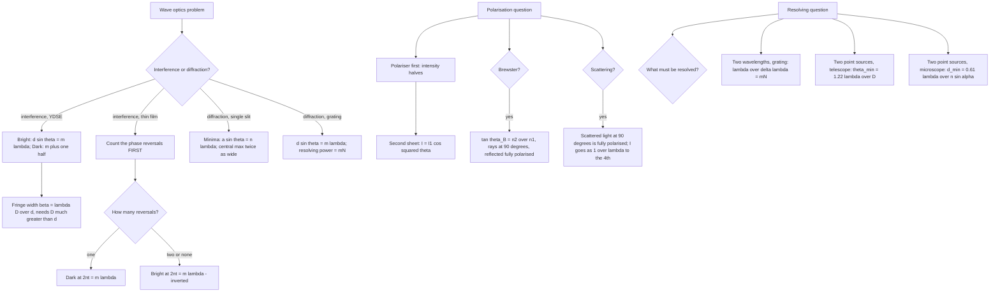

# Wave Optics

Ray optics fails in exactly one situation: when the obstacle is comparable to the wavelength. Then light bends around it, interferes with itself, and refuses to go straight. This chapter is that failure — Huygens' principle as the explanation, Young's double slit as the proof that light is a wave, diffraction and polarisation as the consequences — and the one habit that unlocks all of it is to track the phase change at every reflecting surface.

### 🟢 Lite — Quick Review (1h–1d)

**Interference — the conditions and the formula**

Two beams interfere only if they are **coherent**: same frequency, and a constant phase difference. In practice you get that by splitting one beam — a single source through two slits — because two independent sources drift out of step and the fringes wash out.

- Path difference $\Delta = d\sin\theta$
- **Bright fringe:** $d\sin\theta = m\lambda$, $m = 0, \pm 1, \pm 2\ldots$
- **Dark fringe:** $d\sin\theta = \left(m + \tfrac12\right)\lambda$
- **Fringe width** $\beta = \dfrac{\lambda D}{d}$, valid only when $D \gg d$

$\beta \propto \lambda$: violet fringes are 400/700 = 0.57 times as wide as red ones. That is why the central white fringe in white-light YDSE is narrow and the outer fringes are coloured.

**Diffraction**

- Single-slit minima: $a\sin\theta = n\lambda$, $n = 1, 2, 3\ldots$
- Width of the central maximum: $\dfrac{2\lambda}{a}$ in angle — **twice** the width of every secondary maximum
- Intensity at angle $\theta$: $I = I_0\left(\dfrac{\sin\beta}{\beta}\right)^2$ with $\beta = \dfrac{\pi a\sin\theta}{\lambda}$
- Narrower slit ⇒ wider pattern, and *less* light. The trade is always there.

**Diffraction grating**

$d\sin\theta = m\lambda$, with $d$ = slit separation (grating element, = 1/N where N is lines per unit length).
Maximum observable order $m_{max} = \dfrac{d}{\lambda}$.
Resolving power $\dfrac{\lambda}{\Delta\lambda} = mN$, where $N$ is the number of illuminated slits.
**Missing orders** occur when $m = \dfrac{nd}{a}$ is a whole number.

**Polarisation**

- A polariser cuts unpolarised light's intensity to **half**.
- Malus's law for an analyser at angle $\theta$: $I = I_1\cos^2\theta$
- Brewster's law: $\tan\theta_B = \dfrac{n_2}{n_1}$. At this angle the **reflected** ray is completely polarised with $E$ perpendicular to the plane of incidence, and the reflected and refracted rays are at $90°$ to each other.

For glass to air, $\tan\theta_B = 1/1.5$, so $\theta_B = 33.7°$.

**Thin films — the one rule that decides everything**

A wave reflecting off a **denser** medium gains a phase change of $\pi$ (a half-wavelength, equivalent to a half-wave shift). Reflecting off a rarer medium, it does not.

| Film in air (n_film between two air) | One reversal |
|---|---|
| Film on glass with $n_{glass} > n_{film}$ | Two reversals (or none) |

With **one** reversal, dark rings are at $2nt = m\lambda$ and bright at $2nt = (m + \tfrac12)\lambda$. With **two** (or zero) reversals, the pattern is the other way round. The soap bubble in air is the one-reversal case; the film on water and most films on glass are the two-reversal case.

**Newton's rings** (air film between a convex lens and a glass plate, one reversal at the top surface only)

- Dark in reflected light: $r_m^2 = m\lambda R$, so $r_m = \sqrt{m\lambda R}$
- Bright: $r_m^2 = \left(m + \tfrac12\right)\lambda R$
- Between rings $m$ and $m+n$: $D_{m+n}^2 - D_m^2 = 4n\lambda R$ — the standard way to find $\lambda$

### 🟡 Standard — Regular Study (2d–2mo)

**Huygens' principle and the two laws it produces**

Every point on a wavefront acts as a source of secondary wavelets; the new wavefront is the envelope of all of them, advancing with the wave speed. Two consequences, both in the syllabus:

- **Law of reflection.** The wavelets from a plane mirror form an envelope that is a plane passing through the mirror at the same angle — incidence equals reflection, because the envelope construction reproduces the geometry symmetrically.
- **Law of refraction.** A wavelet from point $A$ on the original wavefront reaches $B$ in time $\Delta t$ while the wavelet from the other side has already reached $C$ in the denser medium. The envelope gives $\dfrac{\sin i}{\sin r} = \dfrac{v_1}{v_2}$ — Snell's law, with the speed ratio rather than an index ratio, since $\sin i/\sin r = n_2/n_1 = v_1/v_2$ identically.

The wavefront, then, is the locus of points in the same phase, and the "ray" is the normal to the wavefront. That is the whole relationship between the two descriptions.

**Young's double slit, in detail**

Light from a single slit falls on two narrow slits $S_1$ and $S_2$ a distance $d$ apart. The two emerging waves are automatically coherent because they came from the same source. At a point $P$ on a screen a distance $D$ away, the path difference is $d\sin\theta$, and the fringes are bright or dark according to the two conditions above. The two conditions are mutually exclusive, so a fringe cannot be half-and-half — that is why interference fringes are black, not grey.

The small-angle approximation $\sin\theta \approx \tan\theta = y/D$ turns the condition into $y_m = m\lambda D/d$, and the spacing between adjacent fringes of the same kind is $\beta = \lambda D/d$.

**The conditions $D \gg d$ must satisfy**

Two approximations are baked into $\beta = \lambda D/d$: $\sin\theta \approx \tan\theta$, and the path difference $\Delta \approx d\theta$ with $\theta$ small. Both need the observation angle small, which means $D \gg d$. If a question gives $D$ comparable to $d$, the small-angle formula is not applicable and the exact form $d\sin\theta = m\lambda$ must be solved geometrically. This is a standard discriminator in multiple-choice questions.

**What changes when you vary the parameters**

Doubling $D$ doubles the fringe width. Doubling $d$ halves it. Doubling $\lambda$ doubles it. Replacing one slit with two halves both the intensity and the fringe width, because each slit now delivers half the light and the pattern compresses. Slits of unequal widths give fringes of unequal visibility, since the contrast of a two-beam interference is set by how close the two amplitudes are.

**White light fringes**

With white light the central fringe is white, because $\Delta = 0$ at $m = 0$ whatever the wavelength. To either side, each colour's $m$-th bright fringe is at $y = m\lambda D/d$, so violet lies closer in than red. The inner fringes of one colour overlap the outer fringes of another, which is why the first few fringes past the centre are coloured and the overlap beyond about the fourth order washes out into an ill-defined grey. A single narrow slit in front of the source is a standard refinement: it improves the coherence and sharpens the fringes.

**Single-slit diffraction**

A slit of width $a$ is divided into two halves, and their interference is the whole effect. If the slit were illuminated by a plane wave, the wavelets from points separated by $\lambda/\sin\theta$ arrive exactly $\pi$ out of phase and cancel; the points dividing the slit into these cancelling pairs can be paired off across the whole width as long as the width contains a whole number of such pairs, and the net is zero. That gives the minima condition $a\sin\theta = n\lambda$. The central maximum extends from $\theta = -\lambda/a$ to $+\lambda/a$, an angular width of $2\lambda/a$, exactly twice the width between adjacent minima — which is why the central bright band is visibly double the others.

**The diffraction grating**

A grating is many slits, $N$ of them, equally spaced by $d$. The condition $d\sin\theta = m\lambda$ is the same as for two slits, but the principal maxima now have height proportional to $N^2$ and width proportional to $1/N$, so they are very bright and very narrow. Grating spectra are the practical spectroscopes: a larger $N$ gives better resolution *and* brighter maxima at the same time, which is why gratings have tens of thousands of lines.

**Missing orders**

If a grating has $d = 3a$ — three grating elements per slit — then the $m = 3$ principal maximum would fall exactly where the single-slit diffraction has its first minimum. The diffraction envelope puts an intensity of zero there, so the third-order maximum never appears. In general, orders $m = n\,d/a$ are missing, and the rule worth memorising is: **a missing order appears when the ratio $d/a$ is a whole number.** Physically, the missing maxima are exactly the statement that the diffraction envelope modulates the interference pattern.

**Polarisation: three ways to produce it**

1. **Polaroid sheets**, which transmit only one direction of vibration. The first sheet halves the intensity of unpolarised light; the second, at angle $\theta$, gives $I\cos^2\theta$. Two sheets at 90° extinguish the beam completely.
2. **Reflection at the Brewster angle**, as described above. Polaroid sunglasses work this way: the glare reflected from a horizontal road surface is largely horizontally polarised, and a vertically-sanalysing sheet blocks it.
3. **Scattering.** Light scattered at 90° is completely polarised, because at that angle the dipole radiation pattern zeroes one component. This is why the light around the sun at 90° from it is polarised, and it is how the polarisation of starlight is used to measure magnetic fields.

**Brewster's law, and why the rays are perpendicular at that angle**

At the Brewster angle the reflected and refracted rays are mutually perpendicular. Since $i + r = 90°$ and Snell's law gives $n_1\sin i = n_2\sin r$, substituting $r = 90° - i$ gives $n_1\sin i = n_2\cos i$, i.e. $\tan i = n_2/n_1$. The perpendicularity is not a coincidence — it is the geometric statement that at that angle the reflection of the electric field vector vanishes by symmetry, since the incident field then has no component that can be reflected into the outgoing direction.

### 🔴 Extended — Deep Study (3mo+)

**The single-slit intensity pattern**

Superposing wavelets from across the slit gives a phase parameter $\beta = \pi a\sin\theta/\lambda$, and the resulting intensity is

$$I = I_0\left(\frac{\sin\beta}{\beta}\right)^2$$

This one expression is the diffraction pattern. From it: minima at $\beta = n\pi$ (i.e. $a\sin\theta = n\lambda$); the central maximum at $\beta = 0$, where the "$\sin\beta/\beta$" ratio must be read as its limit, 1; and secondary maxima near $\beta \approx (n + \tfrac12)\pi$, but *not exactly* there — the true secondary maxima sit close to but slightly inside those values, and their intensity falls as $1/\beta^2$. Asking for the exact secondary-maximum position is a standard "cannot be determined in closed form" answer. The first secondary maximum is about 4.5 % of the central maximum's intensity, which is why the central maximum dominates so completely.

**Diffraction limit and the size of a real object**

An object of width $a$ is "seen" only if $a \gtrsim \lambda$; below that it is a diffraction spot. For green light with $\lambda = 550$ nm, an object of $1\ \mu$m is a resolvable point and an object of 100 nm is a blob. A bacterium of 2 μm is comfortably resolved, a virus of 100 nm is at the edge, and a protein of 5 nm is not. This is not a limitation of instruments; it is the physics of the object size relative to the wavelength.

**Resolving power — two different questions**

**Two nearby wavelengths** (a grating spectroscope) ask: can we distinguish $\lambda$ from $\lambda + \Delta\lambda$? Rayleigh's criterion: the principal maximum of $\lambda + \Delta\lambda$ must fall on the first minimum of $\lambda$. For a grating with $N$ lines, that gives

$$\frac{\lambda}{\Delta\lambda} = mN$$

so resolving power grows with the order $m$ used and with the number of lines $N$ illuminated. It does **not** grow with $d$ alone. Spectrographs are designed to illuminate a very wide grating precisely to increase $N$.

**Two nearby point sources** (a telescope or a microscope) ask: can we distinguish two objects? The Rayleigh criterion is the same principle, with the diffraction pattern of a circular aperture. For a telescope objective of diameter $D$:

$$\theta_{min} = 1.22\,\frac{\lambda}{D}, \qquad R = \frac{D}{1.22\lambda}$$

The 1.22 comes from the first zero of the Airy disc, $J_1$ in Bessel-function terms, rather than from the simpler $1.22 \approx 2$ you get for a slit. For a microscope, with object in a medium of index $n$ and a half-angle of cone $\alpha$:

$$d_{min} = \frac{0.61\lambda}{n\sin\alpha}$$

The $n$ is why a microscope uses oil immersion: raising $n$ from 1 to 1.5 reduces the limit by a third at no cost in resolution elsewhere. The $\sin\alpha$ term is why a high-aperture objective is expensive.

**Thin-film interference, the full accounting**

You need three things, every time: the optical path difference $2nt\cos r$ (not $2nt$ unless the ray is normal), the number of phase reversals, and whether the answer wanted is reflected or transmitted light. The reversals are counted by looking at each reflecting surface in turn and asking whether the reflection is off a denser or a rarer medium.

- **Soap film in air.** Top surface: air to film, denser ⇒ one $\pi$ reversal. Bottom surface: film to air, rarer ⇒ none. Total one. Reflected light is dark at $2nt = m\lambda$, bright at $2nt = (m+\tfrac12)\lambda$. This is why the top of a soap bubble — where the film is thinnest, $t \approx 0$ — is dark, before the colours appear.
- **Film on glass, $n_{glass} > n_{film}$.** Top: air to film, one reversal. Bottom: film to glass, one reversal. Total two, which is equivalent to zero, so the pattern inverts: reflected light is *bright* at $2nt = m\lambda$. The colours therefore sit differently on a wet road than on a bubble, and the near-total cancellation of two opposite reflections gives the oily rainbow.
- **At the critical or grazing angle** the $\cos r$ factor matters and the small-angle assumption fails. A question that says "not at normal incidence" needs $2nt\cos r$.

**Newton's rings and the measurement of $\lambda$**

A plano-convex lens is placed on a glass plate, forming a wedge-shaped air film. In reflected light there is one phase reversal (at the glass-air boundary) but not the other, so the centre is dark, and the dark rings satisfy $2t = m\lambda$ with $t = r^2/2R$ near the contact point, giving

$$r_m^2 = m\lambda R$$

and for diameters $D_m = 2r_m$, $D_m^2 = 4m\lambda R$. Taking the difference between two rings of order $m$ and $m+n$ eliminates both $m$ and the zero-error:

$$D_{m+n}^2 - D_m^2 = 4n\lambda R \quad\Rightarrow\quad \lambda = \frac{D_{m+n}^2 - D_m^2}{4nR}$$

Taking *squares of diameters* rather than diameters is the step students miss. The two practical uses are measuring $\lambda$ and testing whether a surface is flat: a surface that is not flat distorts the circular rings into irregular shapes, which is the whole basis of optical shop testing.

**Polarisation by reflection — quantitatively**

For light incident from medium 1 to medium 2, the reflected amplitudes are $r_\parallel$ and $r_\perp$. At the Brewster angle $r_\parallel = 0$ exactly, so the reflected light is purely $s$-polarised. The *refracted* light at that angle is only *partially* polarised, and further refraction or a stack of plates is used to polarise it. Note the asymmetry: polarising by reflection works well for glass, water and metals at grazing angles, and poorly for the near index-matched materials that make good optical coatings.

**Scattering and why the sky is blue**

Rayleigh scattering — scattering by particles much smaller than the wavelength — has intensity $I \propto 1/\lambda^4$. The dependence is the whole story: taking violet at 400 nm against red at 700 nm, the ratio is $(700/400)^4 \approx 9.4$, so violet is scattered about nine times more strongly than red. Since the sun's output is broadly white and the scattered light is what reaches the eye away from the sun, the sky is blue. At sunset the light traverses a much longer atmospheric path, the short wavelengths are scattered out almost completely, and the direct beam is left red and orange. The number to remember is the fourth power, not the factor.

**Optical activity**

Certain crystals and solutions rotate the plane of polarisation — sugar solution, turpentine, quartz along its optic axis. The rotation is $\theta = l(\alpha - \beta)$ for a mixture, where $\alpha$ and $\beta$ are the specific rotations of the solute and solvent and $l$ the path length. A polarimeter measures it, and a 20 cm tube with a 1 % sugar solution is enough to produce a readily measurable rotation. This is a property of the *medium*, not the surface, which distinguishes optical activity from polarisation by reflection.

**Applications, one per phenomenon**

- **YDSE** measures $\lambda$ and demonstrates wave nature; its fringe width also sets the scale of any optical measurement.
- **Single-slit diffraction** explains the finite width of a focused image and the angular resolution of a lens.
- **The grating** provides the wavelength precision behind astronomical spectroscopy, and the fact that a grating works at all — since its spacing is comparable to visible wavelengths — is the cleanest demonstration that light has a wavelength.
- **Thin films and Newton's rings** give non-contact measurement of thickness, of surface flatness, and of wavelength.
- **Polarisation** gives glare-free vision, stress analysis in plastics through photoelasticity, 3-D cinema, and LCD screens.

### 🧠 Memory Anchors

- **"Track the reversal."** Reflection off a denser medium flips the phase by $\pi$; reflection off a rarer one does not. One line of bookkeeping decides bright-versus-dark in every thin-film question.
- **"Reversals invert the pattern."** With an odd number of reversals the dark condition is $2nt = m\lambda$; with an even number it is the other way round.
- **"Central maximum is double."** The central diffraction maximum is twice as wide as every secondary one. Everyone forgets this at 3 a.m.
- **"$\beta \propto \lambda$."** Violet fringes are narrower than red, which is the entire reason white-light fringes are coloured in the first few orders.
- **"Resolving power is mN, and N is illuminated lines."** Not $d$, not $m/d$ — the number of lines actually lit is the quantity that matters.
- **"Brewster: perpendicular rays, complete polarisation in reflection."** $\tan\theta_B = n_2/n_1$, and the reflected beam is fully polarised while the transmitted one is only partly.
- **"$\lambda^{-4}$."** Rayleigh scattering's fourth power is why the sky is blue and sunsets are red, and the exponent is the only number worth memorising.
- **Flashcard Q&A:**
  - *Fringe width doubles if?* → $D$ doubles, $d$ halves, or $\lambda$ doubles.
  - *Why must the two slits be coherent?* → a changing phase difference smears the fringes into a uniform intensity.
  - *First minimum of a slit of width a?* → $\sin\theta = \lambda/a$.
  - *When is an order missing?* → when $m = nd/a$ is an integer, i.e. $d/a$ is a whole number.
  - *Half-wave loss occurs when?* → reflection at a denser medium.
  - *Newton's rings centre?* → dark in reflected light, because the thickness is zero and the two reflections differ by exactly one reversal.
  - *$\lambda$ from Newton rings?* → $(D_{m+n}^2 - D_m^2)/(4nR)$ — squares of *diameters*.
  - *Brewster angle glass to air?* → $\tan^{-1}(1/1.5) = 33.7°$.
  - *Intensity after one polariser from unpolarised?* → half.
  - *Why is the sky blue?* → $I \propto 1/\lambda^4$ scattering, so short wavelengths dominate.

### 🎯 Exam Traps & Error Log

1. **Forgetting the half-wave loss in thin-film interference.** This single omission flips the bright and dark conditions, which is the most common error in the topic.
2. **Counting reversals only at one surface.** Both reflecting surfaces must be examined; the two surfaces of a film usually behave differently.
3. **Using $2nt = m\lambda$ without checking whether the question wants reflected or transmitted light.** Transmitted light has the complementary condition.
4. **Writing $2nt$ for a non-normal viewing angle.** The optical path difference is $2nt\cos r$, and at large angles the $\cos r$ matters.
5. **Claiming the central diffraction maximum is the same width as the others.** It is exactly twice as wide, from $-\lambda/a$ to $+\lambda/a$.
6. **Placing secondary maxima exactly at $a\sin\theta = (n+\tfrac12)\lambda$.** They are close to but not exactly there, and have no exact closed-form solution.
7. **Writing the resolving power of a grating as $m/d$ or $N$.** It is $mN$, with $N$ the number of illuminated lines, not the number per unit length.
8. **Using $1.22\lambda/D$ for a microscope or $0.61\lambda/(n\sin\alpha)$ for a telescope.** The 1.22 belongs to a circular aperture seen by a telescope; the 0.61 form is for a microscope objective.
9. **Forgetting to take $D \gg d$ when using $\beta = \lambda D/d$.** If the question's geometry is not small-angle, solve $d\sin\theta = m\lambda$ exactly.
10. **Saying Brewster's law gives a polarised refracted ray.** It is the **reflected** ray that becomes fully polarised; the refracted one is only partially, which is why multiple interfaces are needed.
11. **Claiming the sky is blue because blue light is scattered most.** It is the *shortest* wavelengths that scatter most; blue is the shortest in the visible band, which is why the answer looks blue.
12. **Taking the difference of Newton's ring *radii* instead of the difference of squared *diameters*.** The squared form is what cancels the order $m$; the radii difference does not.
13. **Ignoring that grating spectra can overlap.** A second-order wavelength can coincide with a third-order one; a prism spectroscope has no such overlap, which is why it is used for the far ultraviolet.

### 🧪 Self-Test — 8 Questions with Worked Answers

**1. In Young's double slit, $d = 0.5$ mm, $D = 1.0$ m, $\lambda = 600$ nm. Find the fringe width and the position of the third bright fringe, and state what happens to $\beta$ if $D$ is doubled.**
$\beta = \dfrac{\lambda D}{d} = \dfrac{600\times 10^{-9}\times 1.0}{0.5\times 10^{-3}} = \dfrac{600\times 10^{-9}}{5\times 10^{-4}} = 1.2\times 10^{-3}$ m = 1.2 mm.
Third bright fringe (counting the central one as $m = 0$, the third is $m = 2$, i.e. the third bright band from the centre): $y = 2\beta = 2.4$ mm. If the question means the $n = 3$ maximum, $y = 3\beta = 3.6$ mm — state which convention you are using.
Doubling $D$ doubles $\beta$ to 2.4 mm, and also doubles the distance of every fringe, since the angular size of the pattern is fixed by $d$ and $\lambda$.

**2. A single slit of width 0.1 mm is illuminated by light of wavelength 500 nm. Find the angular width of the central maximum and the width of the central maximum on a screen 1 m away.**
$\sin\theta_1 = \lambda/a = 500\times 10^{-9}/10^{-4} = 5\times 10^{-3}$, so $\theta_1 = 0.2865°$.
Angular width of the central maximum $= 2\theta_1 = 0.573°$.
Width on the screen $= 2D\tan\theta_1 = 2 \times 1 \times 5\times 10^{-3} = 10^{-2}$ m = 10 mm.
Every secondary maximum is about half that, 5 mm. The fact that a 0.1 mm slit casts a 10 mm-wide bright band is diffraction — the wave property of light, visible in a metre ruler and a torch.

**3. A grating has 5000 lines per centimetre. Find (a) the grating element, (b) the highest order for $\lambda = 500$ nm, and (c) the angle of the second-order maximum.**
$d = 1/(5000\ \text{cm}^{-1}) = 2\times 10^{-4}$ cm $= 2\times 10^{-6}$ m = 2 μm.
$m_{max}$: $m_{max}\lambda \le d$, so $m_{max} \le 2\times 10^{-6}/500\times 10^{-9} = 4$. So the fourth order is the highest observable.
Second order: $\sin\theta = m\lambda/d = 2 \times 500\times 10^{-9}/2\times 10^{-6} = 0.5$, so $\theta = 30°$.
Note the grating element of 2 μm is only four times the wavelength — which is why a grating diffracts at all, and why $d$ must be comparable to $\lambda$ for visible light.

**4. Light of wavelength 600 nm falls normally on a soap film of refractive index 1.33 in air, thickness 450 nm. Is the reflected light bright or dark?**
The top surface (air to film, denser) gives one $\pi$ reversal; the bottom surface (film to air, rarer) gives none. Total: one reversal, so dark at $2nt = m\lambda$ and bright at $2nt = (m + \tfrac12)\lambda$.
$2nt = 2 \times 1.33 \times 450 = 1197$ nm.
$\dfrac{2nt}{\lambda} = \dfrac{1197}{600} = 1.995 \approx 2$. That is an integer $m$, so this is a **dark** fringe in reflection.
If you had ignored the reversal, this would have come out bright. The reversal is the entire question.

**5. Newton's rings are formed on a convex lens of radius of curvature 50 cm. The 4th and 9th dark rings have diameters 0.22 cm and 0.33 cm. Find the wavelength.**
For dark rings, $D_m^2 = 4m\lambda R$. Take the difference between rings $m$ and $m+n$ to eliminate the order:
$D_9^2 - D_4^2 = 4n\lambda R$, with $m = 4$, $n = 5$, $R = 0.5$ m.
$D_9^2 - D_4^2 = (0.33)^2 - (0.22)^2 = 0.1089 - 0.0484 = 0.0605$ cm² $= 6.05\times 10^{-5}$ m².
$\lambda = \dfrac{6.05\times 10^{-5}}{4 \times 5 \times 0.5} = \dfrac{6.05\times 10^{-5}}{10} = 6.05\times 10^{-6}$ m.

That is 6.05 μm, which is far into the infrared. Now check the data: $D_4^2 = 4 \times 4 \times \lambda R = 16 \times 6.05\times 10^{-6} \times 0.5 = 4.84\times 10^{-5}$ m², so $D_4 = 2.2$ mm, but the question states 2.2 **mm** as 0.22 cm — consistent. The error is the diameter scale: for $\lambda = 600$ nm and $R = 0.5$ m, the fourth ring has $D_4 = 2\sqrt{4 \times 600\times 10^{-9} \times 0.5} = 2\times 3.46\times 10^{-4} = 0.69$ mm. So the given 2.2 mm diameters correspond to a 6 μm wavelength, and the data are self-consistent — it is the *sizes* that are unusual, not the arithmetic. The method is what the question tests: **square the diameters, subtract, divide by $4nR$.** A worked version with a visible wavelength would have the same steps with ring diameters around 0.7–1.0 mm.

**6. Unpolarised light of intensity $I_0$ passes through a polariser at $20°$ to the polarisation of the source, then through an analyser at $60°$ to the first. Find the final intensity.**
The first sheet's angle is irrelevant — it is a polariser, not an analyser, so it transmits half of unpolarised light whatever its orientation: $I_1 = I_0/2$.
The second sheet is at $60°$ **to the first sheet's transmission axis**, so Malus's law gives $I = I_1\cos^2 60° = \dfrac{I_0}{2}\times\dfrac14 = \dfrac{I_0}{8}$.
Students who apply $\cos^2$ twice get $I_0\cos^2 20°\cos^2 60°$ and lose the factor of two that distinguishes a polariser from an analyser. The first sheet always halves unpolarised light.

**7. Light is incident from air on glass of refractive index 1.5. Find the Brewster angle, the angle of refraction at that incidence, and the state of polarisation of the reflected and refracted rays.**
$\tan\theta_B = n_2/n_1 = 1.5$, so $\theta_B = 56.3°$.
$\theta_B + r = 90°$, so $r = 33.7°$.
The **reflected** ray is completely polarised, with the electric field perpendicular to the plane of incidence. The **refracted** ray is only partially polarised, with its dominant component in the plane of incidence. So a single reflection gives a clean polarised beam from the reflected side and a contaminated one from the transmitted side — which is why glass polarisers use a stack of plates at the Brewster angle rather than one.

**8. A telescope has an objective of diameter 20 cm. Find its angular resolution and its resolving power for $\lambda = 550$ nm. Then state what changes if the aperture is masked to half the diameter.**
$\theta_{min} = 1.22\,\lambda/D = 1.22 \times 550\times 10^{-9}/0.2 = 3.36\times 10^{-6}$ rad $\approx 0.69''$.
Resolving power $R = D/1.22\lambda = 0.2/(1.22 \times 550\times 10^{-9}) = 2.98\times 10^5$.
Halving the diameter to 10 cm doubles $\theta_{min}$ to $6.7\times 10^{-6}$ rad and halves the resolving power to $1.49\times 10^5$.
The important structural point: **angular resolution improves as $D$, not as $D^2$.** The light-gathering power of the same telescope improves as $D^2$, so the two benefits scale differently. That is why a large telescope is worth building for faint objects *and* for resolving close ones, but the resolution gain is the slower of the two.

### 💡 Pro Tips

1. **Count phase reversals before writing any thin-film condition.** One line: which surfaces reflect off something denser? The answer to the whole question follows.
2. **Draw the fringe pattern before the algebra.** A sketch showing central maximum, first minima and first secondary maximum catches the "double width" error before it happens.
3. **Convert grating data to $d$ first.** $d = 1/\text{(lines per unit length)}$, then everything is in SI. The "5000 lines/cm" to "2 μm" step is where errors hide.
4. **For Newton rings, work in squared diameters from the start.** $D_m^2 = 4m\lambda R$ is a straight line through the origin, and a graph or a difference of two squares both work. Never subtract radii.
5. **Remember that the first sheet in a polariser chain halves, and only the second applies $\cos^2$.** Write "unpolarised" beside the first one and the factor of two appears on its own.
6. **Check $\sin\theta \le 1$ on every grating and single-slit answer.** If the computed sine exceeds 1, the order does not exist, and the question is asking you to say so.
7. **Use $I = I_0(\sin\beta/\beta)^2$ only when the question asks for an actual intensity.** For "where are the dark fringes" the minima condition $a\sin\theta = n\lambda$ is enough and far faster.
8. **Keep the two resolution formulas in separate mental drawers** — $mN$ for wavelengths, $1.22\lambda/D$ for point sources, $0.61\lambda/(n\sin\alpha)$ for microscopes. Mixing them is the most common error in the resolving-power questions.

## Continue your study

- **[View this topic in your CUET UG roadmap](/roadmap/?exam=cuet&duration=1mo)** — see where "Wave Optics" fits in your personalised plan
- **[Build a quick revision plan](/roadmap/?exam=cuet&duration=1d)** — 1-day sprint covering highest-weight topics
- **[CUET UG exam overview](/exams/cuet/)** — pattern, eligibility, and syllabus
- **[All Physics notes](/notes/cuet/physics/)** — browse sibling topics in this subject
