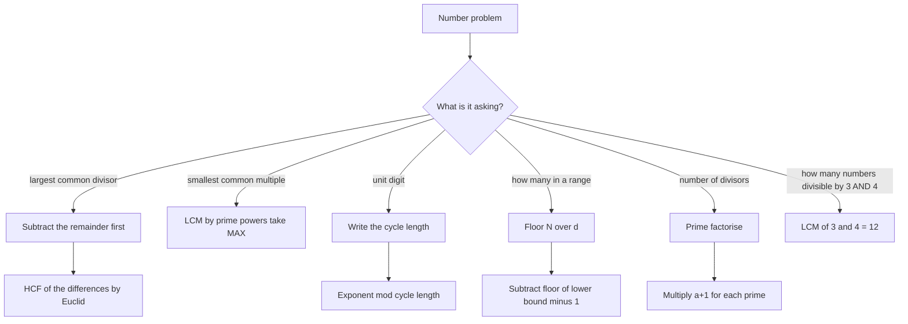

# Number System

Number System is the arithmetic engine that every later topic runs on. Averages, ratios, interest, mensuration — each one hands you a computation and asks you to reduce it before you can see the answer. Reduce means HCF, LCM, remainder, unit digit, divisibility. If those five are automatic, the arithmetic in the rest of the section is slow but safe; if they are shaky, you lose marks in every chapter at once. This note is deliberately formula-first: every rule here is paired with the one place it breaks.

### 🟢 Lite — Quick Review (1h–1d)

**Classification chain, each set inside the next**

N ⊂ W ⊂ Z ⊂ Q ⊂ R, and irrationals = R \ Q. N = 1,2,3,… · W = 0,1,2,… · Z = …,−1,0,1,… · Q = p/q in lowest terms · R includes √2 and π. 1 is neither prime nor composite; 0 is neither positive nor negative.

**The three identities that carry the chapter**

- **HCF(a, b) × LCM(a, b) = a × b** — two positive integers only. Use it as a check, never as the method, because the moment there are three numbers the product identity breaks.
- **Euclid's Division Lemma:** a = bq + r with 0 ≤ r < |b|. The HCF is the last non-zero remainder of repeated long division. With a = 48, b = 18: 48 = 18×2 + 12; 18 = 12×1 + 6; 12 = 6×2 + **0**, so HCF = 6.
- **Fundamental Theorem of Arithmetic:** every integer > 1 has exactly one prime factorisation up to order. HCF takes the **minimum** power of each shared prime; LCM takes the **maximum**.

**HCF and LCM of fractions** — reduce every fraction to lowest terms *first*, then:

- HCF of fractions = HCF of the numerators ÷ LCM of the denominators
- LCM of fractions = LCM of the numerators ÷ HCF of the denominators
- The check: an HCF is divided into each fraction and a whole number comes out; an LCM multiplied by each fraction is also a whole multiple of it.

**Remainder theorem.** If a number leaves remainder r when divided by d, subtracting r makes it exactly divisible by d. This is the opening move in every "largest number that divides X and Y leaving remainders" question.

**Unit-digit cycles.**

| Last digit | Cycle length | Pattern |
| --- | --- | --- |
| 0, 1, 5, 6 | constant | never changes |
| 4, 9 | 2 | 4,6 / 9,1 |
| 2, 3, 7, 8 | 4 | e.g. 7,9,3,1 |

Reduce the exponent **mod the cycle length** before you compute anything. 7^103 → 103 mod 4 = 3 → 7³ = 343 → unit digit **3**.

**Divisibility tests worth having in your fingers:** last digit even → 2 · digit sum ÷ 3 → 3 · digit sum ÷ 9 → 9 · last two digits ÷ 4 · last three digits ÷ 8 · last digit 0 or 5 → 5 · alternating digit sum ÷ 11 → 11.

**Squares, cubes and roots.** The last digit of a square can only be 0, 1, 4, 5, 6 or 9 — so a number ending in 2, 3, 7 or 8 is never a perfect square, and you can reject an option instantly. The last digit of a cube can only be 0, 1, 8, 7, 4, 5, 6, 3, 9, 2 (all of them), so use cubes differently: the cube of a number ending in d ends in the last digit of d³. Between two consecutive squares, n² and (n+1)², the gap is 2n+1; the cube-root estimate for a number between n³ and (n+1)³ can be narrowed the same way. Recognise the small squares to about 30² = 900 and the small cubes to about 12³ = 1728, and you will never need a calculator for a root question.

### 🟡 Standard — Regular Study (2d–2mo)

#### Where each rule actually gets used

Rational numbers decide themselves: a fraction p/q in lowest terms has a terminating decimal exactly when q has no prime factor other than 2 and 5. That single test explains why 1/8 = 0.125 terminates, 1/12 = 0.0833… repeats, and 1/40 = 0.025 terminates even though 40 = 2³×5. The number of decimal places you need equals the larger of the exponents of 2 and 5 in the denominator. This is a syllabus favourite precisely because it is quick to test and hard to guess.

Surds and indices are the two algebraic tools that make simplification bearable. Simplify before you calculate: √12 = √(4×3) = 2√3, not 3.46. Rationalise a denominator of the form √a ± √b by multiplying top and bottom by the conjugate — 1/(√5+√3) = (√5−√3)/((√5)²−(√3)²) = (√5−√3)/2. Powers obey aᵐ × aⁿ = a⁽ᵐ⁺ⁿ⁾, (aᵐ)ⁿ = a⁽ᵐⁿ⁾, and a⁰ = 1 for a ≠ 0.

#### HCF and LCM by prime factorisation, done properly

Take 72 and 120. Factorise: 72 = 2³ × 3², 120 = 2³ × 3 × 5. HCF takes the minimum of each exponent: 2³ × 3² = **72**. LCM takes the maximum: 2³ × 3² × 5 = **360**. Check with the identity: 72 × 360 = 25,920 = 72 × 120. ✓

Note what happened — 72 divides 120 evenly here, so HCF = 72 itself. "HCF" and "one of the numbers" are not mutually exclusive, and students who assume they are lose easy marks.

Fractions: reduce first, then apply the same two rules. Take 2/3 and 3/5. HCF = HCF(2, 3) ÷ LCM(3, 5) = 1 ÷ 15 = **1/15**. Check: (2/3) ÷ (1/15) = 10 and (3/5) ÷ (1/15) = 9, both whole, and nothing larger divides both. LCM = LCM(2, 3) ÷ HCF(3, 5) = 6 ÷ 1 = **6**. Check: 6 ÷ (2/3) = 9 and 6 ÷ (3/5) = 10, both whole.

The "reduce first" step is not optional, and it is the single most-missed step in this chapter. Applied to the unreduced pair 12/18 and 9/15, the shortcut gives HCF(12, 9) ÷ LCM(18, 15) = 3 ÷ 90 = 1/30 — a value that does divide both fractions, but not the *largest* such value, because 1/15 also divides both. Reducing first gives the right answer. When in doubt, verify with the two checks above: an HCF is divided into each fraction and an LCM is divided by each fraction, and both must give whole numbers.

#### Unit-digit cyclicity, worked

- 2^n cycles 2,4,8,6 with period 4. 2^2026: 2026 mod 4 = 2 → unit digit **4**.
- 3^n cycles 3,9,7,1 with period 4. 3^77: 77 mod 4 = 1 → **3**.
- 9^n cycles 9,1 with period 2. 9^101: 101 mod 2 = 1 → **9**.
- A number ending in 0, 1, 5, 6 never changes its unit digit, whatever the positive exponent.

The method is identical every time: write the cycle, find the remainder of the exponent on the cycle length, take that position. Do it the same way every time and you will never miscount the position.

#### Worked Problem — largest number dividing two numbers with remainders

**Question.** Find the largest number that divides 201 and 162 leaving remainders 7 and 5 respectively.

**Solution.** The required number n divides (201 − 7) = 194 and (162 − 5) = 157 exactly. So n = HCF(194, 157).

Apply Euclid's Division Lemma:
- 194 = 157 × 1 + 37
- 157 = 37 × 4 + 9
- 37 = 9 × 4 + 1
- 9 = 1 × 9 + 0

HCF = **1**. No number greater than 1 satisfies both conditions, so the answer is 1. If the question had said "leaving remainder 7 in both cases", the answer would be HCF(201−7, 162−7) = HCF(194, 155) = HCF(194, 39) = HCF(39, 38) = 1 as well — different working, same answer, which is why you should read which remainders are actually given.

#### Worked Problem — smallest number leaving a common remainder

**Question.** Find the smallest number which when divided by 12, 16 and 24 leaves remainder 5 in each case.

**Solution.** The answer must exceed 5, and (answer − 5) must be divisible by all three. LCM(12, 16, 24): 12 = 2²×3, 16 = 2⁴, 24 = 2³×3. Maximum powers: 2⁴ × 3 = 48. So answer − 5 = 48 → answer = **53**. Verify: 53 ÷ 12 = 4 r 5 ✓, 53 ÷ 16 = 3 r 5 ✓, 53 ÷ 24 = 2 r 5 ✓. The trap is answering 48 — that gives remainder 0, not 5.

### 🔴 Extended — Deep Study (3mo+)

#### Counting, not just finding

Questions that ask "how many" are the ones that separate this chapter from a formula sheet. The base result: the number of multiples of d in 1 to N is ⌊N/d⌋. In 1 to 1000, multiples of 7 number ⌊1000/7⌋ = 142, since 7 × 142 = 994 and 7 × 143 = 1001. For a range, subtract: multiples of d in a to b = ⌊b/d⌋ − ⌊(a−1)/d⌋. In 100 to 200, multiples of 7 = 28 − 14 = **14**.

Numbers **not** divisible by d in 1 to N = N − ⌊N/d⌋. In 1 to 100, numbers not divisible by 3 = 100 − 33 = **67**. The most common wrong answer here is 66, from dividing evenly and ignoring the remainder.

#### Divisor functions, and why 360 keeps appearing

If N = p₁^a₁ × p₂^a₂ × … × pₖ^aₖ, then the number of divisors is τ(N) = (a₁+1)(a₂+1)…(aₖ+1), and the sum of all divisors is σ(N) = ∏ [(pᵢ^(aᵢ+1) − 1)/(pᵢ − 1)].

- **360 = 2³ × 3² × 5¹** → τ = 4 × 3 × 2 = **24** divisors. σ = (1+2+4+8)(1+3+9)(1+5) = 15 × 13 × 6 = 1170.
- **Proper divisors** exclude N itself: 24 − 1 = 23.
- **A number is perfect when σ(N) = 2N** (divisors sum to twice the number). 28 = 1+2+4+7+14 works; 6 = 1+2+3 works. These are the only even perfect numbers, and Euclid–Euler shows they are exactly 2ᵖ(2ᵖ⁺¹ − 1) with 2ᵖ⁺¹ − 1 prime.

#### Modular arithmetic, used lightly

Reduce everything mod what the question needs. For unit digits that means mod 10, and φ(10) = 4 is why period 4 keeps appearing for bases ending in 3 and 7. Euler's totient φ(n) counts the integers from 1 to n that are coprime to n; when gcd(a, n) = 1, a^φ(n) ≡ 1 (mod n). Wilson's theorem says (n−1)! ≡ −1 (mod n) exactly when n is prime — a fast way to show 13 is prime, since 12! ≡ −1 (mod 13) but 12! ≡ 0 (mod 14).

Casting out nines: any number and its digit sum leave the same remainder mod 9. That makes digit sums a genuine arithmetic tool, not just a divisibility test.

#### Edge cases where the standard rules stop

- **HCF × LCM = product fails for three numbers.** For 12, 18, 30: HCF = 6, LCM = 180, and 6 × 180 = 1080 ≠ 12 × 18 × 30 = 6480. Compute pairwise and combine; that is why these questions are worded "HCF of 12, 18 and 30" and never as a product.
- **Cyclicity and exponent 0.** 2⁰ = 1 and 5⁰ = 1, so an exponent of 0 is not covered by the cycle. If a question gives a zero exponent, handle it separately.
- **Negative numbers in Euclid's lemma.** Work with absolute values; the constraint is 0 ≤ r < |b|. −7 = 3×(−2) + (−1) is true arithmetic but useless for finding an HCF.
- **Co-prime is HCF = 1.** Two numbers are co-prime exactly when their HCF is 1. That has nothing to do with either number being prime: 8 and 9 are co-prime, 9 and 15 are not.
- **Zero.** HCF(a, 0) = a and LCM(a, 0) = 0 by convention. Every positive integer divides 0, so there is no *least* positive common multiple. Most exam papers avoid it; know the convention in case they do not.

#### Base conversion, briefly

Decimal to binary: divide by 2 repeatedly, read the remainders bottom-up (13 → 1101). Binary to decimal: positional sum of 2ᵏ. The same algorithm works in any base. Base conversion is a low-frequency question type; the algorithm is worth twenty minutes, not two hours.

#### Squares and cubes beyond the last digit

The last-digit filter is the fast exit, but two deeper facts earn the harder questions. First, n² is a perfect square **only if** every prime in its factorisation has an even exponent — 72 = 2³ × 3² has a 3, so it is not a square, while 180 = 2² × 3² × 5 has a single 5 and is not either. Second, the number of squares strictly between m² and n² is n² − m² − 1, and the same holds for cubes: strictly between 2³ and 5³ there are 5³ − 2³ − 1 = **116** cubes. Both are one-line answers once you see them as "count everything in between, then remove the two endpoints".

Zeros at the end of a product are worth one habit: trailing zeros = min(exponent of 2, exponent of 5). For 2⁴ × 3³ × 5² there are min(4, 2) = **2** trailing zeros, and the number of digits is 1 + ⌊log₁₀N⌋, which in practice means 2⁴ × 3³ × 5² = 5400 — four digits, two of them zeros. The count of digits of a product also equals the sum of the digit counts of the factors, or one less if the factors have fewer than three digits each.

#### Three deeper problems

1. **If 2ˣ × 3ʸ = 648 with x, y non-negative integers and x > y**, then 648 = 2³ × 3⁴, so x = 3, y = 4 — which violates x > y, so no such non-negative integers exist as stated; the question is a trap that rewards writing 648 out before reading the condition.
2. **Unit digit of 3^(3³).** Inner: 3³ = 27. Outer: 27 mod 4 = 3, so take the third entry of 3,9,7,1 → **7**.
3. **Counting numbers between 1 and 1000 divisible by 7 but not by 14.** Multiples of 7 = 142; of these, multiples of 14 = 71; so **71**.

### 🧠 Memory Anchors

- **"Subtract, then divide."** For any "largest number that divides X and Y leaving remainder r", the answer is HCF(X − r, Y − r). Do the subtraction before you start long division, never after.
- **"HCF is minimum, LCM is maximum"** — and only over the primes that actually appear. That is the whole rule.
- **"Two numbers, one product."** HCF × LCM = a × b is a checking rule for exactly two integers. Three numbers and it lies to you.
- **Unit-digit chant:** 2-3-7-8 ride a 4-beat cycle, 4-9 ride a 2-beat cycle, 0-1-5-6 are stationary.
- **"Divisors multiply as (a+1)."** 2³ × 3² × 5¹ → 4 × 3 × 2. The exponent turns into plus one, never into itself.
- **"Squares end in 0, 1, 4, 5, 6, 9 — cubes end anywhere."** If an option ends in 2, 3, 7 or 8 it cannot be a square, whatever its size.
- **"Trailing zeros are the smaller exponent."** min(power of 2, power of 5) — that is the entire rule, and it is why factorials end in so many zeros.
- **"Count with floors."** ⌊N/d⌋ multiples of d in 1 to N. Subtract the count below your range and you are done — no listing.
- **Flashcard Q&A:**
  - *HCF of 2/3 and 3/5?* → HCF(2,3) ÷ LCM(3,5) = 1 ÷ 15 = 1/15.
  - *Smallest number leaving remainder 5 with 12, 16, 24?* → LCM = 48, answer 53.
  - *Unit digit of 2^2026?* → 2026 mod 4 = 2 → 4.
  - *Multiples of 7 in 1 to 1000?* → ⌊1000/7⌋ = 142.
  - *Divisors of 360?* → 4 × 3 × 2 = 24.
  - *Does 1/12 have a terminating decimal?* → No: 12 = 2²×3 has a factor 3.

### 🎯 Exam Traps & Error Log

1. **Computing HCF of the original numbers instead of the remainder-adjusted ones.** In the 201/162 problem, HCF(201, 162) = 3, which is the tempting wrong answer. The correct route is HCF(194, 157) = 1.
2. **Answering the LCM where the smallest number with a remainder was asked.** The LCM is the answer minus the remainder, never the answer.
3. **Applying HCF × LCM = a × b to three or more numbers.** It is false there, and the false value is usually a plausible-looking option.
4. **Reducing an exponent mod 4 for a base whose cycle is length 1 or 2.** 5^100 has unit digit 5, not 1 — 5⁴ = 625, and 5^n always ends in 5 for n ≥ 1.
5. **Reporting ⌊N/d⌋ as the count of non-multiples.** Non-multiples of 3 in 1 to 100 = 67, not 66, because 100 is not a multiple of 3.
6. **Taking the HCF of fractions as the smaller number.** HCF is a *divisor* relation (divide each fraction by it and get a whole number); LCM is a *multiple* relation (divide it by each fraction and get a whole number). Mixing them up inverts the answer, and so does skipping the reduction to lowest terms.
7. **Forgetting that 1 is neither prime nor composite,** which kills any statement of the form "every number greater than 1 has a prime factorisation".
8. **Halving the exponent twice for a two-cycle base.** For 9^2026: 2026 mod 2 = 0, so use the second entry, 1. Reading the first entry gives 9.
9. **Dividing by the divisor rather than the quotient in Euclid's lemma.** a = bq + r is exact division of a by b; the remainder is always less than |b|.

### 🧪 Self-Test — 8 Questions with Worked Answers

Answer all eight on paper before reading a single solution.

1. **What is the HCF of 12/18 and 9/15, and what is their LCM?**
   Reduce first: 12/18 = 2/3, 9/15 = 3/5. HCF = HCF(2, 3) ÷ LCM(3, 5) = 1 ÷ 15 = **1/15**; check (2/3) ÷ (1/15) = 10 and (3/5) ÷ (1/15) = 9. LCM = LCM(2, 3) ÷ HCF(3, 5) = 6 ÷ 1 = **6**; check 6 ÷ (2/3) = 9 and 6 ÷ (3/5) = 10. Skipping the reduction would give 1/30, which divides both fractions but is not the largest such number — that is the whole trap in this question.
2. **What is the unit digit of 7^103?**
   Cycle for 7 is 7, 9, 3, 1 with period 4. 103 mod 4 = 3, so take the third entry: 7³ = 343 → unit digit **3**. The commonest error is dividing 103 by 4 to get 25 and using the 25th position without taking the remainder.
3. **Find the largest number that divides 312 and 158 leaving remainders 12 and 8 respectively.**
   Subtract the remainders: 312 − 12 = 300 and 158 − 8 = 150. HCF(300, 150) = **150**. Verify: 300 ÷ 150 = 2 r 0 and 150 ÷ 150 = 1 r 0, so 312 = 150×2 + 12 ✓ and 158 = 150×1 + 8 ✓. This is the fastest possible question type once you see it.
4. **How many integers from 1 to 1000 are divisible by 7 but not by 14?**
   Multiples of 7 = ⌊1000/7⌋ = 142. Multiples of 14 = ⌊1000/14⌋ = 71. Every multiple of 14 is a multiple of 7, so the answer is 142 − 71 = **71**.
5. **How many divisors does 360 have, and what is the sum of all of them?**
   360 = 2³ × 3² × 5¹, so τ = (3+1)(2+1)(1+1) = **24**. Sum = (1+2+4+8)(1+3+9)(1+5) = 15 × 13 × 6 = **1170**.
6. **A number leaves remainder 3 when divided by 8, 9 and 11. What is the smallest such number greater than the remainder?**
   LCM(8, 9, 11) = 8 × 9 × 11 = 792 (all pairwise coprime). The number is 792 + 3 = **795**. Verify: 795 = 8×99 + 3, 795 = 9×88 + 3, 795 = 11×72 + 3. The trap answer is 792, which leaves remainder 0 everywhere.
7. **What is the unit digit of 3^(3³), and what is the unit digit of 9^2026?**
   First: 3³ = 27, and 27 mod 4 = 3, so take the third entry of 3, 9, 7, 1 → **7**. Second: 9 has cycle 9, 1 of period 2, and 2026 mod 2 = 0, so take the second entry → **1**.
8. **Does 1/12 have a terminating decimal? How many places are needed, and does 1/40?**
   A fraction p/q in lowest terms terminates exactly when q = 2ᵃ × 5ᵇ. 1/12: 12 = 2² × 3 contains a 3, so it **repeats** (0.0833…). 1/40: 40 = 2³ × 5¹, so it terminates, and the number of places is max(3, 1) = **3**, giving 0.025. The test is the exponents of 2 and 5, not whether the denominator is even.

### 💡 Pro Tips

1. **Factorise before you divide.** Every HCF, LCM and divisor-count question is 90 seconds faster on paper once the prime factors are written out, and near-zero risk of a long-division slip.
2. **Subtract the remainder before anything else** in a "divides leaving remainder" question. It converts a two-number problem into a single HCF.
3. **Keep the unit-digit cycles on one card** in order — 0,1,5,6 constant; 4,9 → 2-cycle; 2,3,7,8 → 4-cycle. Reciting them in a fixed order removes counting errors entirely.
4. **Count with floors instead of listing.** ⌊b/d⌋ − ⌊(a−1)/d⌋ answers "how many in this range" in one line, and non-multiples are N minus that.
5. **Use the product identity only as a check,** never as the method. If HCF × LCM does not equal a × b, one of your three numbers is wrong and you have caught it for free.
6. **In surds, simplify before you evaluate.** √12 = 2√3 symbolically is both faster and exact; 3.46 is neither.
7. **For a mixed-fraction HCF/LCM question, reduce to lowest terms first.** The shortcut formulas assume it, and that assumption is the usual reason an answer looks wrong.
8. **Write the lowest terms before you write the formula** in every fraction HCF/LCM question. It costs five seconds and it is the difference between the right answer and one that merely divides both fractions.

## Continue your study

- **[View this topic in your CUET UG roadmap](/roadmap/?exam=cuet&duration=1mo)** — see where "Number System" fits in your personalised plan
- **[Build a quick revision plan](/roadmap/?exam=cuet&duration=1d)** — 1-day sprint covering highest-weight topics
- **[CUET UG exam overview](/exams/cuet/)** — pattern, eligibility, and syllabus
- **[All Quantitative Aptitude notes](/notes/cuet/quantitative-aptitude/)** — browse sibling topics in this subject

*Content adapted based on your selected roadmap duration. Switch tiers using the selector above.*
