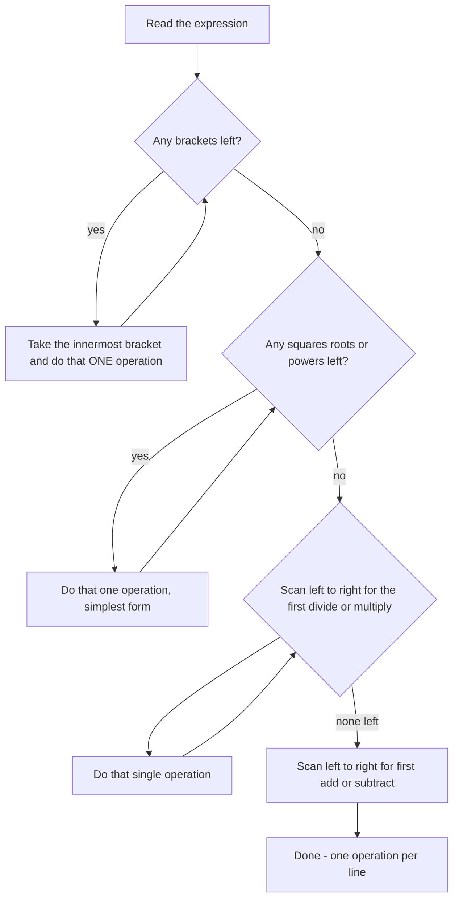

# Simplification & BODMAS

Simplification is where arithmetic stops being arithmetic and starts being a rule. Every other quantitative topic — averages, interest, mensuration, data interpretation — eventually asks you to reduce a nested expression to a single number, and the reduction order is the only thing between you and the answer. BODMAS takes about forty minutes to learn properly and saves a mark on almost every question you attempt, because most wrong answers in this topic are ordering errors rather than arithmetic errors.

### 🟢 Lite — Quick Review (1h–1d)

**The order, highest priority first**

| Rank | Operation | Symbol | Note |
| --- | --- | --- | --- |
| 1 | Brackets | ( ) { } [ ] | Innermost first, always |
| 2 | Orders | ², ³, √, ⁿ√ | Powers and roots, same rank |
| 3 | Division and Multiplication | ÷, × | **Equal rank — left to right** |
| 4 | Addition and Subtraction | +, − | **Equal rank — left to right** |

**The one sentence that settles most arguments:** BODMAS is Brackets, Orders, then the rest — and within a rank, strictly left to right. The letters M and D in "BODMAS" carry no extra authority; ÷ and × are the same level, and so are + and −.

**30-second example.** Simplify 3 + 6 × (5 − 2)² ÷ √16.
(i) Brackets: 5 − 2 = 3. (ii) Orders: 3² = 9, √16 = 4. (iii) Left to right: 6 × 9 = 54, 54 ÷ 4 = 13.5. (iv) Last step: 3 + 13.5 = **16.5**.

**Rules that pay for themselves**

- **All bracket types nest the same way.** () inside {} inside [] — always resolve the innermost surviving bracket first, whatever shape it is.
- **A fraction bar is a bracket.** (a + b)/(c − d) means finish the top and the bottom before you divide.
- **−(−x) = +x**, and a minus sign sitting in front of a bracket flips every sign inside: −(2a − 3b + 4c) = −2a + 3b − 4c.
- **(−3)² = 9 but −3² = −9.** The bracket is the whole difference.
- **Distribute to avoid big numbers:** 1008 × 99 = 1008 × (100 − 1) = 100800 − 1008, which is easier than multiplying a four-digit number by a three-digit one.
- **Perfect squares and cubes collapse first:** √144 = 12, 5³ = 125. Never carry a surd deeper into an expression than you have to.

**Memory trick.** **"Big Owls Drive Motorcycles And Scooters."** B-rackets, O-orders, D/M and A/S at the same rank, and the mnemonic itself does not tell you the order within a rank — the left-to-right rule does.

### 🟡 Standard — Regular Study (2d–2mo)

#### Why BODMAS exists at all

Without a convention, "3 + 4 × 2" is ambiguous: read strictly left to right it is (3 + 4) × 2 = 14; apply multiplication first it is 3 + 8 = 11. Both are defensible, so the convention has to be agreed rather than derived. BODMAS is that agreement. The practical consequence is that **an expression is not a queue of things to be done in the order written** — it is a structure, and you evaluate it from the highest-priority operation that remains.

#### The three bracket shapes, and why the shape does not matter

Parentheses ( ), braces { } and square brackets [ ] are three notations for the same idea. When they nest, you do not have to respect a fixed order among the shapes — you respect the **nesting**. Take {2 + [3 × (4 + 5)]}: (4 + 5) = 9, then 3 × 9 = 27, then 2 + 27 = 29. A mistake students make here is treating { } as "outer" and therefore "last" even when a ( ) sits outside it. The rule is positional, not typographic: **whichever bracket is currently innermost goes first**, regardless of shape.

#### The identities that make big numbers small

| Identity | Use it when |
| --- | --- |
| a ÷ b × c = (a ÷ b) × c | Left-to-right is mandatory, not optional |
| a − b + c = (a − b) + c | Same rule at the lower rank |
| (a + b)² = a² + 2ab + b² | Expanding a squared bracket |
| a² − b² = (a + b)(a − b) | Difference of two squares, for factorising |
| √(a × b) = √a × √b | a, b both non-negative |
| a × (b + c) = ab + ac | Distributing to skip a bracket |
| (a + b)(a − b) = a² − b² | The same identity, used backwards |

These are the same fact used in different directions. a² − b² = (a + b)(a − b) is what you reach for when a number is "almost a square" — 10³ − 8³ factorises instantly, while direct cubing does not.

#### Worked Example — a four-layer nested expression

**Q.** Simplify 48 ÷ {5 − [3 × (2 + 1)]}

- Step 1, innermost: (2 + 1) = 3
- Step 2: [3 × 3] = 9
- Step 3: {5 − 9} = −4
- Step 4: 48 ÷ (−4) = **−12**

A negative divisor is perfectly legal, and stopping because "the bracket has gone negative" is how people lose this mark.

#### Worked Example — the identity shortcut

**Q.** Evaluate 999 × 7 + 999 × 3.

Standard route: 999 × 7 = 6993, 999 × 3 = 2997, sum = 9990.
Shortcut: 999 × (7 + 3) = 999 × 10 = 9990. Same answer, and the second route needs one multiplication instead of two. Whenever the same number appears as a factor in several terms, look for the distributive law before you start multiplying.

#### Worked Example — surds that cancel

**Q.** Simplify 1/(√5 + √3).

Multiply top and bottom by the conjugate: (1 × (√5 − √3)) / ((√5 + √3)(√5 − √3)) = (√5 − √3)/(5 − 3) = (√5 − √3)/2. The rule generalises — any expression of the form a + √b in a denominator is handled by multiplying by the conjugate a − √b, which always produces a rational denominator.

### 🔴 Extended — Deep Study (3mo+)

#### The inside-out discipline

For an expression like 2 × { [(3 + 4)² − 5] + 6 }, each step removes exactly one layer: (3 + 4) = 7 → 7² = 49 → 49 − 5 = 44 → 44 + 6 = 50 → 2 × 50 = 100. The value of writing every intermediate line is not neatness. It is that **each step is checkable**. If you try to do two layers at once, a sign error inside a bracket propagates silently to the end, and you cannot tell which layer produced it. Write one operation per line.

#### Orders: powers, roots and the sign trap

Orders sit at rank 2, above ÷ and ×. The distinction that costs marks is between a bracket and a bare sign: **(−3)² = 9** because the bracket is the base, while **−3² = −9** because the square applies to 3 and the minus is outside. The same applies to roots: −√9 is −3, not ±3. An even power kills the sign, an odd power keeps it — 2⁴ = 16 and (−2)⁴ = 16, but 2³ = 8 and (−2)³ = −8.

Surds inside larger expressions: pull perfect squares out immediately (√50 = 5√2, √72 = 6√2), and keep the expression surd-free for as long as possible. √2 + √8 = √2 + 2√2 = 3√2 is a two-line job; doing it in decimals is not.

#### Signs through brackets

A minus immediately outside a bracket distributes as a minus to every term inside: −(2a − 3b + 4c) = −2a + 3b − 4c. The pattern is minus, plus, minus — it alternates. This is the single most-missed step in simplification, and it is a two-second check: if you expand a bracket with a leading minus, count the signs. Two negatives in a row are a positive, so −(−4) = +4 and −3 × (−4) = +12.

#### Two checks that catch a wrong answer without redoing the work

**Modular check (casting out nines).** A number and its digit sum leave the same remainder when divided by 9. So the value of an expression must leave the same remainder mod 9 as the values of its terms — and if an answer choice has the wrong remainder, discard it without computing anything. In 3 + 6 × 9 ÷ 4, work with integers by clearing the decimal: multiply the whole expression by 4 to get 12 + 6 × 9 = 66, and the true value is 66 ÷ 4 = 16.5. Digit sum of 66 is 12, so 16.5 must satisfy 4 × 16.5 = 66 and 6 + 6 = 12 — it does. Applied consistently, this check eliminates an entire option list in seconds.

**Bound check.** Know roughly what the answer should be *before* you compute it. 18 − [24 ÷ {5 − (3 − 2)}] has a bracket that evaluates to 4 and a division giving 6, so the answer must be near 12; if your result is 1200 or 0.8, the mistake is structural, not arithmetic. Bounding takes three seconds and catches most errors.

#### Shortcuts that avoid large numbers

- **Distribute over a round number:** 1008 × 99 = 1008 × 100 − 1008.
- **Factor before multiplying:** 25 × 32 × 125 = (25 × 4) × (8 × 125) = 100 × 1000 = 100,000, with no three-digit multiplication at all.
- **Difference of squares:** 87² − 13² = (87 + 13)(87 − 13) = 100 × 74 = 7,400.
- **Approximation when options are far apart:** √1523 sits between 39² = 1521 and 40² = 1600, so √1523 ≈ 39 with no calculator. If two options differ by more than a few percent, an estimate is enough to choose.

#### Two practice problems with full working

**P1.** Simplify 18 − [24 ÷ {5 − (3 − 2)}]
(3 − 2) = 1 → {5 − 1} = 4 → [24 ÷ 4] = 6 → 18 − 6 = **12**.

**P2.** Find the value of 5 × { [(2³ + 3²) ÷ 7] − √16 }
2³ = 8, 3² = 9, so (8 + 9) ÷ 7 = 17/7. √16 = 4 = 28/7. Inside the braces: (17 − 28)/7 = −11/7. Multiply by 5: **−55/7**, that is −7 6/7.

**P3.** Which step is wrong? A student writes 288 ÷ 12 × 6 = 288 ÷ (12 × 6) = 4.
÷ and × are the same rank, so the leftmost operation is 288 ÷ 12 = 24, and 24 × 6 = **144**. The error is in treating the two symbols as different ranks. The value 4 is a perfectly calculated answer to a different expression.

### 🧠 Memory Anchors

- **"Big Owls Drive Motorcycles And Scooters."** B, O, then two equal-rank pairs — the mnemonic is about ranks, and the rule inside a rank is always left to right.
- **"One operation, one line."** The single habit that prevents nearly every error in this topic.
- **"Innermost wins."** Not parentheses-first, not braces-first: whichever bracket is currently deepest.
- **"Minus flips the whole bracket."** −(a − b + c) = −a + b − c — the signs alternate.
- **"Even powers forgive, odd powers keep."** (−2)⁴ = 16, (−2)³ = −8.
- **"Divide the value by the fraction."** 6 ÷ (2/3) = 9. Dividing *by* a fraction means multiplying by its reciprocal.
- **Flashcard Q&A:**
  - *12 ÷ 4 × 3?* → 9, left to right. 12 ÷ (4 × 3) = 1 is the trap.
  - *2ⁿ × 2³?* → 2ⁿ⁺³, add the exponents.
  - *√144 + √81?* → 12 + 9 = 21; collapse roots first.
  - *−3² vs (−3)²?* → −9 vs 9.
  - *1/(√5+√3)?* → (√5−√3)/2, multiply by the conjugate.
  - *288 ÷ 12 × 6?* → 24 × 6 = 144.

### 🎯 Exam Traps & Error Log

1. **Doing all multiplications before all divisions.** ÷ and × are the same rank. 12 ÷ 4 × 3 = 9, not 1. This is the single most common error in the chapter.
2. **Reading M before D because M comes before D in the letters.** The spelling of the mnemonic is not the rule; the equal rank is.
3. **Treating { } as outermost by shape rather than by position.** If a ( ) sits outside a { }, the parentheses are resolved first.
4. **Ignoring a negative bracket result.** 48 ÷ {5 − 9} is 48 ÷ (−4) = −12. Brackets may go negative, and that is legal.
5. **Writing −3² = 9.** The square binds to 3, not to −3. Only (−3)² = 9.
6. **Forgetting to distribute the minus sign across a bracket,** or distributing it to only the first term. −(2a − 3b + 4c) alternates.
7. **Dividing by the numerator instead of inverting.** (a + b)/(c − d) needs the top and bottom finished separately; a fraction bar is a bracket, not a multiply.
8. **Refusing to divide by a fraction.** a ÷ (b/c) = a × c/b, and 6 ÷ (2/3) = 9 is a whole number, which is a common multiple-choice answer.
9. **Carrying surds deeper than necessary.** √2 + √8 = 3√2; extracting first removes the decimal approximations that cause errors.
10. **Trusting a bracket result without checking the sign of the next operation.** Write the sign before you write the operation.

### 🧪 Self-Test — 8 Questions with Worked Answers

Do all eight on paper, one operation per line, before reading the solutions.

1. **Simplify 3 + 6 × (5 − 2)² ÷ √16.**
   Brackets: 5 − 2 = 3. Orders: 3² = 9, √16 = 4. Expression becomes 3 + 6 × 9 ÷ 4. Left to right: 6 × 9 = 54, then 54 ÷ 4 = 13.5. Finally 3 + 13.5 = **16.5**.
2. **Simplify 18 − [24 ÷ {5 − (3 − 2)}].**
   (3 − 2) = 1 → {5 − 1} = 4 → [24 ÷ 4] = 6 → 18 − 6 = **12**. Check by bounding: the bracket chain gives 4, the division 6, so the answer must be near 12.
3. **Evaluate 288 ÷ 12 × 6.**
   ÷ and × share a rank, so left to right: 288 ÷ 12 = 24, then 24 × 6 = **144**. The tempting wrong answer is 288 ÷ (12 × 6) = 4, which changes the expression.
4. **If (x + 5)² = x² + kx + 25, find k.**
   Expand: (x + 5)² = x² + 2×5x + 25 = x² + 10x + 25. Comparing with x² + kx + 25 gives **k = 10**. The constant term 25 already matches, which is a quick confirmation that the expansion is right.
5. **Find −(2a − 3b + 4c) for a = 1, b = 2, c = 3.**
   Inside the bracket: 2(1) − 3(2) + 4(3) = 2 − 6 + 12 = 8. Then −(8) = **−8**. Doing it in one line: −2a + 3b − 4c = −2 + 6 − 12 = −8, the same value, and the sign pattern minus-plus-minus is the check that you distributed correctly.
6. **Find the value of 5 × { [(2³ + 3²) ÷ 7] − √16 }.**
   2³ = 8, 3² = 9, so the bracket's numerator is 8 + 9 = 17 and 17 ÷ 7 stays as the fraction 17/7. √16 = 4 = 28/7. Inside the braces: (17 − 28)/7 = −11/7. Times 5: **−55/7**, that is −7 6/7.
7. **A student writes 12 − 4 + 3 = 12 − (4 + 3) = 5. What is the correct value, and what is the general rule?**
   + and − are the same rank, so read left to right: (12 − 4) + 3 = 8 + 3 = **11**. The student treated the lower rank as a single block instead of a sequence. The same error gives 12 + 4 − 3 = 13, not 12 + (4 − 3) = 13 — that one agrees by luck, which is exactly why the rule must be applied rather than guessed.
8. **Estimate √1523 without a calculator, and say which integers it lies between.**
   39² = 1521 and 40² = 1600, so 39 < √1523 < 40 and the value is just above 39 — approximately **39.02**, so 39 is the right choice among options like 38, 39, 40, 51. Note that 39² = 1521 is itself the giveaway: 1523 is 2 above a perfect square, so the root is 2/(39+40) ≈ 0.025 above 39.

### 💡 Pro Tips

1. **One operation per line, always.** It costs three extra seconds and it converts an untraceable wrong answer into a one-line correction.
2. **Write the sign before the operation.** When a bracket turns negative, record the minus immediately; that is where simplification errors actually live.
3. **Read the whole expression before you touch it.** The first division is often to the right of a multiplication you would have done first if you had started at the left edge.
4. **Look for a distributable common factor** before multiplying. Two products with a shared number collapse in one step.
5. **Bound the answer first.** Decide roughly what the result should be, then compute. It turns a silent structural error into an obvious one.
6. **Extract perfect squares and cubes the moment you see them,** so the rest of the arithmetic stays exact.
7. **Keep casting-out-nines in your back pocket** for the long expressions where one slip in the middle would be invisible.
8. **Practise the three bracket types together in every practice set.** Nesting all three is where the topic is actually tested, and mixed-practice is the only way to stop reading brackets by shape.

## Continue your study

- **[View this topic in your CUET UG roadmap](/roadmap/?exam=cuet&duration=1mo)** — see where "Simplification & BODMAS" fits in your personalised plan
- **[Build a quick revision plan](/roadmap/?exam=cuet&duration=1d)** — 1-day sprint covering highest-weight topics
- **[CUET UG exam overview](/exams/cuet/)** — pattern, eligibility, and syllabus
- **[All Quantitative Aptitude notes](/notes/cuet/quantitative-aptitude/)** — browse sibling topics in this subject

*Content adapted based on your selected roadmap duration. Switch tiers using the selector above.*
