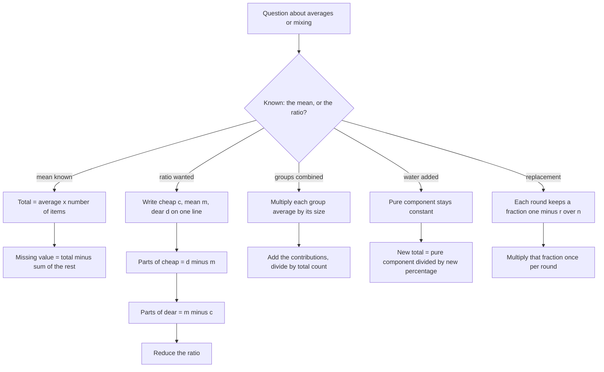

# Average, Mixture & Alligation

Averages and mixtures are the same idea seen from two ends. An average asks "what is the fair share of this group?"; a mixture asks "in what ratio do I combine two things to get a target?" Between them they cover weighted averages, missing-value questions, alloys, acid mixtures, repeated replacement, and the single most useful diagram in commercial arithmetic. Two rules carry the whole topic: **count what each group contributes before you divide**, and **the mean always lies between the extremes**.

### 🟢 Lite — Quick Review (1h–1d)

**The five formulas that answer almost everything**

| Formula | Use it for |
| --- | --- |
| Average = Sum ÷ Number | The central value of any group |
| Sum = Average × Number | Reversing the average |
| Missing value = (Average × n) − Sum of the rest | One unknown in a group |
| Weighted average = (n₁a₁ + n₂a₂ + …) ÷ (n₁ + n₂ + …) | Groups of unequal size |
| Alligation ratio = (d − m) : (m − c) | Mixing cheap and dear to get mean m |

**Alligation, in one line.** Cheap on the left, mean in the middle, dear on the right. The difference on the dear side, d − m, is the number of parts of the **cheap** ingredient; the difference on the cheap side, m − c, is the number of parts of the **dear** ingredient. The differences are written on the opposite side from the ingredient they measure. Prices ₹30 and ₹50 to reach ₹40: differences 10 and 10, so the ratio is **1 : 1**.

**30-second example.** The average of 4, 8, 12 and 16 is (4 + 8 + 12 + 16) ÷ 4 = 40 ÷ 4 = **10**.

**The three things students get wrong**

- **Averaging two averages.** (60 + 80)/2 = 70 is wrong unless both groups are the same size. Group sizes are weights, and you must multiply before you divide.
- **Reading the alligation difference on the wrong side.** The bigger the gap to the mean, the smaller the quantity you need of that ingredient.
- **Forgetting that a ratio from alligation is a ratio of quantities,** not of values or of prices. If you want a value ratio, multiply each quantity by its price.

### 🟡 Standard — Regular Study (2d–2mo)

#### Average as fair share

Five students score 60, 70, 80, 90, 100. The sum is 400 over 5 students, so the average is 80. Every student effectively scored 80. That interpretation is what makes the formula obvious: the average redistributes the total as if every member had received exactly the same amount.

This also gives the fastest missing-value route. If four numbers average 20 and you need the fifth, do not solve anything — the total must be 5 × 20 = 100, and the fifth is 100 minus the other four. Write the total, subtract, done.

#### Weighted average: the formula that matters most

Group A has 10 students averaging 60; Group B has 20 students averaging 80. You cannot take (60 + 80)/2 = 70, because the 20 students in B carry double the weight. Each group contributes its size times its average to the grand total: (10 × 60) + (20 × 80) = 600 + 1600 = 2200, spread over 30 students, giving **73.33**. Notice that the answer is closer to 80 than to 60 — which is exactly what the larger group should do, and a quick sanity check that costs nothing.

The general rule: the combined average always lies between the two group averages, closer to whichever average belongs to the larger group. If a question produces a combined average outside that range, you have made an arithmetic or a weighting error before you have made any other kind.

#### Alligation, and why the cross works

Suppose you mix x kg at ₹c per kg with y kg at ₹d per kg to get a mean of ₹m. Then m = (cx + dy)/(x + y), so m(x + y) = cx + dy, which rearranges to y(m − d) = x(c − m). Multiply both sides by −1 and read off the ratio: **x : y = (d − m) : (m − c)**. The quantity of the cheap ingredient is proportional to how far the dear ingredient sits above the mean, and vice versa. That is the whole derivation — the cross-diagram is just this equation drawn.

The practical consequence is the sanity check that catches most errors: the ingredient that is further from the mean is needed in the *smaller* quantity. If a rule tells you to add four times as much of the cheapest thing as of the most expensive one to land on a mean close to the expensive one, the rule has been applied backwards.

#### Worked Example — cost of a mixture

**Q.** A merchant mixes 20 kg of tea at ₹200/kg with 30 kg of tea at ₹300/kg. What is the price of the mixture per kg?

- Cost of the cheap tea: 20 × 200 = ₹4,000
- Cost of the expensive tea: 30 × 300 = ₹9,000
- Total cost = ₹13,000 over a total weight of 50 kg
- Price per kg = 13,000 ÷ 50 = **₹260/kg**

Notice the trap: the simple average of 200 and 300 is 250, but the answer is 260 because the expensive tea is present in the larger quantity. A ₹50 error on a one-mark question, entirely from ignoring weights.

#### Worked Example — how much water to add

**Q.** A vessel holds 40 litres of mixture containing 30% spirit. How much water must be added to make it 20% spirit?

The quantity of spirit never changes — nothing is removed, only water added. Spirit = 30% of 40 = 12 litres. If 12 litres is to become 20% of the new total, the new total is 12 ÷ 0.2 = 60 litres. Water added = 60 − 40 = **20 litres**.

The single sentence that makes this chapter work: **adding a diluting liquid does not change the quantity of what is being diluted.** Whenever you see "how much water/salt is added", fix the pure component first and let it tell you the new total.

#### Worked Example — repeated replacement

**Q.** A vessel has 60 litres of milk. 12 litres are drawn off and replaced with water, and this is done twice. How much milk remains?

The vessel always holds 60 litres, and each round removes 12/60 = 1/5 of whatever is in it, so 4/5 of the milk survives each time. After one round: 60 × 4/5 = 48 litres. After two: 48 × 4/5 = **38.4 litres**.

Replacement is multiplicative, never additive, and that is the entire trap. The common wrong answer of 60 − 2×12 = 36 assumes the second removal takes 12 litres of *milk* out of a vessel that is now mostly water — it does not. The second removal takes 12 litres of mixture, of which only 4/5 × 12 = 9.6 litres is milk.

### 🔴 Extended — Deep Study (3mo+)

#### Alloy problems, where alligation earns its keep

A jeweller has gold of 80% purity and gold of 95% purity and needs 100 g of 88% pure gold. Alligation: cheap = 80, mean = 88, dear = 95. Ratio = (95 − 88) : (88 − 80) = 7 : 8. Total 15 parts over 100 g, so each part is 100/15 g. The 80% gold needed is 7 × 100/15 = **46.67 g** and the 95% gold is 8 × 100/15 = **53.33 g**. Verify: 0.80 × 46.67 = 37.33 and 0.95 × 53.33 = 50.67, total 88.0 g of pure gold out of 100 g. Always run this verification — it takes ten seconds and confirms both the ratio and the interpretation.

The same machinery handles milk and water (water is the 0% ingredient, so it always sits on the cheap side), acid mixtures, and blended fuel. If one ingredient is pure water, the ratio simplifies: 20% acid and 50% acid to reach 30% gives (50 − 30) : (30 − 20) = 20 : 10 = **2 : 1**, more of the weaker acid, as it must be.

#### Why the mean can never leave the range

A mean price of ₹35 between ₹20 and ₹30 is impossible, and knowing that instantly can save a minute of hunting. More usefully, the reverse constraint is a strong filter: if a proposed ratio does not put the mean between the extremes, the ratio is wrong before you compute anything.

There is one family of exceptions to be aware of — the mean of a *frequency distribution* need not lie at a data value, and weighted means can sit outside the unweighted range of the group averages in the sense of not being a data point. But for every mixture, ratio and combined-average question in this topic, the mean lies strictly between its two components unless the quantities of one component are zero.

#### Repeated values, and the average that will not move

Adding a number equal to the current average does not change the average. This is the useful fact behind a whole family of questions: "the average of 5 numbers is 20; if 20 is added to the set, what is the new average?" stays 20. More generally, if you add k copies of the average, the average is unchanged; if you add k copies of some other number x, the new average is (n·ā + kx)/(n + k).

For a set with repetitions, count every occurrence: the average of 5, 5, 5, 7, 7, 8 is 37 ÷ 6 = 6.17, not 6. A set written with commas is a list of six values, not three.

#### Problems that mix two ideas

1. **Sequential average change.** The average of 30 students is 45 kg. One weighing 60 kg leaves and is replaced, and the new average is 44 kg. Total before = 1,350 kg; after the departure, 1,290 kg; new total required = 30 × 44 = 1,320 kg, so the newcomer weighs **30 kg**. Two totals, one subtraction.
2. **Adding a group rather than replacing.** The average age of 30 students is 14 years. Including the teacher makes it 15 years over 31 people. Students total 420; all 31 total 31 × 15 = 465; the teacher is **45 years**. The whole question is "has the count changed, and by how much".
3. **Ratio of values rather than quantities.** Articles at ₹480 and ₹520 mixed in the ratio 5 : 3 have a mean price of (5 × 480 + 3 × 520)/8 = 3960/8 = **₹495**. A ratio from alligation is always a ratio of quantities; convert before you average.

#### Two routes to the same answer

**Missing value:** the standard route is Total = Average × n, then subtract the known sum. There is no shorter route, and the reason students lose marks is not the method but forgetting that n counts the missing value too.

**Alligation with three components.** The two-ingredient cross does not generalise, so use algebra and choose the smallest quantity as the free variable. To get 50% by mixing 20%, 40% and 60% acid, set the total to 100 units and let y be the 40% acid. Then x + y + z = 100 and 0.2x + 0.4y + 0.6z = 50. Substituting x = 100 − y − z gives 0.2(100 − y − z) + 0.4y + 0.6z = 50, which simplifies to 20 + 0.2y + 0.4z = 50, so y + 2z = 150. Choose y = 0 and z = 75, giving x = 25 — a mixture of 20% and 60% in the ratio **1 : 3** reaches 50% without any 40% acid at all. Verify: (1 × 20 + 3 × 60)/4 = 200/4 = 50 ✓. The lesson is that a three-component question usually has a family of solutions, and the answer options will pick out one of them; solving the linear pair takes two minutes and removes all guesswork.

### 🧠 Memory Anchors

- **"Fair share."** Average = total ÷ number. It redistributes the sum as if everyone received the same.
- **"Weight before you average."** Multiply each group's average by its size, then add, then divide by the total count.
- **"Opposite side of the cross."** The gap d − m tells you how much *cheap* to use, because the cheap ingredient must be further away to balance.
- **"Further from the mean, smaller the quantity."** The single alligation intuition, and the fastest way to spot a reversed ratio.
- **"Addition keeps the pure part."** Adding water does not touch the salt or the spirit — fix the pure amount, then read off the new total.
- **"Replacement is a multiplier."** Each round multiplies by (1 − r/n); it never subtracts a fixed amount.
- **"The mean lives between the extremes."** No exceptions in this topic — use it to reject nonsense options.
- **Flashcard Q&A:**
  - *10 items at 60 plus 20 items at 80?* → (600 + 1600)/30 = 73.33, not 70.
  - *₹30 and ₹50 to reach ₹40?* → (50 − 40) : (40 − 30) = 1 : 1.
  - *20% and 50% to reach 30%?* → 20 : 10 = 2 : 1.
  - *60 L, 12 L replaced twice?* → 60 × (4/5)² = 38.4 L.
  - *5 numbers average 20, add 20?* → still 20.

### 🎯 Exam Traps & Error Log

1. **Taking the simple average of two group averages.** Legal only when the groups are the same size; otherwise the answer is wrong by an amount proportional to the size difference.
2. **Reading an alligation difference on the ingredient's own side.** 10 parts of cheap and 10 parts of dear is only right when the gaps are equal; in general the difference is written opposite.
3. **Forgetting that n changes when a member is added or removed.** Adding a teacher makes it 31 people, not 30, and the total changes too.
4. **Using the old count for the new total.** In a replacement question the new average applies to the same count, but the new *sum* is what you solve for.
5. **Subtracting the removed amount twice in a replacement problem.** 60 − 12 − 12 = 36 ignores that the second removal takes mixture, not pure milk.
6. **Treating a percentage as an amount.** "20% spirit in 40 litres" is 8 litres of spirit, not 20.
7. **Assuming the mean can sit outside the two component values.** A mixture's mean is always between its extremes; anything else signals an error.
8. **Confusing a ratio of quantities with a ratio of values.** If the question asks for the ratio of *money*, multiply each quantity by its unit price first.
9. **Reducing the alligation ratio incorrectly,** e.g. writing 20 : 10 as 20 : 1. Divide both sides by the same number every time.

### 🧪 Self-Test — 8 Questions with Worked Answers

Work all eight before reading a solution. For every mixture question, verify the answer by plugging it back in.

1. **What is the average of 4, 8, 12 and 16?**
   Sum = 40, count = 4, so 40 ÷ 4 = **10**. The value 10 is also one of the data points here, which is a coincidence, not a rule — the average of 2, 4, 6, 9 is 5.25 and is not in the set.
2. **The average of five consecutive even numbers is 26. Find them.**
   In an arithmetic progression of five terms the middle term equals the mean, so the middle number is 26 and the series is 22, 24, **26**, 28, 30. Check: sum = 130, and 130 ÷ 5 = 26 ✓.
3. **Ten students average 60 kg and twenty students average 80 kg. What is the combined average?**
   Contribution of the first group: 10 × 60 = 600 kg. Second group: 20 × 80 = 1,600 kg. Total weight 2,200 kg over 30 students, so 2200 ÷ 30 = **73.33 kg**. It sits closer to 80 than to 60, which is what the larger group should produce.
4. **A batsman scores 24, 18, 30, 12 and 36 in five innings. What must he score in the sixth to raise his average to 28?**
   Runs so far = 24 + 18 + 30 + 12 + 36 = 120. Required total for six innings at 28 = 6 × 28 = 168. Sixth-innings score = 168 − 120 = **48**.
5. **In what ratio must rice at ₹40/kg be mixed with rice at ₹60/kg to obtain a mixture at ₹50/kg?**
   Cheap 40, mean 50, dear 60. Parts of cheap = 60 − 50 = 10. Parts of dear = 50 − 40 = 10. Ratio **1 : 1**. Verify: the mean of two equal quantities is their simple average, (40 + 60)/2 = 50 ✓.
6. **In what ratio must 20% acid and 50% acid be mixed to get 30% acid?**
   Parts of the weaker acid = 50 − 30 = 20. Parts of the stronger acid = 30 − 20 = 10. Ratio **2 : 1**, that is 2 of the 20% acid to 1 of the 50% acid. Verify: (2 × 20 + 1 × 50)/3 = 90/3 = 30 ✓. The weaker acid is needed in double quantity because it is further from the target.
7. **A vessel holds 60 litres of milk. 12 litres are drawn off and replaced with water, and the process is repeated once. How much milk is left?**
   Each round keeps (60 − 12)/60 = 4/5 of the milk present. After one round: 60 × 4/5 = 48 litres. After two: 48 × 4/5 = **38.4 litres**. The additive answer 36 litres is wrong because the second 12 litres drawn is mostly water.
8. **The average age of 30 students is 14 years. Including the teacher raises the average to 15 years. How old is the teacher?**
   Students' total age = 30 × 14 = 420 years. With the teacher there are 31 people, so the total is 31 × 15 = 465 years. Teacher's age = 465 − 420 = **45 years**. Two different counts, two different totals — count the change before you compute anything.

### 💡 Pro Tips

1. **Draw the alligation cross on rough paper every time,** even when the numbers look obvious. It costs five seconds and it makes a reversed ratio impossible.
2. **Write the units on every intermediate value** — kg, litres, ₹, years. A misplaced unit is the most common silent error in mixture problems.
3. **Always verify an alligation answer** by substituting the quantities back into the weighted average. Ten seconds, and it catches both a reversed ratio and an arithmetic slip.
4. **Check the range before you compute.** If the proposed mean sits outside the two component values, stop — the setup is wrong.
5. **In weighted averages, compute the total first,** then the count, then divide once. Two divisions invite rounding errors.
6. **For missing-value questions, write Total = Average × n on paper before you subtract anything.**
7. **Use the (1 − r/n)ⁿ form for replacement** so that a third or fourth round costs you the same effort as the second.
8. **Fix the pure component first** in any "add water" or "evaporate" question; the new total falls out of it in one line.

## Continue your study

- **[View this topic in your CUET UG roadmap](/roadmap/?exam=cuet&duration=1mo)** — see where "Average, Mixture & Alligation" fits in your personalised plan
- **[Build a quick revision plan](/roadmap/?exam=cuet&duration=1d)** — 1-day sprint covering highest-weight topics
- **[CUET UG exam overview](/exams/cuet/)** — pattern, eligibility, and syllabus
- **[All Quantitative Aptitude notes](/notes/cuet/quantitative-aptitude/)** — browse sibling topics in this subject

*Content adapted based on your selected roadmap duration. Switch tiers using the selector above.*
