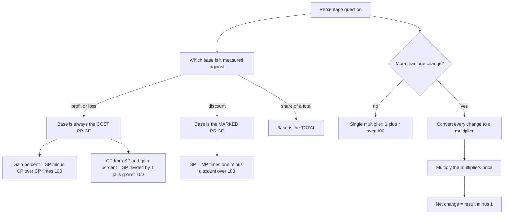

# Percentage & Profit-Loss

Percentage is a fraction with the denominator removed, and every question in this topic is a question about *which base you are measuring against*. Once that choice is automatic, the arithmetic is trivial; while it is not, the same numbers produce answers that are wrong by 20% or more and look entirely reasonable. This note is organised around that single idea, because percentages, profit, loss, discount, markup, depreciation and successive change are all the same operation wearing different clothes.

### 🟢 Lite — Quick Review (1h–1d)

**Percentage itself**

- % of a number = (percentage ÷ 100) × number. 12% of 250 = (12 ÷ 100) × 250 = **30**.
- Percentage increase = (change ÷ original) × 100. Percentage decrease is the same with a negative sign.
- x% of y always equals y% of x, because both are xy/100. Options that imply otherwise are traps.
- A 100% increase means doubling, not "increasing by the same amount".

**Profit and loss — every percentage is measured against the Cost Price**

| Quantity | Formula | Base |
| --- | --- | --- |
| Gain% | (SP − CP) ÷ CP × 100 | **CP** |
| Loss% | (CP − SP) ÷ CP × 100 | **CP** |
| Discount% | (MP − SP) ÷ MP × 100 | **MP**, not CP |
| SP from CP and gain | CP × (1 + gain/100) | — |
| CP from SP and gain | SP ÷ (1 + gain/100) | — |

**30-second example.** An article costs ₹600 and is sold for ₹750. Gain = 750 − 600 = ₹150, and 150 ÷ 600 × 100 = **25% gain**. Had you divided by 750 you would have got 20%, a number that looks fine and is not the answer.

**Successive changes: multiply the multipliers, never add the percentages.** +20% then −10% gives 1.20 × 0.90 = 1.08, a net **increase of 8%**. Two discounts of 20% and 10% on a ₹1,000 marked price give 800 × 900 = **₹720**, an overall discount of 28%, not 30%.

**MP, SP, CP in one line each.** CP is what it cost you. MP is the tag. SP is what the customer pays. Profit is always CP against SP; a discount is always MP against SP.

### 🟡 Standard — Regular Study (2d–2mo)

#### Why the base decides the answer

"Increased by 25%" does not mean "plus a quarter of itself" as a *fixed* amount — it means the new value is 1.25 times the old one, and the quarter is taken from the old value. Once the value changes, every later percentage is a fraction of a different number. This is the whole reason successive-percentage questions are harder than they look, and it is why you must convert each change into a **multiplier** before combining it:

- increase by r% → multiply by (1 + r/100) = (100 + r)/100
- decrease by r% → multiply by (1 − r/100) = (100 − r)/100

Multipliers are the honest representation of a percentage, and once everything is a multiplier the arithmetic is a single multiplication.

#### Successive change, worked two ways

Take ₹1,000, increased by 20% and then decreased by 10%.

Multiplier route: 1000 × 1.20 = 1200, then 1200 × 0.90 = **1080**. Net change +8%.

Shortcut route: for two changes, net% = r₁ + r₂ + (r₁ × r₂)/100 = 20 − 10 + (20 × −10)/100 = 10 − 2 = **+8%**. The cross term is what makes this work: it is +r₁r₂/100 when the two changes have the *same* sign, and −r₁r₂/100 when they differ in sign. Add it and you can do two-step percentage problems in your head; forget it and you will be tempted to write 20 − 10 = 10%.

#### A rise and fall of the same size never cancel

Increase by 25%, then decrease by 25%: 1.25 × 0.75 = 0.9375, a net **decrease of 6.25%**. The decrease is applied to the larger, post-increase number, so it removes 0.25 × 1.25 = 0.3125 while the increase added only 0.25. The gap of 0.0625 is the loss.

The general statement: after a rise of x% and a fall of x%, the value stands at 1 − (x/100)² of the original. At 50% that leaves exactly a quarter; at 100% it leaves nothing. Inverting a change has its own rule: to undo a doubling you need a 50% fall, not a 100% fall.

#### Markup, discount, and where profit appears

A shop does three separate things: it buys at CP, it sets a **marked price**, and it sells at SP after any discount. Profit compares SP to CP. Discount compares SP to MP. Because the MP can be set at any markup above CP, a large discount and a large profit can coexist without contradiction — and questions that give all three of CP, MP and SP are testing whether you keep the three comparisons separate.

**Worked example.** An article costs ₹800. The shopkeeper marks it up by 40% and then offers 10% off.
- MP = 800 × 1.40 = **₹1,120**
- SP = 1120 × 0.90 = **₹1,008**
- The shopkeeper's gain is 1008 − 800 = ₹208, i.e. 26% on CP — even though the *discount* was only 10%. Never confuse the two percentages.

#### Mixture cost, then gain

Cost is a weighted average, and gain is measured against that cost. A trader mixes rice at ₹40/kg and ₹60/kg in the ratio 3 : 2, so 5 kg of mixture costs 3 × 40 + 2 × 60 = ₹240, that is **₹48/kg**. Selling at ₹55/kg gives a gain of ₹7 on ₹48, i.e. 7 ÷ 48 × 100 = **14.58%**. The tempting 20% comes from selling at 55 and comparing to 45, or from assuming a 10% gain on the base price.

### 🔴 Extended — Deep Study (3mo+)

#### Population growth and depreciation

Both are chained multipliers, and both are asked as "after n years".

Population 2,00,000 growing at 5% per annum: 2,00,000 × 1.05 = 2,10,000; × 1.05 = 2,20,500; × 1.05 = **2,31,525**. Three separate multiplications is slow, so use 1.05³ = 1.157625 and multiply once: 2,00,000 × 1.157625 = 2,31,525.

Depreciation is the same arithmetic with a smaller multiplier. A machine worth ₹1,00,000 depreciating at 20% per year is worth 1,00,000 × 0.80 = ₹80,000 after one year and 80,000 × 0.80 = **₹64,000** after two. If a question asks for the value after *n* years, work out 0.8ⁿ first — 0.8² = 0.64, 0.8³ = 0.512, 0.8⁴ = 0.4096 — and then multiply once.

#### Dishonest dealer problems

These give you the dealer's *apparent* quantity against the *true* one, and the gain follows directly.

- **False weight:** the dealer gives 900 g and charges for 1 kg. His cost is for 1 kg, his revenue is for 900 g, so his gain% = (1000 − 900)/900 × 100 = **11.11%**. The base is 900, not 1000, because the question asks how much he gained *on what he actually gave away*.
- **False measure:** the dealer "weighs" 1 kg as 900 g using a dishonest weight but the customer believes it is 1 kg — identical arithmetic.
- **Under-measuring the metre:** same structure, and worth recognising instantly from the shape of the question.

The one-sentence rule: **gain% = (amount received − amount given) ÷ amount given × 100.** Find what the customer thinks they are getting and what they actually get, and the question is solved.

#### Percentage points versus percentage change

These are different quantities and mixing them up costs a mark. A share rising from 20% to 25% has risen by **5 percentage points**, but that is a rise of (5 ÷ 20) × 100 = **25%** in relative terms. Likewise, an interest rate rising from 8% to 10% is a rise of 2 percentage points and 25% relative. Read the question's wording: "by how many percentage points" and "by what percentage" have different answers, and options for both are usually present.

#### Three more traps worth naming

- **A 50% loss followed by a 50% gain is not break-even.** 0.5 × 1.5 = 0.75, so you are 25% down overall. The same asymmetry shows up on a shop that discounts heavily and then "gives back" a percentage.
- **Discounts do not add.** Two discounts of 20% and 10% give 0.80 × 0.90 = 0.72, an overall discount of 28%.
- **The base changes with every step in a chain,** so the "net formula" r₁ + r₂ + r₁r₂/100 applies to exactly two changes. For three, either chain the multipliers or use (1 + r₁/100)(1 + r₂/100)(1 + r₃/100) directly.

#### Two full problems, start to finish

**P1.** A population of 2,00,000 increases at 5% per annum. What is the population after 3 years?
2,00,000 × 1.05 = 2,10,000 → × 1.05 = 2,20,500 → × 1.05 = **2,31,525**.
Check by the single-multiplier route: 1.05³ = 1.157625, and 2,00,000 × 1.157625 = 2,31,525, the same value.

**P2.** Rice at ₹40/kg and ₹60/kg is mixed in the ratio 3 : 2 and sold at ₹55/kg. Find the gain%.
Cost of 5 kg = 3 × 40 + 2 × 60 = ₹240 → ₹48/kg. Gain = 55 − 48 = ₹7. Gain% = 7 ÷ 48 × 100 = **14.58%**. The base is ₹48, the cost of what you sold — never ₹55, the price you got.

**P3.** A shopkeeper buys at ₹400, marks the price up by 50% and offers a 20% discount. What is the gain%?
MP = 400 × 1.5 = ₹600. SP = 600 × 0.8 = ₹480. Gain = 480 − 400 = ₹80, so 80 ÷ 400 = **20%**. Note the shopkeeper's 20% gain and the 20% discount are numerically equal and have nothing to do with each other — a good illustration of why the two percentages must be kept apart.

### 🧠 Memory Anchors

- **"CP is the base for profit. MP is the base for discount."** One sentence, and half the topic's errors disappear.
- **"Percent is a multiplier, not a subtraction."** +20% is ×1.20, never "minus 20".
- **"Multiply, never add, for successive changes."** 1.20 × 0.90 = 1.08, so +20% then −10% is +8%.
- **"Up then down by the same amount still loses."** 1.25 × 0.75 = 0.9375 — a 6.25% loss, because the fall came off a bigger base.
- **"Two discounts never add."** 20% and 10% is 28%, not 30%.
- **"Honest dealer: gain on what you actually gave."** (received − given) ÷ given.
- **"Points are not percent."** 20% → 25% is 5 points and 25% relative.
- **Flashcard Q&A:**
  - *SP 750, CP 600?* → 25% gain, base 600.
  - *₹800, +40% then −10%?* → 800 × 1.4 × 0.9 = ₹1,008.
  - *+20% then −10%?* → net +8%.
  - *CP from SP 1200 at 20% gain?* → 1200 ÷ 1.2 = ₹1,000.
  - *20% off then 10% off ₹1,000?* → ₹720, overall 28% off.
  - *900 g sold as 1 kg?* → (1000 − 900)/900 = 11.11% gain.

### 🎯 Exam Traps & Error Log

1. **Dividing the gain by the SP.** ₹150 on a sale of ₹750 is 20% of 750 and 25% of the ₹600 cost. Profit percentage is always over CP.
2. **Adding successive percentages.** +20% and −10% is +8%, not +10%. Same for two discounts: 20% and 10% is 28%.
3. **Assuming a rise and fall of equal size cancel.** They do not; the fall is applied to the increased value.
4. **Treating "20% of y" and "y% of 20" as different.** They are the same number, xy/100.
5. **Confusing the discount percentage with the profit percentage.** A 20% discount off a 50% markup yields a 20% profit — equal by coincidence, and only because the bases were chosen well.
6. **Computing CP as SP − gain% of SP.** It is gain% of CP, so divide: CP = SP ÷ (1 + g/100).
7. **Using the marked price as the cost price** when a question gives MP and SP and asks for profit. You cannot find profit at all without the CP.
8. **Ignoring the count change in a chain.** Three years of 5% growth is 1.05³, not 1.15 and not 1 + 3 × 0.05.
9. **Answering a percentage-point question with a relative percentage** (or the reverse).
10. **Setting up the alligation/weighted-average cost incorrectly for a mixture,** then computing a gain off the selling price instead of that cost.

### 🧪 Self-Test — 8 Questions with Worked Answers

Write your answer and your base before reading the solution.

1. **An article costs ₹600 and is sold for ₹750. What is the gain percentage, and what is the wrong answer that usually attracts?**
   Gain = 750 − 600 = ₹150. Gain% = 150 ÷ 600 × 100 = **25%**. The common wrong answer is 20%, which comes from 150 ÷ 750 — dividing by the selling price. The base for profit is always the cost.
2. **What is 12% of 250?**
   (12 ÷ 100) × 250 = 0.12 × 250 = **30**. The reverse check: 12% of 250 is 30, and 30 is 12% of 250 because 30/250 = 0.12.
3. **An article costs ₹800, is marked up by 40% and then discounted by 10%. Find the final selling price and the shopkeeper's gain percentage.**
   MP = 800 × 1.40 = ₹1,120. SP = 1120 × 0.90 = **₹1,008**. Gain = 1008 − 800 = ₹208, and 208 ÷ 800 × 100 = **26%**. The 10% discount and the 26% gain are both correct and measure different things.
4. **A price is increased by 20% and then decreased by 10%. What is the net change?**
   Multipliers: 1.20 × 0.90 = 1.08, so the net change is an **8% increase**. Check with the two-change formula: 20 − 10 + (20 × −10)/100 = 10 − 2 = 8. The 10% answer comes from subtracting the percentages, which is only valid on a common base.
5. **A price is increased by 25% and then decreased by 25%. Is the final price above, below, or equal to the original, and by how much?**
   1.25 × 0.75 = 0.9375, so the final price is **6.25% below** the original. The 25% fall was taken from 1.25 times the original, so it removed 0.3125 while the rise added only 0.25.
6. **Rice at ₹40/kg and ₹60/kg is mixed in the ratio 3 : 2 and sold at ₹55/kg. What is the gain percentage?**
   Cost of 5 kg = 3 × 40 + 2 × 60 = 120 + 120 = ₹240, so ₹48/kg. Gain = 55 − 48 = ₹7, and 7 ÷ 48 × 100 = **14.58%**. The base is the ₹48 cost of what was sold.
7. **An article is sold for ₹1,200 at a profit of 20%. Find the cost price.**
   SP = CP × 1.20, so CP = 1200 ÷ 1.20 = **₹1,000**. The common error is 1200 − 20% of 1200 = 960, which subtracts the percentage from the wrong base.
8. **A ₹1,000 article is discounted by 20% and then by a further 10%. What is the final price and the overall discount?**
   First discount: 1000 × 0.80 = ₹800. Second: 800 × 0.90 = **₹720**. The overall discount is (1000 − 720)/1000 = **28%**, not 30% — the second 10% applies to ₹800, not to ₹1,000.

### 💡 Pro Tips

1. **Name the base before you compute.** Write "CP = 600" next to the question and the right answer usually follows without thought.
2. **Convert every percentage to a multiplier the moment you see two of them.** 1.20 and 0.90 cannot be misread; "20% up, 10% down" can.
3. **Use the two-change net formula when it saves time** — r₁ + r₂ + r₁r₂/100 — but only for exactly two changes, and mind the sign of the cross term.
4. **For chains, compute the power first** (1.05³ = 1.157625) and multiply once instead of three times.
5. **Keep MP, SP and CP on separate lines of your rough work,** even when the numbers are small. Mixing two of them is the defining error of this topic.
6. **Check dishonest-dealer problems by asking what the customer actually received,** then take that as the base — it is nearly always the opposite of what students use.
7. **In a mixture question, find the cost per kg first,** with a weighted average, and only then compute the gain against it.
8. **Read the wording for "percentage points".** If the question says points, subtract; if it says percentage, divide by the old value.

## Continue your study

- **[View this topic in your CUET UG roadmap](/roadmap/?exam=cuet&duration=1mo)** — see where "Percentage & Profit-Loss" fits in your personalised plan
- **[Build a quick revision plan](/roadmap/?exam=cuet&duration=1d)** — 1-day sprint covering highest-weight topics
- **[CUET UG exam overview](/exams/cuet/)** — pattern, eligibility, and syllabus
- **[All Quantitative Aptitude notes](/notes/cuet/quantitative-aptitude/)** — browse sibling topics in this subject

*Content adapted based on your selected roadmap duration. Switch tiers using the selector above.*
