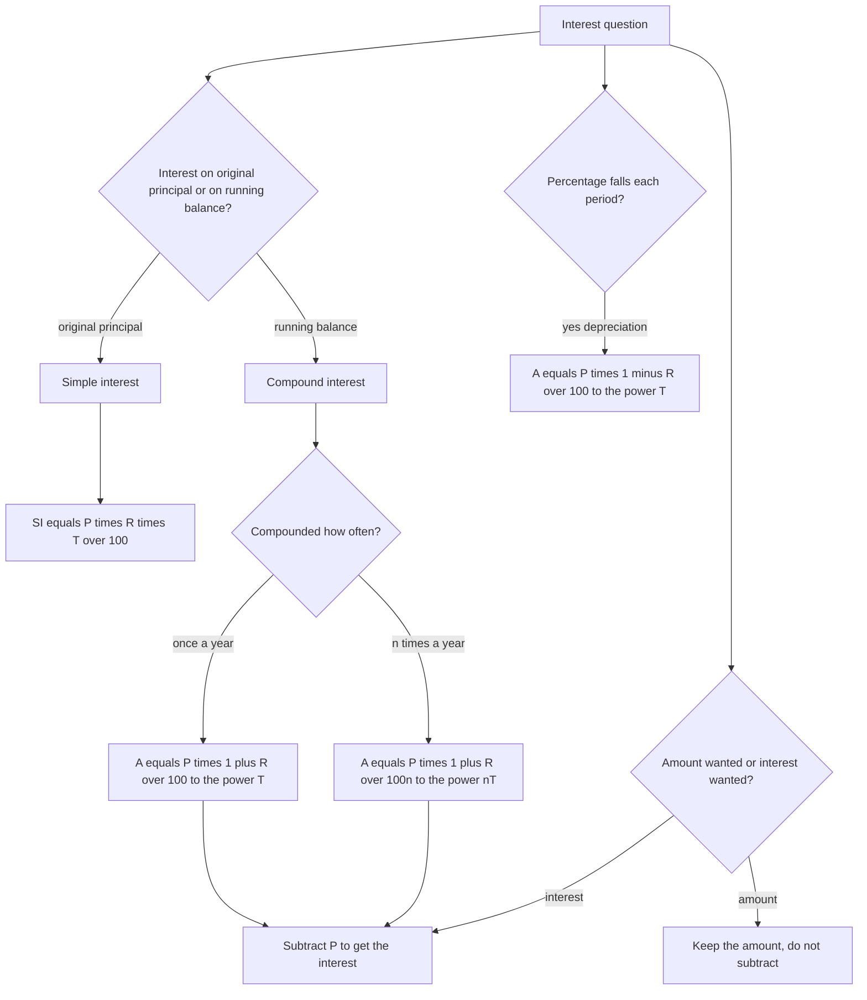

# Simple & Compound Interest

Interest is the price of money over time, and the whole topic turns on one question: **is the charge calculated on what you started with, or on what you have accumulated?** Simple interest always uses the original principal, so it grows in a straight line. Compound interest uses the running balance, so it curves upward and eventually dwarfs the simple case. Almost every question in this topic is a variation on that single distinction, and most of them can be answered by picking the right formula and doing one multiplication.

### 🟢 Lite — Quick Review (1h–1d)

**The formulas**

| Formula | Meaning |
| --- | --- |
| SI = (P × R × T) ÷ 100 | Simple interest |
| A = P(1 + RT/100) | Amount under simple interest |
| A = P(1 + R/100)^T | Amount under annual compounding |
| CI = A − P | Compound interest, interest part only |
| A = P(1 + R/(100n))^(nT) | Compounded n times a year |
| A = P(1 − R/100)^T | Depreciation, same as CI with a minus |

**30-second example.** SI on ₹5,000 at 6% per annum for 2 years: (5000 × 6 × 2) ÷ 100 = **₹600**. For 6 months, use T = 0.5, not 6 — the time must be in the same unit as the rate.

**The difference between CI and SI, memorised as a formula.** For 2 years the gap is P × (R/100)², because CI is P(R/100) + P(R/100)² while SI is P(R/100) + P(R/100). For 3 years the gap is P[(R/100)² + (R/100)³]. Every "find the sum given the difference between CI and SI" question is a one-line inversion of this.

**Two habits that prevent most errors**

- **CI is the interest, not the amount.** A = P(1 + R/100)^T gives the amount; subtract P for the interest. Reporting the amount where the interest is asked is the single most common error in this topic.
- **Convert the rate and the time together** whenever compounding is not annual. Half-yearly on 8% for 2 years means 4% per period for 4 periods, not 8% for 2.

**Memory trick.** SI is "**P R T** over 100" — three letters, one division, always linear. CI is "**P bracket 1 + R over 100, to the power T**" — the exponent is doing the work, because each period's amount becomes the next period's base.

### 🟡 Standard — Regular Study (2d–2mo)

#### Simple interest: a straight line you can draw

Borrow ₹10,000 at 8% per annum. The interest each year is 8% of ₹10,000 = ₹800, so every year is identical and the total is ₹800 × T. After 3 years: **₹2,400**, and the amount is ₹12,400.

Two consequences follow immediately. First, **the SI per year is constant**, so "interest in the nth year" is the same as in every other year — a question that looks harder than it is. Second, because the growth is linear, **doubling the time exactly doubles the SI**. Any question where doubling T does not double SI is not a simple-interest question.

#### Compound interest: the balance grows, so the charge grows

At 8% compounded annually on ₹10,000: year 1 interest ₹800, balance ₹10,800; year 2 interest is 8% of ₹10,800 = ₹864, balance ₹11,664; year 3 interest is 8% of ₹11,664 = ₹933.12, balance ₹12,597.12. The formula A = P(1 + R/100)^T reproduces this in one step: 1.08³ = 1.259712, and 10,000 × 1.259712 = **₹12,597**.

The gap between the two is interest on interest, and it is small over two years and enormous over thirty. ₹10,000 at 12% for 30 years is ₹46,000 under simple interest and about ₹2,99,600 under compound interest — roughly **six and a half times as much**, from an identical deposit. That ratio is why compounding is taught at all.

#### Worked Example — compound interest, two routes

**Q.** Find the compound interest on ₹20,000 at 10% per annum for 2 years, compounded annually.

*Year-by-year:* year 1 interest ₹2,000, balance ₹22,000; year 2 interest ₹2,200, balance ₹24,200. CI = 24,200 − 20,000 = **₹4,200**.

*By formula:* A = 20,000 × (1.1)² = 20,000 × 1.21 = ₹24,200, so CI = **₹4,200**.

Both routes agree, and doing the year-by-year version once is the fastest way to make sure the formula is not being misread. Notice that the SI on the same sum would be (20,000 × 10 × 2)/100 = ₹4,000, so CI is ₹200 more for a single extra year of compounding.

#### Worked Example — find the principal from the CI–SI difference

**Q.** The difference between CI and SI on a sum at 10% per annum for 2 years is ₹31. Find the sum.

For 2 years, SI = P(0.10) + P(0.10) = 0.20P, and CI = 0.10P + 0.11P = 0.21P, so the difference is 0.01P. Setting 0.01P = 31 gives **P = ₹3,100**. The general form of what you just did: CI − SI for 2 years = P(R/100)², so P = difference ÷ (R/100)².

#### Worked Example — instalments under simple interest

A sum of ₹10,000 is borrowed at 10% per annum simple interest and repaid in four equal annual instalments of ₹2,500. Interest is charged for the whole period each instalment remains outstanding, and that period shrinks by one year each time:

- Instalment 1 is outstanding for 3 years: 2500 × 10 × 3/100 = ₹750
- Instalment 2 for 2 years: ₹500
- Instalment 3 for 1 year: ₹250
- Instalment 4 for 0 years: ₹0

Total interest = 750 + 500 + 250 = **₹1,500**. The counting is the whole question: with n equal annual instalments, the first accrues interest for n − 1 years, the second for n − 2, and the last for none.

### 🔴 Extended — Deep Study (3mo+)

#### More frequent compounding

When interest is credited n times a year, the rate per period is R/n and the number of periods is nT, so **A = P(1 + R/(100n))^(nT)**. Quarterly compounding on 8% for 2 years is P(1 + 8/400)^8 = P(1.02)^8. Monthly compounding on 12% is P(1 + 12/1200)^(12T) = P(1.01)^(12T).

The rate per period falls as n rises, but the number of periods rises faster, and the net effect is always a higher amount. Comparing the three: on ₹10,000 at 12% for 1 year, annual gives 1.12, half-yearly gives (1.06)² = 1.1236, quarterly gives (1.03)⁴ = 1.1255, and monthly gives (1.01)¹² = 1.1268. The increments shrink — which is why switching from annual to daily changes almost nothing, while switching from annual to monthly is visible.

#### Nominal rate and effective rate

The **nominal rate** is the number written in the contract. The **effective annual rate** is what you actually earn once compounding is included, and it is always at least as large. At 12% compounded monthly the effective rate is (1.01)¹² − 1 = 0.1268, i.e. **12.68%**. A question comparing two offers with the same nominal rate is asking which one has the higher effective rate, and the answer is the one compounded more often.

#### The Rule of 72

Divide 72 by the annual rate to get the approximate number of years to double. At 6% it is 12 years, at 9% it is 8 years, at 8% it is 9 years. It is an approximation that is closest in the range students actually meet, and it is accurate enough to choose between options.

Use it with care and know its limit: 1.08⁹ = 1.9990, so at 8% the money reaches ₹1,999 for every ₹1,000 after exactly nine years and needs a little longer to actually double. Treat "72 ÷ r" as a good estimate, and fall back on the exact power when the options are close together.

#### Depreciation, and other reverse compounds

Depreciation is compound interest with a negative sign: **value after T years = P(1 − R/100)^T**. A machine worth ₹8,00,000 depreciating at 10% per year is worth 8,00,000 × 0.9³ = 8,00,000 × 0.729 = **₹5,83,200**. Year by year that is ₹7,20,000, then ₹6,48,000, then ₹5,83,200.

The same structure appears in population decline, in the value of a recurring deposit left to run, and in "a quantity halves every n years" problems, which are just (1/2)^k multipliers. Recognising the shape is worth more than memorising the label: **a constant percentage change per period is always a power.**

#### When the rate changes each year

If the rate differs by year, the single-formula route is wrong. Apply each year's rate to the running balance: A = P × (1 + r₁/100) × (1 + r₂/100) × (1 + r₃/100).

₹1,000 at 10% in year 1 and 20% in year 2 becomes 1000 × 1.1 × 1.2 = **₹1,320**, so the interest is ₹320. Note what the wrong approach gives: a flat 15% for two years would be 1000 × 1.15² = ₹1,322.50. The two are close but not equal, and the sequential method is the correct one.

#### Reading time units carefully

6 months is 0.5 years, 18 months is 1.5 years, 2 years 3 months is 2.25 years. SI is directly proportional to T, so T = 3/12 of a year on a monthly rate is exactly the arithmetic. Under simple interest this is trivial; under compound interest a fractional number of periods needs a fractional power, which is why such questions are almost always posed on simple interest. Convert the unit first, then apply the formula.

### 🧠 Memory Anchors

- **"PRT over 100"** is simple interest and nothing else — three factors, one division, always linear in T.
- **"The exponent is the compounding."** (1 + R/100)^T is the whole idea; T is how many times the balance charged you.
- **"Interest part only means subtract P."** A is the amount, CI is A − P.
- **"Two years, gap is P(R/100)²."** For 3 years add the cubic term as well. Memorise the 2-year form; the rest follows.
- **"Halve the rate, double the periods."** Switching to half-yearly compounding means R/2 per period and 2T periods.
- **"72 over r is the doubling time."** An estimate for choosing between options, not a substitute for the exact power.
- **"A falling percentage is a minus in the bracket."** Depreciation is (1 − R/100)^T.
- **Flashcard Q&A:**
  - *₹5,000 at 6% for 2 years, SI?* → ₹600.
  - *₹5,000 at 6% for 6 months, SI?* → ₹150, since T = 0.5.
  - *CI on ₹20,000 at 10% for 2 years?* → ₹4,200.
  - *CI − SI = 31 at 10% for 2 years?* → 0.01P = 31, P = ₹3,100.
  - *₹8,00,000 at 10% depreciation for 3 years?* → ₹5,83,200.
  - *4 equal instalments at 10% SI?* → interest on 3, 2, 1, 0 years.

### 🎯 Exam Traps & Error Log

1. **Reporting the amount when the interest is asked.** A = ₹24,200 is not the CI; the CI is ₹4,200.
2. **Using the nominal rate with the wrong number of periods.** 8% half-yearly for 2 years is 4% for 4 periods, never 8% for 2.
3. **Taking T in months while R is per annum.** 6 months at 6% per annum is T = 0.5, not T = 6, and the answers differ by a factor of 12.
4. **Applying one average rate when the rate changes each year.** The sequential product P(1 + r₁/100)(1 + r₂/100) is correct; a flat average rate is not.
5. **Forgetting that instalment interest counts only the years the money remains outstanding.** For n instalments the first accrues n − 1 years, not n.
6. **Using P as the base for the SI of year 2 under compound interest.** Year 2 is charged on P(1 + R/100), not on P.
7. **Assuming SI doubles when the rate doubles.** Doubling R or T doubles SI, but doubling *both* quadruples it.
8. **Forgetting the minus sign in depreciation,** which turns a falling value into a rising one.
9. **Treating the Rule of 72 as exact** when two options are within a few percent of each other.
10. **Solving for the principal from the CI–SI difference using SI − CI,** which is negative and produces a negative sum.

### 🧪 Self-Test — 8 Questions with Worked Answers

Attempt all eight before reading a solution, and write down whether the question wants the amount or the interest.

1. **Find the simple interest on ₹5,000 at 6% per annum for 2 years.**
   SI = (P × R × T) ÷ 100 = (5000 × 6 × 2) ÷ 100 = 60,000 ÷ 100 = **₹600**. The amount would be ₹5,600; the interest is ₹600. Note the per-year interest is ₹300, the same in each year.
2. **Find the simple interest on ₹5,000 at 6% per annum for 6 months.**
   T = 6/12 = 0.5 years, so SI = (5000 × 6 × 0.5) ÷ 100 = 15,000 ÷ 100 = **₹150**. Using T = 6 would give ₹1,800, twelve times too much — the rate is per annum, so the time must be too.
3. **Find the compound interest on ₹20,000 at 10% per annum for 2 years, compounded annually.**
   A = 20,000 × (1.1)² = 20,000 × 1.21 = ₹24,200. CI = A − P = 24,200 − 20,000 = **₹4,200**. The SI on the same sum is ₹4,000, so compounding added ₹200 in the second year alone.
4. **The difference between CI and SI on a sum at 10% per annum for 2 years is ₹31. Find the sum.**
   For 2 years, SI = 0.20P and CI = 0.10P + 0.11P = 0.21P, so the difference is 0.01P. Then 0.01P = 31 gives **P = ₹3,100**. Check: SI = ₹620, CI = 0.21 × 3,100 = ₹651, and 651 − 620 = 31 ✓.
5. **A car worth ₹8,00,000 depreciates at 10% per year. What is it worth after 3 years?**
   Value = P(1 − R/100)^T = 8,00,000 × 0.9³ = 8,00,000 × 0.729 = **₹5,83,200**. Year by year: 7,20,000 → 6,48,000 → 5,83,200, the same figure. Total depreciation is 8,00,000 − 5,83,200 = ₹2,16,800, which is 27.1% of the original value rather than the 30% you would get by adding 10% three times.
6. **At about what annual rate, compounded annually, does a sum double in 9 years?**
   Rule of 72: 72 ÷ 9 = **8%**. Check the power: 1.08⁹ = 1.9990, so after nine years the sum is 1.999 times the original — just short of a true doubling, which is exactly why the rule is an estimate. At 8% the doubling is effectively complete in nine years, and 8% is the right option.
7. **₹1,000 earns 10% in the first year and 20% in the second. What is the compound amount, and what would a flat 15% for two years have given?**
   Sequential: 1000 × 1.1 × 1.2 = **₹1,320**, so the interest is ₹320. Flat 15%: 1000 × 1.15² = 1000 × 1.3225 = **₹1,322.50**. The two are close but not equal, which is the point: when the rate changes by year, apply each year's rate to the running balance rather than averaging.
8. **₹10,000 is borrowed at 10% per annum simple interest and repaid in four equal annual instalments of ₹2,500. Find the total interest charged.**
   The first instalment stays outstanding for 3 years, the second for 2, the third for 1 and the last for none. Interest = 2500 × 10/100 × (3 + 2 + 1 + 0) = 250 × 6 = **₹1,500**. In parts: ₹750 + ₹500 + ₹250 + ₹0. Charging the first instalment for a full 4 years would give ₹2,500 of interest and is the usual error.

### 💡 Pro Tips

1. **Write "amount" or "interest" at the top of your rough work** before you start. The subtraction of P is the most common step to forget.
2. **Convert the time to years the moment you read it,** and write the conversion down: 6 months → 0.5, 18 months → 1.5.
3. **When compounding is not annual, write "rate per period × number of periods"** on paper. Two of the four values then arrive together and the third is forced.
4. **Use the CI − SI gap formula rather than computing both amounts,** whenever a question gives the difference. It is a one-line inversion instead of two powers.
5. **Chain the years on your fingers** for any problem longer than two periods — it is faster than a power and it cannot be mis-typed.
6. **For instalment questions, list the outstanding years first** (n − 1, n − 2, …, 0) and then do the arithmetic.
7. **Keep the depreciation form separate in your memory** from the interest form. Same power, opposite sign, and mixing them up produces a value that grows when it should shrink.
8. **Reach for the Rule of 72 to eliminate options,** then confirm with the exact power only if two options are close.

## Continue your study

- **[View this topic in your CUET UG roadmap](/roadmap/?exam=cuet&duration=1mo)** — see where "Simple & Compound Interest" fits in your personalised plan
- **[Build a quick revision plan](/roadmap/?exam=cuet&duration=1d)** — 1-day sprint covering highest-weight topics
- **[CUET UG exam overview](/exams/cuet/)** — pattern, eligibility, and syllabus
- **[All Quantitative Aptitude notes](/notes/cuet/quantitative-aptitude/)** — browse sibling topics in this subject

*Content adapted based on your selected roadmap duration. Switch tiers using the selector above.*
