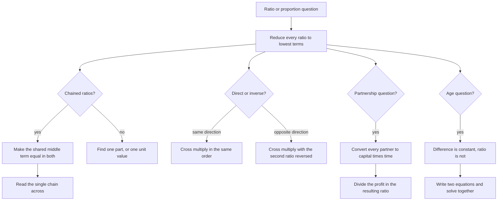

# Ratio, Proportion & Partnership

A ratio is a division problem wearing a disguise, proportion is the rule that lets you balance two divisions, and partnership is proportion applied to money over time. That is the entire chapter. What makes it feel harder is that the questions arrive in unfamiliar clothing — speeds, taps, ages, recipe quantities, profit shares — so the real skill is recognising the shared structure quickly enough that the arithmetic never becomes the bottleneck.

### 🟢 Lite — Quick Review (1h–1d)

**Core operations**

- **Simplify** a ratio by dividing both terms by their HCF: 15:20 = **3:4**. Always give the simplest form.
- **Convert units before comparing:** 2 hours : 45 minutes = 120 : 45 = **8 : 3**.
- **Divide a quantity** in the ratio a : b: one part = Total ÷ (a + b), then multiply. ₹500 in 3 : 2 gives parts of ₹100, so ₹300 and ₹200.
- **Compound ratio:** (a : b) × (c : d) = (ac : bd). So (2 : 3) × (4 : 5) = **8 : 15**.
- **Proportion** a : b = c : d means a/b = c/d, so **a × d = b × c**. Given any three terms, the fourth is (b × c)/a.

**Direct vs inverse — the one decision that decides the answer**

| Type | Behaviour | Setup |
| --- | --- | --- |
| Direct | both move the same way | a₁/a₂ = b₁/b₂ |
| Inverse | they move opposite ways | a₁/a₂ = b₂/b₁ |

- 5 pens cost ₹50, so 8 pens cost (50 × 8)/5 = **₹80** — direct.
- 10 workers finish in 6 days, so 15 workers take (10 × 6)/15 = **4 days** — inverse. More workers, fewer days.

**Partnership in one line:** share ∝ **capital × time**. Put every partner's money into "rupee-months" and divide the profit in the ratio of those. A invests ₹5,000 for 12 months, B invests ₹3,000 for 8 months: 60,000 : 24,000 = **5 : 2**.

**Special ratios worth knowing:** duplicate 3 : 4 → 9 : 16 · sub-duplicate 3 : 4 → √3 : √4 · inverse 3 : 4 → 4 : 3.

### 🟡 Standard — Regular Study (2d–2mo)

#### Ratio, and why simplifying comes first

Fifteen boys and ten girls give a ratio of 15 : 10, which is 3 : 2. Simplifying works exactly like simplifying a fraction — divide both terms by the HCF — and it matters because every later step (scaling to a total, dividing a profit, forming a proportion chain) is much easier on small numbers. A ratio of 48 : 72 tells you nothing at a glance; 2 : 3 tells you immediately that one is a third of the other.

For three or more quantities the same rule applies: flour : water : salt = 5 : 3 : 1 with 500 g of flour gives one part = 500 ÷ 5 = 100 g, so water is 300 g and salt 100 g. The move is always the same — **find the value of one part, then multiply**.

#### Proportion and cross-multiplication

Two equal ratios are in proportion. The workhorse is that a/b = c/d gives a × d = b × c, which lets you recover any missing term from the other three. This is the "unitary method" in disguise and it is faster than algebra: if 12 pens cost ₹180, then one pen costs 180/12 = ₹15 by the third proportion, and 20 pens cost 20 × 15 = ₹300.

Compound ratio is just multiplication of ratios, and it describes two changes acting at once. If the price per pen rises 3 : 2 and the number of pens falls 5 : 4, the total cost changes by (3 : 2) × (5 : 4) = 15 : 8.

#### Direct and inverse proportion, decided by meaning

Proportion questions always reduce to a yes/no question: when the first quantity goes up, does the second go up or down? More pens at a fixed unit price means more money — direct. More workers on a fixed job means less time — inverse. Speed problems are always inverse, because distance is fixed: a faster vehicle takes less time. Cost-per-unit questions are always direct.

Getting this wrong does not produce a near-miss; it produces an answer that is wrong by the square of the error, which is why the two cases are worth memorising as a pair.

#### Worked Example — partnership with a mid-year change

**Q.** A and B start business with ₹30,000 and ₹20,000. After 8 months A adds another ₹10,000. The annual profit is ₹46,000. How is it divided?

- A: 30,000 for 8 months, then 40,000 for 4 months → (30,000 × 8) + (40,000 × 4) = 2,40,000 + 1,60,000 = **4,00,000** rupee-months
- B: 20,000 for 12 months → 20,000 × 12 = **2,40,000** rupee-months
- Ratio 4,00,000 : 2,40,000 = **5 : 3**
- Total parts 8, so one part = 46,000 ÷ 8 = ₹5,750
- A gets 5 × 5,750 = **₹28,750**, B gets 3 × 5,750 = **₹17,250**

The only real trap is using 30,000 for the whole year. A's capital changes partway, so the year has to be split into two periods with two different capitals. Whenever a partner's investment changes, the business year splits with it.

#### Worked Example — joining and leaving partners

- **Joining mid-year:** A invests ₹4,000 for the full year (4,000 × 12 = 48,000); B invests ₹5,000 but joins after 6 months (5,000 × 6 = 30,000). Ratio **8 : 5** — A's money was in the business twice as long.
- **Investing, then adding:** A invests ₹3,000 for 8 months (24,000) and then ₹5,000 for 4 months (20,000), total **44,000**. The second period uses the new capital, not the original.
- **A working partner:** if A draws a monthly salary from the business, deduct that salary from the total profit first and divide only the remainder in the capital-time ratio. Reversing those two steps is the standard error.

### 🔴 Extended — Deep Study (3mo+)

#### Why capital × time is the right measure

Money in a business does work, and the amount of work it does depends on how much there was and for how long. ₹100 for 12 months and ₹100 for 6 months are not equal contributions; the first is double the second. So the natural unit of contribution is the "rupee-month": amount × months. A puts ₹100 for a year (1,200 rupee-months) and B puts ₹100 for six months (600 rupee-months), and the split is 2 : 1 — which is exactly the conclusion the ratio of capital alone would have got wrong.

The same unit explains why a partner who invests less but stays longer can earn more. A's ₹10,000 for 12 months is 1,20,000 rupee-months while B's ₹5,000 for 6 months is 30,000, giving a ratio of 4 : 1 in A's favour. Time is not a footnote to the capital; it is multiplied into it.

#### Chains of ratios

Given a : b and b : c, you cannot multiply them directly, because the two ratios are expressed in different units of b. Make b common first. With a : b = 2 : 3 and b : c = 4 : 5, take the LCM of 3 and 4, which is 12, and rewrite a : b = 8 : 12 and b : c = 12 : 15. Then **a : b : c = 8 : 12 : 15**. Skipping this step is the single most common error in chained-ratio questions, and it produces a ratio whose parts do not add up correctly.

#### Continued proportion, and the mean proportional

Three quantities a, b, c are in continued proportion when a/b = b/c. The useful consequence is **b² = ac**: b is the geometric mean of a and c. With a = 4 and c = 36, b² = 144 so b = **12**. The same identity works for four terms, a/b = b/c = c/d with common ratio r: reading backwards from d, c = rd, b = r²d and a = r³d. Check any answer by squaring the middle term and comparing with the product of its neighbours — it is a two-second verification.

#### Age problems: the difference is fixed, the ratio is not

This is where most students go wrong, so state it exactly: **the difference between two ages never changes, and the ratio between them does.** If A is 30 and B is 15, the difference is 15 forever. Ten years later A is 40 and B is 25 — the difference is still 15, but the ratio has moved from 2 : 1 to 8 : 5.

So a question that says "4 years ago the ratio was 3 : 1 and 4 years hence it will be 5 : 2" is giving you two different ratios plus a known difference in each period, and the two equations are solved together:

- (y − 4) = 3(x − 4)
- 2(y + 4) = 5(x + 4)

From the first, y = 3x − 8. Substituting: 2(3x − 4) = 5x + 20, so 6x − 8 = 5x + 20 and x = 28, giving y = 76. Check: four years ago 24 : 72 = 1 : 3, and the stated ratio is read as 3 : 1 in the order given; four years hence 80 : 32 = 5 : 2 ✓.

The same structure handles "A is twice as old as B, and the sum of their ages is 49" — write A = 2k, B = k, then 3k = 49.

#### Rate problems in disguise

Four taps fill a tank in 6 hours. In 6 hours they do 4 × 6 = 24 tap-hours of work, so 6 identical taps need 24 ÷ 6 = **4 hours**. This is a compound-ratio and inverse-proportion question at once, and the working is the same as for workers, vehicles or machines. Taps, workers, machines and readers all obey one law: **work = rate × time**, and with work fixed, rate and time vary inversely.

#### Sharing in a ratio with successive changes

When the shares themselves change mid-period, split the period at the change and add. Two shops sharing a daily profit of ₹3,000 in 2 : 3, where the second shop's partner joins halfway: split the day, apply the first ratio to the first half and the new ratio to the second half, then add the two amounts. The rule is the same one that governs partnership — no single ratio applies to the whole period once the ratio itself changes.

### 🧠 Memory Anchors

- **"A ratio is a fraction."** 3 : 7 means three sevenths, and simplifying is just cancelling.
- **"One part first, then multiply."** Total ÷ (a + b) gives a part; the share is that part times a.
- **"Chain ratios: make the middle term common."** LCM of the two middle values, then read straight across.
- **"Direct moves together, inverse moves apart."** More pens costs more; more workers takes less time.
- **"Money is measured in rupee-months."** Capital × time, always, before any profit is divided.
- **"Ages: the difference is fixed, the ratio moves."** Saying the ratio stays constant is the classic wrong answer.
- **"Continued proportion means b squared equals a times c."** A two-second check on any answer.
- **Flashcard Q&A:**
  - *₹500 in 3 : 2?* → ₹300 and ₹200.
  - *a:b = 2:3, b:c = 4:5?* → 8 : 12 : 15.
  - *5 pens cost ₹50, 8 pens?* → ₹80, direct proportion.
  - *10 workers, 6 days, 15 workers?* → 4 days, inverse proportion.
  - *₹5,000 × 12 months vs ₹3,000 × 8 months?* → 5 : 2.
  - *a, b, c continued, a = 4, c = 36?* → b = 12 since b² = ac.

### 🎯 Exam Traps & Error Log

1. **Multiplying chained ratios without making the middle term common.** (2 : 3) × (4 : 5) is not 8 : 15 — it is 8 : 12 : 15 once b is made common.
2. **Believing the ratio of two ages stays constant.** The *difference* stays constant; the ratio changes with every passing year.
3. **Splitting the whole year at a partner's capital change,** instead of splitting it at the point the change happened.
4. **Using the original capital for the second period** when a partner adds money midway.
5. **Dividing a profit before deducting a working partner's salary.** Salary first, then the ratio.
6. **Using one ratio for a period during which the ratio itself changed.** Split the period and add the parts.
7. **Treating a speed or taps problem as direct proportion** when the total distance or work is fixed and therefore inverse.
8. **Forgetting to convert minutes to hours (or days to years)** before forming a ratio, which silently scales one side.
9. **Leaving a ratio unsimplified** and then dividing a total by the unsimplified sum, which gives a valid-looking but wrong share.
10. **Using "a/b = b/c" to mean a, b and c are equal.** Continued proportion gives a geometric, not an arithmetic, progression.

### 🧪 Self-Test — 8 Questions with Worked Answers

Work all eight on paper first, and for each one say whether the proportion is direct or inverse (or, for partnership, compute the rupee-months) before you start.

1. **Divide ₹500 in the ratio 3 : 2.**
   Total parts = 5, so one part = 500 ÷ 5 = ₹100. The shares are 3 × 100 = **₹300** and 2 × 100 = **₹200**. Check: 300 + 200 = 500 and 300 : 200 = 3 : 2 ✓.
2. **If a : b = 2 : 3 and b : c = 4 : 5, find a : b : c.**
   Make b common. LCM(3, 4) = 12, so a : b = 8 : 12 and b : c = 12 : 15. Reading across, **a : b : c = 8 : 12 : 15**. Directly multiplying the ratios to get 8 : 15 would be wrong, because it loses b entirely and the parts no longer correspond to a common total.
3. **If 5 pens cost ₹50, how much do 8 pens cost?**
   Unit cost = 50 ÷ 5 = ₹10, so 8 pens cost 8 × 10 = **₹80**. This is direct proportion: more pens, more money, so the quantities line up in the same order. Cross-multiplying gives 5 × x = 50 × 8, so x = 80.
4. **10 workers complete a job in 6 days. How many days will 15 workers take?**
   Total work is fixed, so this is inverse proportion. 10 × 6 = 60 worker-days; 60 ÷ 15 = **4 days**. The answer must be *less* than 6, and any answer longer than 6 tells you the proportion was set up the wrong way round.
5. **A invests ₹5,000 for 12 months and B invests ₹3,000 for 8 months. In what ratio do they share a profit of ₹14,000?**
   A's contribution: 5,000 × 12 = 60,000 rupee-months. B's: 3,000 × 8 = 24,000. Ratio 60,000 : 24,000 = **5 : 2**, total 7 parts. A gets 5/7 × 14,000 = **₹10,000** and B gets 2/7 × 14,000 = **₹4,000**. Note that B invested less than A but stayed 8 months, so B does not get a 3:5 share.
6. **A and B start with ₹30,000 and ₹20,000. After 8 months A adds ₹10,000. The annual profit is ₹46,000. Find each share.**
   A: (30,000 × 8) + (40,000 × 4) = 2,40,000 + 1,60,000 = 4,00,000. B: 20,000 × 12 = 2,40,000. Ratio **5 : 3**, eight parts, one part = 46,000 ÷ 8 = ₹5,750. A gets 5 × 5,750 = **₹28,750**; B gets **₹17,250**. Using 30,000 for A's full year would give 3,60,000 : 2,40,000 = 3 : 2, which is the standard error here.
7. **Four years ago A and B were in the ratio 3 : 1, and four years from now they will be in the ratio 5 : 2. What are their present ages?**
   Let the present ages be x and y. Then y − 4 = 3(x − 4) and 2(y + 4) = 5(x + 4). The first gives y = 3x − 8; substituting into the second gives 2(3x − 4) = 5x + 20, so 6x − 8 = 5x + 20 and **x = 28**, y = **76**. Check: four years ago 24 : 72 = 1 : 3, matching the given 3 : 1 in the order stated; four years hence 80 : 32 = **5 : 2** ✓. The difference stayed 48 throughout, which is the invariant to trust.
8. **a, b and c are in continued proportion with a = 4 and c = 36. Find b, and verify.**
   a/b = b/c gives b² = ac = 4 × 36 = 144, so **b = 12**. Verify: 4/12 = 12/36 = 1/3 ✓. Squaring the middle term and comparing with the product of its neighbours is a two-second check that catches most arithmetic slips.

### 💡 Pro Tips

1. **Reduce every ratio to lowest terms before using it,** including the intermediate ones. 48 : 72 becomes 2 : 3 and the arithmetic stops being risky.
2. **For chained ratios, write the two ratios on separate lines with the shared term visibly in the same position,** then rewrite the first to match. It takes ten seconds and removes the only real trap in the question.
3. **Decide direct or inverse by asking whether both quantities can rise together.** If they cannot, invert the second ratio.
4. **Convert all partnership data into one unit — usually rupee-months —** and let the ratio fall out. Do not try to reason about who invested more.
5. **Split the business period at every change in capital or in the number of partners,** then add the contributions.
6. **In age problems, write down "difference is constant" before you start,** and use it as a check on the answer.
7. **Use the mean-proportional identity b² = ac** for any three-term continued proportion, and the r-power form for four terms.
8. **Check that your parts sum to the whole.** If the shares of a ₹46,000 profit do not add to ₹46,000, one of the ratios was not reduced or was inverted.

## Continue your study

- **[View this topic in your CUET UG roadmap](/roadmap/?exam=cuet&duration=1mo)** — see where "Ratio, Proportion & Partnership" fits in your personalised plan
- **[Build a quick revision plan](/roadmap/?exam=cuet&duration=1d)** — 1-day sprint covering highest-weight topics
- **[CUET UG exam overview](/exams/cuet/)** — pattern, eligibility, and syllabus
- **[All Quantitative Aptitude notes](/notes/cuet/quantitative-aptitude/)** — browse sibling topics in this subject

*Content adapted based on your selected roadmap duration. Switch tiers using the selector above.*
