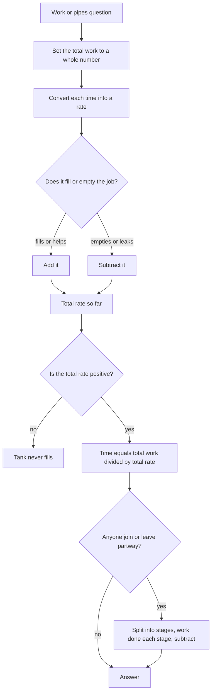

# Time & Work, Pipes & Cisterns

Every question in this topic is the same question wearing different clothes: **what is the rate?** Once you convert each worker or pipe into a fraction of the job completed per unit time, the rest is addition or subtraction. Time and work, pipes and cisterns, and the labour component of time-speed-distance are the same arithmetic. What the topic really tests is whether you can restructure a wordy question into rates without losing a sign.

### 🟢 Lite — Quick Review (1h–1d)

**The only identity you need:** Work = Rate × Time, with total work set to 1 (or to a convenient total like 60 or 120).

| Situation | What to write |
| --- | --- |
| A finishes in x days | A's 1-day work = 1/x |
| A and B work together | add the rates: 1/x + 1/y |
| A fills, B empties | subtract: +1/x − 1/y |
| m men take d days | total work = m × d man-days |
| Two workers, times t₁ and t₂ | together they take t₁t₂/(t₁ + t₂) |

**30-second example.** A paints a room in 6 days, B in 3. Rates are 1/6 and 1/3, together 1/6 + 2/6 = 3/6 = 1/2 per day, so the job takes **2 days**.

**Choosing a total to make the fractions easy.** If every time is a multiple of 12, set total work = 12 and the rates become whole numbers (4, 6, 12, 3, 4, 6). If the times are multiples of 60, use 60. This is the single best habit in the topic: you turn fraction arithmetic into integer arithmetic, and the errors mostly disappear.

**Sign discipline.** Filling pipes and working workers are **positive**. Emptying pipes, leaks and workers who *undo* work are **negative**. Before adding anything, ask of each item: does this help fill the job or empty it?

**Memory trick.** "**One day, one share**" — if someone finishes a whole job in 5 days, they do exactly one-fifth of it every day, whatever else is going on around them.

### 🟡 Standard — Regular Study (2d–2mo)

#### Rates are the whole topic

If you can clean a room in 2 hours, your rate is half a room per hour. That single sentence is the "one day work" idea, and every formula in this chapter is a rearrangement of it. Two people working together do not take the average of their times — they **add their rates**. A in 6 days and B in 3 days together is 1/6 + 1/3 = 1/2, so 2 days, which is faster than either alone but nowhere near the sum or average of their individual times.

The two-person shortcut follows directly: if the times are t₁ and t₂, the combined time is t₁t₂/(t₁ + t₂). For 6 and 3 that is 18/9 = 2, agreeing with the rate method. Use the shortcut for two workers when you want to be quick, and add rates when there are three or more, or when the direction of the work varies.

#### Pipes and cisterns: the same arithmetic with a sign

Two pipes filling a tank in 4 and 6 hours give a combined rate of 1/4 + 1/6 = 5/12, so the tank fills in 12/5 = 2.4 hours. Add an outlet that empties the tank in 12 hours and the rate becomes 5/12 − 1/12 = 4/12 = 1/3, so 3 hours. The outlet is not a special case; it is a negative rate, and the only new thing about pipes is that the numbers are usually in hours and the fractions are usually nastier.

The critical check: **if the outflow rate is greater than or equal to the inflow rate, the tank never fills.** A tap filling in 6 hours with a leak emptying in 4 hours gives 1/6 − 1/4 = −1/12, a negative rate, and a negative rate means the tank fills from empty never. Recognising this instantly saves several minutes on questions designed to trap it.

#### Worked Example — three pipes, one of them a drain

**Q.** Pipe A fills a tank in 10 hours, B fills it in 15 hours, and C empties it in 20 hours. All are open together. How long to fill?

Set the total work to 60 so everything becomes whole:
- A: +6 per hour (60/10)
- B: +4 per hour (60/15)
- C: −3 per hour (60/20)
- Net rate = 6 + 4 − 3 = **7 per hour**
- Time = 60 ÷ 7 = **8 4/7 hours**, that is 8 hours and about 34 minutes

Doing it with fractions gives 1/10 + 1/15 − 1/20 = (6 + 4 − 3)/60 = 7/60 per hour, and 1 ÷ (7/60) = 60/7 — the same answer, with a common denominator of 60 that you chose precisely because it divides 10, 15 and 20.

#### Worked Example — men leaving mid-job

**Q.** 20 men are to build a road in 30 days. After 10 days, 5 men leave. How many extra days are needed?

Set the total work to 20 × 30 = 600 man-days.
- Done in the first 10 days: 20 × 10 = 200 man-days
- Remaining: 600 − 200 = 400 man-days
- Remaining men: 20 − 5 = 15
- Extra days: 400 ÷ 15 = **26 2/3 days** (so 36 2/3 days in total)

The two steps that are easy to lose are the reduction in the workforce (15, not 20) and the fact that the question asks for the *extra* days, not the total. The man-day method works here because everyone is assumed equally efficient; the moment efficiencies differ, you must go back to rates.

#### Worked Example — a tank that starts partly full

If a tank is already 2/5 full and A fills it in 10 hours while B empties it in 15 hours, the work remaining is only 3/5, not 1. The net rate is 1/10 − 1/15 = 1/30 per hour, so the time is (3/5) ÷ (1/30) = **18 hours**. Reading the "total work = 1" habit as a reflex instead of a choice is the trap in these.

### 🔴 Extended — Deep Study (3mo+)

#### Why work is inversely proportional to time

Work = Rate × Time is always true, so if the total work is fixed at 1 then rate and time are locked together. A takes 6 days at a rate of 1/6. Double the rate to 1/3 and the time must halve to 3 days. This is not an approximation or a rule of thumb; it is what it means for the product to stay equal to 1. Recognising the mechanism means you can *derive* the answer to an unfamiliar work question instead of pattern-matching it.

#### The man-day and man-hour units

If m men finish in d days, the job is worth m × d man-days. With 4 men working 6 hours a day for 5 days, the job is 4 × 6 × 5 = 120 man-hours. This unit is the most convenient one in the topic because it is a product of whole numbers, and it works only while efficiency is constant.

The important caveat: **M × D = constant is valid only at equal efficiency.** If a question says efficiency changes, or if the workers are of different types (a mason and a helper), the ratio of efficiencies becomes the ratio of the man-day costs, and the simple product rule silently gives wrong answers. In that situation, convert everyone to a rate of 1/time in a common unit of work and add the rates.

#### Pipes in series and in parallel

Two pipes filling the same tank **in parallel** each contribute their full rate, so the times combine like workers: the combined time is t₁t₂/(t₁ + t₂), always less than the faster pipe's time.

Two pipes in **series** fill in turns, so the rates add as fractions of a full tank per hour and the total time is the sum of the individual times: a 4-hour pipe followed by a 6-hour pipe takes 10 hours, which is *longer* than either alone. This is the opposite of the parallel case and it is the point of the question. The intuition is that in series each pipe has to fill the entire tank before the next one starts, while in parallel they share it.

#### Leaks, and the impossibility check

A tank fed by a tap that fills in 4 hours while leaking at a rate that empties it in 6 hours has a net rate of 1/4 − 1/6 = 1/12 per hour, so it fills in 12 hours. Two leaks must both be subtracted: 1/4 − 1/6 − 1/12 = 3/12 − 2/12 − 1/12 = 0, and a net rate of exactly zero means the tank never fills no matter how long you wait. Recognising zero, positive and negative net rates is a three-second check that decides three different answer types.

#### Efficiency changes

If efficiency rises by 25%, the *rate* rises by a factor of 1.25 and the *time* falls by a factor of 1.25. So a job that took 8 hours now takes 8/1.25 = 6.4 hours. Dividing the time by 1.25 is right; dividing the rate is not, and neither is reducing the time by 25% (which would give 6 hours — a plausible wrong answer, since the same 25% cut applies to a different base).

#### Staged problems, and how to structure them

When workers join or leave partway through, split the job into stages. In each stage compute rate × time = work done, subtract from what is left, and continue. A is twice as efficient as B; A works alone for 6 days, then B joins and both work for 4 days. In rate terms, if B's rate is 1, A's is 2, and the job is some total W. Stage 1 does 2 × 6 = 12 units; stage 2 does (2 + 1) × 4 = 12 units; total 24 units, so W = 24. The structure — stage, work, subtract, continue — is the same whatever the numbers are, and writing the stages on separate lines is what keeps it reliable.

### 🧠 Memory Anchors

- **"One day, one share."** Finish in 5 days and you do a fifth of the job every day, no matter who else is working.
- **"Rates add, times never do."** Two workers together are faster than either and slower than the sum of their times.
- **"Choose a total of 60 or 120."** Whole-number rates beat fraction arithmetic every time.
- **"Sign before you sum."** Filling and working are positive; draining and leaking are negative.
- **"Zero net rate means never."** If the arithmetic gives 0, the answer is that it never fills.
- **"Series is the opposite of parallel."** In series the times add; in parallel they combine.
- **"Efficiency up by 25% means time down by a factor of 1.25."** Rate up 1.25, time divided by 1.25 — never time cut by 25%.
- **Flashcard Q&A:**
  - *6 days and 3 days together?* → 18/9 = 2 days.
  - *A fills in 10, B fills in 15, C empties in 20?* → 60/7 = 8 4/7 hours.
  - *Fill in 6 h, leak empties in 4 h?* → 1/6 − 1/4 is negative, so never fills.
  - *4 men, 6 h/day, 5 days?* → 120 man-hours.
  - *20 men, 30 days, 5 leave after 10?* → 26 2/3 extra days.

### 🎯 Exam Traps & Error Log

1. **Adding the times instead of the rates.** Two people who take 6 and 3 days do not finish in 9 days, and certainly not in 4.5.
2. **Averaging the times.** The combined time is always less than the faster individual time, and an average can be faster than the faster worker, which is impossible.
3. **Forgetting to subtract a drain or leak,** which silently produces an answer smaller than it should be.
4. **Missing the case where the net rate is zero or negative,** which means the tank never fills at all.
5. **Using 1 as the total work in a partly-filled tank,** when the remaining fraction is what matters.
6. **Applying M × D = constant when efficiencies differ,** or when the question says efficiency has changed.
7. **Treating a series connection like a parallel one.** In series the times add; the answer is longer than the slowest pipe alone, not shorter.
8. **Reducing time by the same percentage the efficiency rose,** instead of dividing by 1 + the rise.
9. **Forgetting that a man-day count needs the same unit of time throughout** — mixing days and hours in one product.
10. **Answering the total days when the question asked for the extra days,** or vice versa.

### 🧪 Self-Test — 8 Questions with Worked Answers

Set a whole-number total work before you start, and write the sign next to every rate.

1. **A can paint a room in 6 days and B in 3 days. How long do they take together?**
   A's rate = 1/6 room per day, B's = 1/3 = 2/6. Together = 3/6 = 1/2 per day, so **2 days**. Check with the two-person shortcut: 6 × 3/(6 + 3) = 18/9 = 2 ✓. It must be less than 3, and it is.
2. **Pipe A fills a tank in 10 hours, B in 15 hours, and C empties it in 20 hours. All open together, from empty. How long?**
   Taking total work as 60: A = +6/hour, B = +4/hour, C = −3/hour. Net = 7/hour, so 60 ÷ 7 = **8 4/7 hours**, about 8 hours 34 minutes. With fractions: 1/10 + 1/15 − 1/20 = 7/60 per hour, and 1 ÷ (7/60) = 60/7, the same value.
3. **Pipe A fills a tank in 6 hours; pipe B empties it in 4 hours. Both are open on an empty tank. What happens?**
   Net rate = 1/6 − 1/4 = 2/12 − 3/12 = −1/12 per hour. The rate is **negative**, so the tank never fills — it empties. The negative sign is the whole answer, and failing to check for it is why this question type exists.
4. **20 men are to build a road in 30 days. After 10 days, 5 men leave. How many extra days are needed?**
   Total = 20 × 30 = 600 man-days. Done = 20 × 10 = 200. Remaining = 400 man-days with 15 men, so 400 ÷ 15 = **26 2/3 extra days** (36 2/3 days overall). Using 20 men instead of 15 would give 20 days and a total of 30, which ignores the men who left.
5. **A 4-hour pipe and a 6-hour pipe can fill a tank. How long if they are open together, and how long if they are connected in series?**
   **Together (parallel):** both contribute their full rate, so 1/4 + 1/6 = 5/12 per hour and 1 ÷ (5/12) = **2.4 hours** — equivalently 4 × 6/(4 + 6) = 2.4. **In series:** each pipe must fill the whole tank in turn before the next starts, so the times simply add, 4 + 6 = **10 hours**. The two answers differ because in parallel the pipes share the tank while in series they do not, and that reversal is the entire point of the question.
6. **A tank is 2/5 full. Pipe A fills it in 10 hours and pipe B empties it in 15 hours. How long to fill it completely?**
   Remaining work = 1 − 2/5 = 3/5. Net rate = 1/10 − 1/15 = 1/30 per hour. Time = (3/5) ÷ (1/30) = 3/5 × 30 = **18 hours**. Using a total of 1 instead of 3/5 would give 30 hours, which ignores what is already there.
7. **A's efficiency is 25% higher than B's. Working alone, B takes 8 hours. How long does A take?**
   B's rate is r, so A's is 1.25r and A's time is 1/(1.25r) = 0.8 × (1/r) = 0.8 × 8 = **6.4 hours**. Cutting 8 hours by 25% to get 6 hours is the standard wrong answer, because the same 25% applies to a different base — the rate, not the time.
8. **4 men working 6 hours a day finish a job in 5 days. How many man-hours does the job contain, and how long would 6 men take at the same daily hours?**
   The job is 4 × 6 × 5 = **120 man-hours**. With 6 men at 6 hours a day, 36 man-hours are done per day, so 120 ÷ 36 = **3 1/3 days**. The man-hour total is the invariant here; only the men per day and therefore the duration change.

### 💡 Pro Tips

1. **Pick a total work that clears every denominator** — 60 when the times are multiples of 12, 120 when they are multiples of 24. Integer arithmetic is the fastest route to a correct answer.
2. **Write every rate with its sign,** even the positive ones. It takes a second and it makes the never-fills case obvious.
3. **Do the impossibility check before anything else** in a leak or drain question: is the net rate positive?
4. **Use the t₁t₂/(t₁ + t₂) shortcut for exactly two workers** and rates for three or more, or whenever the directions differ.
5. **Split every staged problem into labelled periods** and write "work done" under each. The structure is identical every time; only the numbers change.
6. **When someone joins partway, check whether the ratio makes them the more or less efficient partner** before you assume anything about the final share of work.
7. **Sanity-check with the direction of the answer.** More workers must mean less time; a bigger tank must mean more time; a bigger leak must mean a longer fill.
8. **Keep "series adds, parallel combines" as a pair** — it is a one-line memory hook for the only genuinely different case in the topic.

## Continue your study

- **[View this topic in your CUET UG roadmap](/roadmap/?exam=cuet&duration=1mo)** — see where "Time & Work, Pipes & Cisterns" fits in your personalised plan
- **[Build a quick revision plan](/roadmap/?exam=cuet&duration=1d)** — 1-day sprint covering highest-weight topics
- **[CUET UG exam overview](/exams/cuet/)** — pattern, eligibility, and syllabus
- **[All Quantitative Aptitude notes](/notes/cuet/quantitative-aptitude/)** — browse sibling topics in this subject

*Content adapted based on your selected roadmap duration. Switch tiers using the selector above.*
