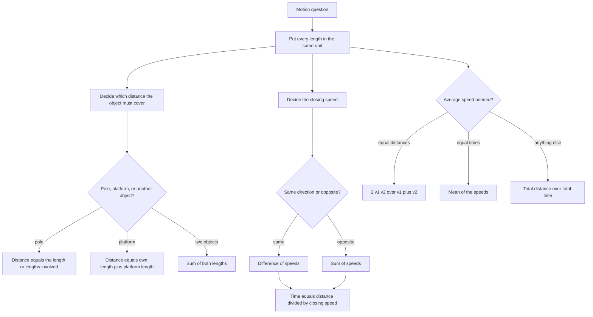

# Time, Speed & Distance

There is exactly one formula in this topic — speed = distance ÷ time — and everything else is a decision about **which distance and which speed**. Relative speed, average speed, current speed, train length, escalator speed: all of them answer the same two questions, *how far apart are the things that matter* and *how fast is the gap closing*. Get those two right and the arithmetic is trivial. The whole chapter is practice at spotting them.

### 🟢 Lite — Quick Review (1h–1d)

**The triangle.** Speed = Distance ÷ Time, rearranged freely as Distance = Speed × Time and Time = Distance ÷ Speed. Memorise it as "**shoe over dirt, through time**": shoe ÷ dirt = through time. The mnemonic is silly, which is the point — it survives exam pressure.

**Unit conversion, non-negotiable.** 1 km/h = **5/18** m/s, and 1 m/s = **18/5** km/h. Divide speeds by 3.6 to go to m/s. Mixing km/h with metres is the most frequent error in the topic and it silently produces plausible numbers.

**The four decisions**

| Situation | Distance to use | Speed to use |
| --- | --- | --- |
| Train crosses a pole | the train's own length | the train's speed |
| Train crosses a platform | train length + platform length | the train's speed |
| Two trains, opposite ways | sum of both lengths | **sum** of speeds |
| Two trains, same way | sum of both lengths | **difference** of speeds |
| Boat with the current | — | still-water speed **+** stream |
| Boat against the current | — | still-water speed **−** stream |

**Average speed.** Same distance each way: 2v₁v₂/(v₁ + v₂). Same time each way: (v₁ + v₂)/2. Anything else: total distance ÷ total time, always.

**30-second example.** A train 100 m long crosses a pole in 5 s. Speed = 100/5 = 20 m/s = 20 × 18/5 = **72 km/h**.

**Memory rule for the boats.** Downstream and upstream are u + v and u − v. Add them to get 2u, subtract them to get 2v, halve. The current helps by exactly as much as it hinders, which is why the two effects cancel symmetrically.

### 🟡 Standard — Regular Study (2d–2mo)

#### Average speed, and why the obvious answer is wrong

Average speed is total distance ÷ total time, and it is not the arithmetic mean unless the two speeds were held for equal times.

Travel 100 km at 50 km/h (2 hours) then 100 km at 100 km/h (1 hour). Total 200 km in 3 hours, so the average is 200/3 = **66.67 km/h** — not 75. You spent two-thirds of your time at the slower speed, so the average is pulled towards it. When equal distances are covered at each speed, the average is the harmonic mean 2v₁v₂/(v₁ + v₂); for 50 and 100 that is 2 × 50 × 100/150 = **66.67**, matching. The quick check: the average over equal distances always lies between the two speeds and always nearer the slower one.

#### Trains, and the length that is easy to forget

A train is not a point. Crossing a pole, the whole train must pass the pole, so the distance is the train's own length. Crossing a platform of length P, the distance is the train's length **plus** P. Crossing another train of length L₂ in the opposite direction, the distance is the sum of both lengths, because the two ends have to clear each other; in the same direction it is still the sum of both lengths, but the speed is the difference.

**Worked example.** Two trains 150 m and 200 m long run at 40 km/h and 30 km/h in the same direction.
- Relative speed = 40 − 30 = 10 km/h = 10 × 5/18 = 25/9 m/s
- Distance to cover = 150 + 200 = 350 m
- Time = 350 ÷ (25/9) = 350 × 9/25 = **126 seconds**, i.e. 2 minutes 6 seconds

Note the conversion appears exactly once, in the relative speed, and everything after that is in metres and seconds. Converting the two speeds separately and then subtracting gives the same number and twice the chances to slip.

#### Boats and streams

A boat's speed in still water is u; the stream runs at v. Downstream the two carry the boat the same way, so the speed is u + v; upstream they oppose each other, so it is u − v. Solve the two equations by adding and subtracting: u = (down + up)/2 and v = (down − up)/2.

Downstream 15 km/h and upstream 9 km/h give u = 24/2 = **12 km/h** and v = 6/2 = **3 km/h**. Any question that hands you two measured speeds is really handing you u and v, and any question that hands you u and v is really handing you the two measured speeds — the system is fully reversible and always has the same two answers.

#### Relative speed and catch-up

Two objects moving in the **same** direction close the gap at the difference of their speeds; in **opposite** directions they close it at the sum. Everything follows. Two trains 180 km apart, running toward each other at 40 and 50 km/h, meet after 180/90 = 2 hours — 80 km and 100 km along, which is a free check that the two distances must add to 180.

For a catch-up, the faster one must make up a head start: if B leaves an hour before A and both travel at constant speeds, set distance_B = distance_A, i.e. v_B · t = v_A · (t + 1), and solve for t. A negative answer means you set the equation up backwards.

### 🔴 Extended — Deep Study (3mo+)

#### Meeting and overtaking on a circular track

On a track of length L, two runners starting together in the **same** direction with speeds v₁ > v₂ meet every L/(v₁ − v₂); in **opposite** directions they meet every L/(v₁ + v₂). The first meeting is L divided by the relative speed, and the meeting point is that speed times that time along the track.

Two runners start together on a 400 m track, A at 8 m/s clockwise and B at 5 m/s anticlockwise. Opposite directions, so the relative speed is 13 m/s and they first meet after 400/13 ≈ **30.77 seconds**, at a point 8 × 400/13 = 3200/13 ≈ **246 m** from the start in A's direction. B has covered 5 × 400/13 = 2000/13 ≈ 154 m in the other direction, and 246 + 154 = 400 ✓ — that check catches most errors in a hurry.

They return to the starting point together only when both have completed whole laps, so the first common return is the least common multiple of their individual lap times, L/v₁ and L/v₂.

#### Trains crossing a platform and a man

Two measurements of the same train give both its length and its speed. If the train passes a man in 8 s, then length = 8v. If it passes a 120 m platform in 15 s, then length + 120 = 15v. Subtracting gives 120 = 7v, so v = 120/7 ≈ 17.14 m/s = 17.14 × 18/5 ≈ **61.7 km/h**, and the train is 8 × 120/7 ≈ 137 m long.

The method generalises: whatever the two stationary lengths are, subtract them to get the relative distance, and divide by the difference in the two times.

#### Escalators and moving walkways: a stream that carries people

An escalator with 40 visible steps moves at 2 steps per second. A person walking up at 3 steps per second *relative to the escalator* actually climbs at 3 + 2 = **5 steps per second**, so the 40 steps take 40/5 = **8 seconds**. Walking down at the same personal speed, the escalator works against them: 3 − 2 = 1 step per second, so the descent takes **40 seconds**.

The structure is identical to a boat in a stream — the walkway is the current and the person is the boat. The only new idea is that the "distance" is counted in steps rather than metres, and that the step count is what stays fixed. The same framing handles a moving walkway in an airport, a lift moving while you walk, and a river boat.

#### Round trips, and when the average really is the mean

A round trip at constant speed out and back **is** the mean of the two speeds, because the two legs take equal times by symmetry. The harmonic-mean trap only appears when the two speeds are held for *unequal* times — which happens whenever the two distances differ, as in a boat going upstream and downstream over the same distance, or a cyclist returning by a different route.

For a boat over distance D each way, total time = D/(u − v) + D/(u + v) = 2Du/(u² − v²). This form is worth having: given the total round-trip time, it is a single equation in u and v.

#### Partial distances and multi-leg journeys

When a journey has three legs, never average the three speeds. Compute the total distance and the total time and divide once: total distance ÷ total time. Any leg-by-leg average is wrong unless the three legs took equal time, and a five-leg journey is a standard way to make the harmonic-mean error invisible.

### 🧠 Memory Anchors

- **"Shoe over dirt, through time."** Speed = Distance ÷ Time, and every other formula is a rearrangement.
- **"Divide by 3.6 to reach metres per second."** 5/18 and 18/5, used once per question at the relative speed.
- **"Sum to meet, difference to chase."** Opposite directions add; the same direction subtracts.
- **"A train has length."** Pole → its own length; platform → plus the platform; another train → plus that train.
- **"The current adds one way and subtracts the other."** That symmetry is why u and v fall out of a sum and a difference.
- **"Equal distances, harmonic mean."** The average leans towards whichever speed you spent longer at.
- **"Never average the speeds of a multi-leg trip."** Total distance over total time, once.
- **Flashcard Q&A:**
  - *100 m in 5 s?* → 20 m/s = 72 km/h.
  - *150 m and 200 m trains at 40 and 30, same way?* → 126 s.
  - *100 km at 50 then 100 km at 100?* → 66.67 km/h, not 75.
  - *Downstream 15, upstream 9?* → u = 12, v = 3.
  - *400 m track, 8 and 5 m/s opposite?* → first meeting at 400/13 ≈ 30.8 s.

### 🎯 Exam Traps & Error Log

1. **Averaging two speeds for a round trip over equal distances.** 2v₁v₂/(v₁ + v₂) is the answer; the mean is a guaranteed error.
2. **Forgetting the train's own length** when it crosses a platform, or a pole.
3. **Adding speeds when two trains move the same way.** The closing speed is the difference.
4. **Mixing km/h with metres.** Convert the relative speed once, then stay in metres and seconds.
5. **Using the still-water speed for a boat question** instead of adding or subtracting the stream speed.
6. **Forgetting the catch-up head start**, so the two distances are set equal when they should differ by the lead.
7. **Assuming the first meeting on a circular track is at the start point.** They meet where the relative distance equals the track length, not after a full lap each.
8. **Averaging the speeds of a three-leg journey** instead of dividing total distance by total time.
9. **Treating an escalator as stationary,** which turns a 40-step climb into a different number of seconds entirely.
10. **Answering the distance instead of the time** (or the meeting point instead of the time) in a relative-speed question — read the last line of the question twice.

### 🧪 Self-Test — 8 Questions with Worked Answers

Convert units before you start, and state which distance and which speed the question is really about.

1. **A train 100 m long crosses a pole in 5 seconds. What is its speed?**
   Crossing a pole means covering its own length, so speed = 100 ÷ 5 = 20 m/s. Converting: 20 × 18/5 = **72 km/h**. The 100 m is the train's length, not a distance between two points.
2. **Two trains 150 m and 200 m long run at 40 km/h and 30 km/h in the same direction. How long to pass each other completely?**
   Same direction, so the closing speed is 40 − 30 = 10 km/h = 10 × 5/18 = 25/9 m/s. The distance is the sum of the lengths, 150 + 200 = 350 m. Time = 350 ÷ (25/9) = 350 × 9/25 = **126 seconds**, or 2 minutes 6 seconds. Using 40 + 30 would give a much shorter time, which is impossible for a slower train to catch up.
3. **You travel 100 km at 50 km/h and then 100 km at 100 km/h. What is the average speed?**
   Total distance 200 km; total time 2 + 1 = 3 hours; average = 200/3 = **66.67 km/h**. The mean of the two speeds is 75, which is wrong because twice as much time was spent at 50 km/h. The harmonic mean 2 × 50 × 100/150 gives the same 66.67.
4. **Two runners start together on a 400 m circular track, one at 8 m/s clockwise and the other at 5 m/s anticlockwise. When do they first meet, and where?**
   Opposite directions, so the closing speed is 13 m/s and they meet when the total distance covered equals the track: 400/13 ≈ **30.77 seconds**. A covers 8 × 400/13 = 3200/13 ≈ 246 m from the start; B covers 2000/13 ≈ 154 m the other way, and 246 + 154 = 400 ✓.
5. **A train passes a man in 8 seconds and a 120 m platform in 15 seconds. Find its speed and length.**
   Let the speed be v. Length = 8v from the man. Length + 120 = 15v from the platform. Subtracting: 120 = 7v, so v = 120/7 ≈ 17.14 m/s ≈ **61.7 km/h**. The length is 8 × 120/7 = 960/7 ≈ **137.1 m**.
6. **A boat travels 15 km/h downstream and 9 km/h upstream. Find its speed in still water and the speed of the stream.**
   Downstream = u + v = 15, upstream = u − v = 9. Adding: 2u = 24, so u = **12 km/h**. Subtracting: 2v = 6, so v = **3 km/h**. Check: 12 + 3 = 15 and 12 − 3 = 9 ✓.
7. **An escalator has 40 visible steps and moves at 2 steps per second. A person walks at 3 steps per second relative to the escalator. How long does the climb take, and the descent?**
   Going up, the two speeds help each other: 3 + 2 = 5 steps per second, so 40 ÷ 5 = **8 seconds**. Going down, the escalator works against the person: 3 − 2 = 1 step per second, so 40 ÷ 1 = **40 seconds**. The step count is the fixed "distance" and the escalator is a current, exactly as in a boat problem.
8. **A cyclist leaves at 25 km/h. An hour later a second cyclist leaves the same point at 20 km/h, following the same route. When does the second catch the first, and how far from the start?**
   Let t be the hours the second cyclist rides. The first has ridden t + 1 hours. Equal distances: 25(t + 1) = 20t, so 25t + 25 = 20t and 5t = −25, giving t = −5. A negative answer means the faster rider is *ahead* and never gets caught; the second cyclist is slower and starts later, so he never catches up. The correct reading is "the two never meet", and the negative t is the algebraic way of saying so.

### 💡 Pro Tips

1. **Convert to one unit system at the start of every question,** and convert the relative speed only once.
2. **Write down the distance you must cover in words before the formula.** "Both train lengths" or "train plus platform" prevents most of the errors in this topic.
3. **Use the direction rule as a question:** are they closing or separating? That single sentence settles every relative-speed question.
4. **Compute average speed as total ÷ total, always,** and only reach for the harmonic-mean formula when you want to save time.
5. **For a circular track, the first meeting distance is one track length** of the combined distance, and the meeting point is the first runner's share of it.
6. **Treat an escalator, a lift and a moving walkway as boats in a stream.** The same u + v and u − v equations apply without modification.
7. **Check the sign of your answer in catch-up problems.** A negative time means the follower is slower and the meeting never happens — and that is a real question type, not an error.
8. **Verify with the adding check** (distances to a meeting point must sum to the total gap). It takes five seconds and catches every sign slip.

## Continue your study

- **[View this topic in your CUET UG roadmap](/roadmap/?exam=cuet&duration=1mo)** — see where "Time, Speed & Distance" fits in your personalised plan
- **[Build a quick revision plan](/roadmap/?exam=cuet&duration=1d)** — 1-day sprint covering highest-weight topics
- **[CUET UG exam overview](/exams/cuet/)** — pattern, eligibility, and syllabus
- **[All Quantitative Aptitude notes](/notes/cuet/quantitative-aptitude/)** — browse sibling topics in this subject

*Content adapted based on your selected roadmap duration. Switch tiers using the selector above.*
