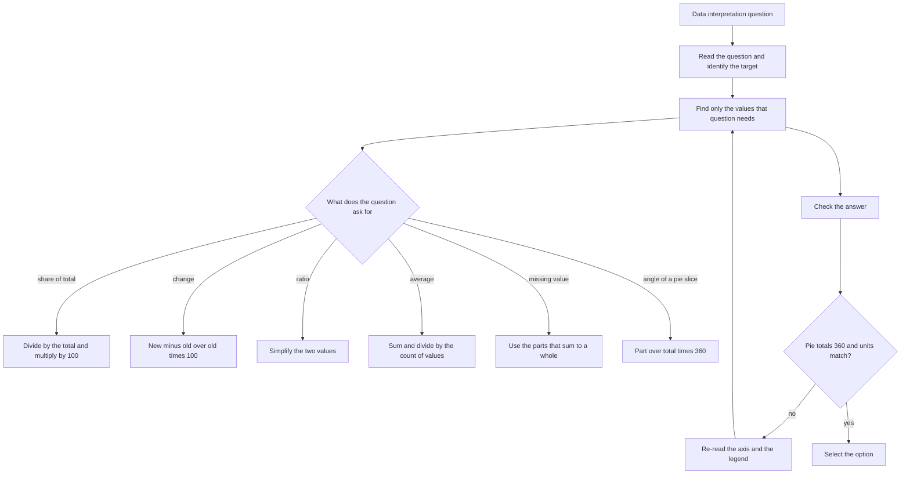

# Data Interpretation

Data interpretation is not a new subject. It is the arithmetic you already do — addition, subtraction, percentages, ratios, averages — with the numbers delivered inside a picture and a timer running. There is no new formula to learn here. What the topic actually tests is **speed of reading**: finding the two or three numbers a question needs out of a chart full of numbers you do not need, without losing your place. That is why every technique below is about locating data and checking it, not about computing.

### 🟢 Lite — Quick Review (1h–1d)

**The only formulas DI needs**

| Task | Method |
| --- | --- |
| Pie chart angle | (Value ÷ Total) × 360° |
| Share as a percentage | (Angle ÷ 360) × 100, same as (Value ÷ Total) × 100 |
| % change | [(New − Old) ÷ Old] × 100 |
| Average | Sum of values ÷ number of values |
| Ratio | Value₁ : Value₂, simplified |
| Fraction → % | 1/2 = 50%, 1/3 ≈ 33%, 1/4 = 25%, 1/5 = 20%, 1/6 ≈ 17% |

**The three checks that catch a misread**

- **Pie slices must total 360°** (or 100%). If your answer does not, you have misread a value.
- **Read the y-axis origin.** A bar chart starting at 90 makes small differences look enormous.
- **Check the units in the header.** A column headed "₹ crore" and one headed "₹ lakh" are not comparable without converting.

**Speed rules that are worth more than any formula**

- **Read the question first, then find the data.** Reading the whole chart before you know what you want is the single biggest time loss.
- **Convert fractions to percentages and work there.** Two-thirds of 360 is 240, and 66.7% of 360 is also 240, but the second is much easier to check.
- **Estimate when the options are far apart.** If the options are 10, 500 and 2,000, an approximate read is a legitimate answer.

**Memory hook.** "**Pie is 360 of a circle.**" A slice is a fraction of the whole, so a slice is that fraction of 360 degrees. For bars and tables there is nothing to memorise at all — you read the number.

### 🟡 Standard — Regular Study (2d–2mo)

#### The chart types and what each one is actually for

**Pie charts** show parts of a whole. The centre angle is the fraction of 360, so an angle and a percentage convert into each other without touching the values. The weakness is that small slices are hard to read precisely, and a question about two *unlabelled* sub-slices is unanswerable.

**Bar charts** compare values across categories. Read the scale before the bars: a broken or truncated y-axis exaggerates small differences, and a grouped chart with two bars per category needs the legend matched to the right bar in every case.

**Line graphs** show direction over time, so the questions they generate are about change, peak, trough and trend. The slope between two points is the rate of change, and the steepest segment is usually the answer to "in which period was the change greatest".

**Tables** look like the easiest and are the most dangerous, because they invite you to read the wrong row. The discipline is to identify what each row and column represents, confirm the units, and then trace row-then-column rather than scanning.

**Radar or spider charts** compare several variables at once on a single shape; treat them as a bar chart with the axes as categories.

#### Worked examples, one per chart type

**Pie chart.** Rice = 90, wheat = 150, maize = 120, total 360. The angles are 90°, 150° and 120°, because angle = (part/total) × 360 = (part/360) × 360 when the total happens to equal 360. The moment the total is not 360 you must divide first, and then the work is: wheat's share is 150/360 = 5/12, so its angle is (5/12) × 360 = **150°**.

**Table.**

| Year | A (₹ crore) | B (₹ crore) |
| --- | --- | --- |
| 2019 | 120 | 80 |
| 2020 | 150 | 100 |
| 2021 | 180 | 90 |

The ratio of A to B in 2020 is 150:100 = **3:2**. A's growth from 2019 to 2020 is (150 − 120)/120 × 100 = **25%**, while B's is (100 − 80)/80 × 100 = 25% as well — identical percentages on different bases, which is exactly the kind of thing a question is built to expose.

**Bar chart.** Two factories produce 95 and 100 units. If the axis starts at 90, the first bar looks half the height of the second; the true difference is 5 units out of 100, that is 5%. Always find the axis origin first.

#### The question types that repeat

1. **Share:** "What percentage of the total is X?" → X ÷ total × 100.
2. **Comparison:** "Which is largest?" → compare values, not angles or bar heights alone.
3. **Average:** sum the values and divide by how many there are — including the years or quarters, which students routinely miscount.
4. **Ratio:** simplify, and check whether the question wants the ratio of the two values or the ratio of their shares.
5. **Growth or decline:** (new − old)/old × 100, and always state which direction you are measuring from.
6. **Cumulative total:** add a whole column or row, checking the units line by line.
7. **Missing value:** the chart usually has enough information to recover it, either because the parts total a whole or because a percentage is given.

### 🔴 Extended — Deep Study (3mo+)

#### Truncated axes and the lies of the picture

A bar chart whose y-axis starts at 90 rather than 0 turns a 5% difference into something that looks like a doubling. This is not a trick question so much as a habit question: locate the origin, note the interval between gridlines, and only then compare. The same caution applies to a pie chart drawn with unequal radii across slices, and to a line graph whose vertical scale is very coarse — the direction of the line is reliable, its apparent steepness is not.

#### Multi-source sets: connecting two charts

A harder set gives you two displays over the same categories — for instance a pie chart of shares and a bar chart of totals across years. The connection is: **share × total = value**. If the pie says category A is 30% and the bar says the year's total is 800, then A = 0.30 × 800 = 240. Recognise the pattern by looking for shared categories and for a stated total anywhere in the display. The working is trivial once you see which number is the share and which is the total; the difficulty is entirely in spotting the pairing under time pressure.

#### Caselets: building your own table

Some sets present the data as a paragraph. The method that works is: read once for the scenario and the variables, read a second time to list the quantities, build a rough table on your sheet, and only then start on the questions. Turning prose into a table is the whole task, and doing it in that order stops you from losing a value that a later question needs.

#### Compound changes

Growth of 10% then 20% is not 30% — it is 1.1 × 1.2 = 1.32, a **32%** increase. Any multi-year question with more than one rate must use multipliers. A three-year version: 1.1 × 1.2 × 0.9 = 1.188, a net **18.8%** increase.

#### Percentages of percentages

If 30% of a category is female and females are 20% of the total, then females in that category are 0.30 × 0.20 = **6% of the total** — chain multiplication, never addition. These chain questions are common in set-based DI and the arithmetic is trivial once you resist the urge to add.

#### Contradictory-looking displays

Two displays can appear to disagree while both being correct, when they measure different things (value against volume, share against absolute, this year against last year) or different periods. Before assuming an error, check what is being measured and when. If they genuinely are about the same quantity and the same period, then a misread is the explanation — usually the axis origin or a units mismatch.

#### Approximation as a deliberate strategy

Options in DI sets are usually spaced far enough apart that a two-significant-figure estimate selects the right one. Estimate the total, estimate the share, and multiply roughly: if the pie says about one-third and the total is about 900, the answer is about 300, and any option near 300 is the one. This only fails when the options are clustered, and you can see that from the question itself.

### 🧠 Memory Anchors

- **"Read the question, not the chart."** Locate two or three numbers, ignore the rest.
- **"Pie is 360; everything else is just reading."**
- **"Share × total = value."** That is the whole of multi-source DI once you spot which number is which.
- **"Multiply the multipliers for chained change."** 10% then 20% is 32%, not 30%.
- **"Chain percentages, never add them."** 30% of a category that is 20% of the total is 6%.
- **"Find the axis origin before you compare."** Truncated axes are the classic misread.
- **"Units in the header, not in the answer options."** Lakh and crore have to be reconciled first.
- **Flashcard Q&A:**
  - *Angle for 90 of 360?* → 90°.
  - *120 to 150, % rise?* → 30/120 = 25%.
  - *Pie totals?* → must be 360°, a free check.
  - *30% then 20% rise?* → 1.3 × 1.2 = 56%, a 56% rise.
  - *Two factories, 95 and 100, axis from 90?* → difference is 5, not 5×.

### 🎯 Exam Traps & Error Log

1. **Reading the wrong bar in a grouped chart,** because the legend was not matched to the series.
2. **Ignoring a truncated y-axis** and concluding that near-equal values are wildly different.
3. **Mixing units** between rows quoted in lakhs, crores or thousands without converting.
4. **Adding two successive percentage changes** instead of multiplying the multipliers.
5. **Adding percentages of percentages** instead of chaining the multiplications.
6. **Misreading a pie slice as a value** when it is labelled as a percentage of some unstated total.
7. **Dropping an "Other" category** from a total because it has no label of its own.
8. **Averaging over the wrong count** — counting years you have no data for, or forgetting that a missing year still counts in the series.
9. **Answering the change when the question asked for the value at the end** (or the reverse). Read the last line of the question.
10. **Panicking over a caselet and skipping it.** The prose-to-table step takes thirty seconds and the questions that follow are ordinary arithmetic.

### 🧪 Self-Test — 8 Questions with Worked Answers

Use this set for the practice. Answers are worked below, and the numbers in bold are the ones you should have located.

*Bar chart, five schools (numbers of students in hundreds): A 800, B 600, C 1000, D 700, E 900.*
*Line chart, profit in ₹ lakh: Year 1 = 10, Year 2 = 15, Year 3 = 12, Year 4 = 20, Year 5 = 18.*
*Table, A and B in ₹ crore: 2019 = 120 and 80; 2020 = 150 and 100; 2021 = 180 and 90.*
*Pie chart of grain: Rice 90, Wheat 150, Maize 120.*

1. **What is the angle of the wheat slice in the pie chart?**
   Total = 90 + 150 + 120 = 360. Wheat's share = 150/360 = 5/12, so the angle is (5/12) × 360 = **150°**. Check: the three angles 90 + 150 + 120 = 360 ✓, so the reading is consistent.
2. **If 20% of all the students in the bar chart take part in a competition and each pays ₹100, how much is collected?**
   Total students = 800 + 600 + 1000 + 700 + 900 = **4,000**. Participants = 20% of 4,000 = **800**. Collection = 800 × 100 = **₹80,000**. One addition, one percentage, one multiplication — the shape of most DI questions.
3. **Which school has the highest participation, and what is the percentage difference between the largest and second largest?**
   Largest is C at 1,000, second largest is E at 900. Difference = 100, which is 100/900 × 100 ≈ **11.1%** of the second largest (or 10% of the largest — say which base you used). The point of the question is the base: 100/1,000 = 10% and 100/900 = 11.1% are both defensible, so the question's wording decides.
4. **What is the average annual profit in the line chart, and between which consecutive years was the percentage growth greatest?**
   Average = (10 + 15 + 12 + 20 + 18)/5 = 75/5 = **₹15 lakh**. Growth rates: Y1→Y2 = 5/10 = 50%; Y2→Y3 = −3/15 = −20%; Y3→Y4 = 8/12 ≈ **66.7%**; Y4→Y5 = −2/20 = −10%. Greatest growth is **Y3 to Y4**, at about 66.7% — not the largest absolute rise, which is also 8, but the largest *relative* one.
5. **In the table, what is the ratio of A to B in 2020, and by what percentage did each change from 2019?**
   Ratio = 150 : 100 = **3 : 2**. A: (150 − 120)/120 × 100 = **25%**. B: (100 − 80)/80 × 100 = **25%**. The identical percentages on different bases are the lesson: a rise of 30 and a rise of 20 look different and are the same.
6. **A quantity rises 10% in one year and 20% in the next. What is the total percentage change?**
   Multipliers: 1.10 × 1.20 = 1.32, so the total change is **+32%**, not 30%. Taking 100 as the base: year 1 ends at 110, year 2 at 132.
7. **If 30% of a category is female, and females are 20% of the whole, what percentage of the whole is female in that category?**
   Chain multiplication: 0.30 × 0.20 = 0.06, so **6%**. Adding would give 50%, which is larger than either input and cannot be a part of a whole.
8. **A bar chart has an axis running from 90 to 100. Two bars are at 95 and 100. What is the percentage difference?**
   The values differ by 5. As a percentage of the larger, 5/100 = **5%**; as a percentage of the smaller, 5/95 ≈ **5.3%**. The chart makes the difference look enormous because the bars are drawn over a range of 10 rather than 100, and that visual impression is the trap the question is built on.

### 💡 Pro Tips

1. **Read the question stem twice and underline the target quantity** before looking at any chart. It converts a scanning task into a lookup.
2. **Find the axis origin and the units in the first five seconds.** Those two facts decide whether every later reading is right.
3. **Use the 360° total as a free check** on every pie chart, and check that your table column actually totals what the header claims.
4. **Convert to percentages early** and work in percentages; they are easier to compare and easier to sanity-check than raw values.
5. **Estimate rather than compute when the options are widely spaced,** and only do the full calculation when two options are close.
6. **For caselets, build the table on your sheet before answering anything.** Thirty seconds there saves two minutes of hunting later.
7. **Watch the difference between absolute and percentage change.** The largest rupee rise and the largest percentage rise are frequently different years.
8. **Mark each answer's base** — of the old value, the new value, or the total. Most DI errors are a base error rather than an arithmetic error.

## Continue your study

- **[View this topic in your CUET UG roadmap](/roadmap/?exam=cuet&duration=1mo)** — see where "Data Interpretation" fits in your personalised plan
- **[Build a quick revision plan](/roadmap/?exam=cuet&duration=1d)** — 1-day sprint covering highest-weight topics
- **[CUET UG exam overview](/exams/cuet/)** — pattern, eligibility, and syllabus
- **[All Quantitative Aptitude notes](/notes/cuet/quantitative-aptitude/)** — browse sibling topics in this subject

*Content adapted based on your selected roadmap duration. Switch tiers using the selector above.*
