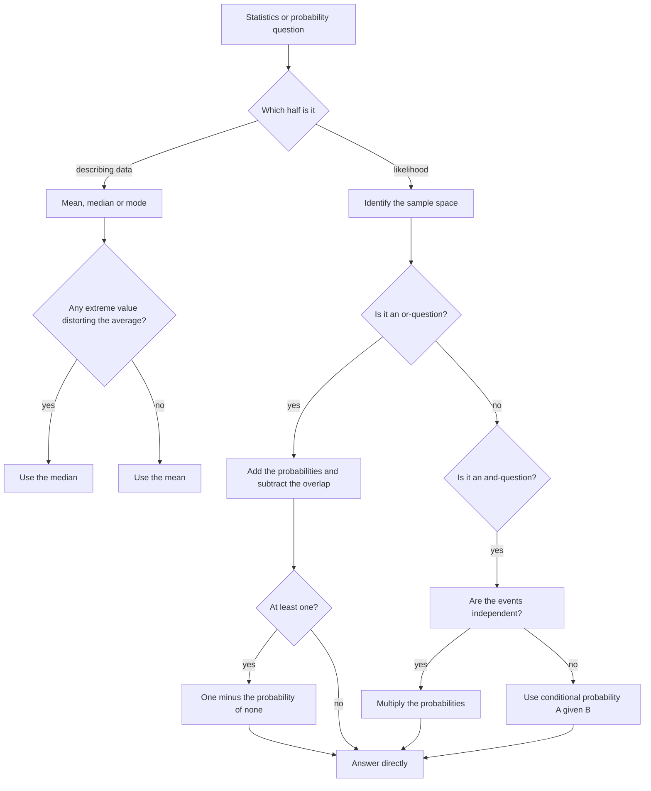

# Probability & Statistics

Two halves, one topic. **Statistics** takes a set of numbers and compresses it into a typical value, a spread, or a shape. **Probability** takes a situation and produces a number between 0 and 1 describing how likely an event is. They are different subjects that happen to share arithmetic, so keep them apart in your head, but learn them together because both are small: three measures of central tendency, three rules for combining events, and a handful of counting formulas cover almost everything asked.

### 🟢 Lite — Quick Review (1h–1d)

**Central tendency**

- **Mean** = sum ÷ count. Use it when the data are reasonably balanced.
- **Median** = middle value after sorting. Average the two middle values if the count is even.
- **Mode** = most frequent value. May not exist.

**Probability**

- P(event) = favourable outcomes ÷ total outcomes, always between 0 and 1.
- P(A or B) = P(A) + P(B) − P(A and B) — the overlap is counted twice, so subtract it once.
- P(A and B) = P(A) × P(B) **only when the events are independent**.
- P("at least one") = 1 − P("none"). The shortcut that saves the most time in the topic.

**Counting**

- **nPr = n!/(n − r)!** when order matters (captain and vice-captain).
- **nCr = n!/[r!(n − r)!]** when it does not (a committee of three).
- **nCr = nC(n − r)**, so if r is more than half of n, work with n − r instead.

**30-second example.** The mean of 4, 8, 6, 5 and 7 is (4 + 8 + 6 + 5 + 7)/5 = 30/5 = **6**.

**Memory hooks.** "**Sum, divide**" for the mean; "**Middle, in**" for the median; "**Most**" for the mode; "**Good over all**" for probability. For the two counting formulas the test is one word: if the problem says *arrange*, *order* or *sequence*, use nPr; if it says *choose*, *select* or *team*, use nCr.

### 🟡 Standard — Regular Study (2d–2mo)

#### Choosing the right measure of central value

Five salaries of ₹3 lakh, ₹4 lakh, ₹5 lakh, ₹6 lakh and ₹100 lakh give a mean of ₹23.6 lakh, which suggests everyone earns more than ₹23 lakh. Nobody does. The median is ₹5 lakh, which describes the typical person. **Outliers move the mean and leave the median untouched**, so the choice of measure is a judgement about what the data represent, not a preference.

Two structural points follow. First, a mean can only take a value that lies between the smallest and largest entries — a mean below the minimum is impossible. Second, for a symmetric, unimodal distribution the three measures satisfy **Mean − Mode = 3(Mean − Median)**, equivalently Mode = 3·Median − 2·Mean. That relation lets a question give you two of the three and ask for the third, and it is a property of roughly symmetric data rather than a universal law, so use it only when the distribution is plausibly symmetric.

#### Weighted mean

Ten students averaging 80 and twenty averaging 90 do not give a combined mean of 85. Each group contributes its size times its average: (10 × 80 + 20 × 90)/(10 + 20) = 2600/30 = **86.67**. The larger group pulls the average towards its own value, and the result must lie between 80 and 90 — a free check.

#### Classical probability, and the two rules you actually need

P(event) = favourable ÷ total. From a deck of 52 cards, P(Ace) = 4/52 = **1/13**. Always reduce the fraction, and always check the value lies between 0 and 1 — a probability above 1 means the counting is wrong, usually because an overlap was counted twice.

**Addition** for "A or B": P(A) + P(B) − P(A and B). The subtraction handles the overlap. If the two events cannot occur together, the overlap is zero and the subtraction disappears — that is the case where P(A or B) = P(A) + P(B) exactly.

**Multiplication** for "A and B": P(A) × P(B), but only for independent events. Drawing a card and replacing it, then drawing again, keeps the probability the same. Drawing without replacing it does not, and the second probability must use the reduced deck.

#### Conditional probability, stated once

P(A | B) means "the probability of A given that B has already happened", and equals P(A and B) ÷ P(B). The fraction **reduces the sample space to B**, which is the whole idea: knowing that a student likes Physics, you are choosing from the 50% who like Physics, and of those, 30 points out of 100 like Mathematics as well. So P(Mathematics | Physics) = 30/50 = **3/5**, not 30/100 and not 0.3. Reading the question's "given that" is the entire skill.

#### Worked Example — cards without replacement

Three cards drawn without replacement, all Kings:
P = (4/52) × (3/51) × (2/50) = 24/132,600 = **1/5525**.

The denominators fall as cards are removed, which is exactly what "without replacement" means. With replacement the answer would be (4/52)³ = 1/2197 — larger, as it must be, since replacing a King gives you a fresh chance at one.

### 🔴 Extended — Deep Study (3mo+)

#### The complement shortcut

"At least one" problems have many favourable cases — one head, two heads, three heads — and each must be counted separately. Their complement is a single case. So:

P(at least one head in three tosses) = 1 − P(no heads) = 1 − P(all tails) = 1 − (1/2)³ = 1 − 1/8 = **7/8**.

The same move handles "at least one six in two dice throws" (1 − (5/6)² = 11/36) and "at least one item is defective" in a sample. It is the highest-value habit in elementary probability, because the complement of a messy union is a clean intersection.

#### Probability trees

For a multi-stage experiment, draw the tree. Two dice give six branches, each splitting into six more, so 36 equally likely paths each of probability 1/36; the number of paths is your numerator. For P(sum = 7) the favourable paths are (1,6), (2,5), (3,4), (4,3), (5,2), (6,1) — six of them — so the answer is 6/36 = **1/6**. Sum 7 is the most frequent sum of two dice because it has the most ways to occur, which is worth knowing without counting.

#### Symmetry of combinations

Because nCr = nC(n − r), any selection of r items is matched by the same number of selections of the remaining n − r. So ¹⁰C₈ = ¹⁰C₂ = 45 and ¹⁵C₁² = ¹⁵C₃ = 455, both far easier than working with 8! or 12!. The rule is not just an optimisation: it is the formal statement that choosing whom to leave out is the same problem as choosing whom to include.

#### Arrangements with repetition

Arranging the letters of BANANA gives 6! = 720 if all letters were distinct, but A appears three times and N twice, so the count is 6!/(3! × 2!) = 720/12 = **60**. The general rule divides by the factorial of each repetition count. The same structure appears in passwords, licence plates and words built from a fixed multiset of letters.

#### Frequency distributions

When values come with counts, the mean is **Σ(f × x) ÷ Σf** — each value multiplied by its frequency, summed, then divided by the total frequency. Dividing by the number of distinct values instead is the standard error, and it always biases the result downwards. The median of such a distribution is found by accumulating frequencies until you reach half the total, and the mode is the value with the highest frequency.

#### Binomial probability

For r successes in n independent trials, each with success probability p, P = nCr × p^r × (1 − p)^(n − r). For exactly two heads in five tosses: 10 × (1/2)² × (1/2)³ = 10 × 1/32 = **5/16**. Note that this counts *exactly* r, not at least r — the at-least version needs the complement or a sum.

#### Worked problems, start to finish

**P1.** The mean of 20 numbers is 15. Every number is multiplied by 3. What is the new mean? The sum triples and the count is unchanged, so the mean triples: **45**. The useful generalisation is that multiplying every value by k multiplies the mean by k, while adding k to every value adds k to the mean — and neither is true of the median or the mode.

**P2.** How many distinct words can be formed from the letters of DELHI that must begin with D? D is fixed in the first position, leaving four distinct letters free: 4! = **24**.

**P3.** In a class, 60% like Mathematics, 50% like Physics and 30% like both. A student who likes Physics is selected. What is the probability they also like Mathematics? P(M | P) = P(M and P)/P(P) = 30/50 = **3/5**. The 30/100 answer is the probability a random student likes both, which is a different question.

**P4.** Three cards are drawn without replacement. What is the probability all three are Kings? (4/52) × (3/51) × (2/50) = **1/5525**.

### 🧠 Memory Anchors

- **"Sum, divide. Middle, in. Most."** Mean, median, mode in three words.
- **"Or means add and subtract the overlap."** And means multiply — but only if independent.
- **"At least one is one minus none."** The complement of a messy union is a single case.
- **"Order decides the formula."** Arrange uses nPr, choose uses nCr.
- **"nCr equals nC(n − r)."** If r is more than half, flip it.
- **"Repeated letters divide the factorials out."** BANANA is 6!/(3!2!) = 60.
- **"A frequency distribution weights the values."** Σ(f × x) ÷ Σf, never ÷ the number of distinct values.
- **Flashcard Q&A:**
  - *Mean of 4, 8, 6, 5, 7?* → 6.
  - *Median of 3, 4, 5, 6, 100?* → 5, while the mean is 23.6.
  - *P(Ace) from 52 cards?* → 4/52 = 1/13.
  - *At least one head in three tosses?* → 1 − (1/2)³ = 7/8.
  - *60% M, 50% P, 30% both — P(M|P)?* → 30/50 = 3/5.
  - *¹⁰C₈?* → ¹⁰C₂ = 45.

### 🎯 Exam Traps & Error Log

1. **Using nPr where nCr is meant,** which over-counts by a factor of r! — the error is invisible, so read the verb carefully.
2. **Adding probabilities for "or" without subtracting the overlap,** giving a value above 1.
3. **Multiplying probabilities for events that are not independent,** as when cards are drawn without replacement.
4. **Answering P(M and P) when the question says "given that P".** The conditional halves the sample space.
5. **Counting "at least one" case by case** when the complement gives it in one line.
6. **Using the mean when an outlier has distorted it,** which is the whole reason the median exists.
7. **Dividing Σ(f × x) by the number of distinct values** instead of by Σf in a frequency distribution.
8. **Leaving a probability fraction unreduced,** so 4/52 misses the intended 1/13.
9. **Forgetting that with an even count the median averages the two middle values.**
10. **Producing a probability greater than 1** and not treating it as a signal that the counting is wrong.

### 🧪 Self-Test — 8 Questions with Worked Answers

Work all eight on paper first, and for each probability question write down the sample space you are dividing by.

1. **Find the mean of 4, 8, 6, 5 and 7.**
   Sum = 30, count = 5, so the mean is 30 ÷ 5 = **6**. It happens to equal one of the data points, which is a coincidence of symmetric data, not a general property.
2. **The salaries of five people are ₹3 lakh, ₹4 lakh, ₹5 lakh, ₹6 lakh and ₹100 lakh. Find the mean and the median, and say which better describes a typical salary.**
   Mean = (3 + 4 + 5 + 6 + 100)/5 = 118/5 = **₹23.6 lakh**. Sorted data: 3, 4, 5, 6, 100, so the median is **₹5 lakh**. The median describes a typical person; the mean is inflated by the outlier. No typical salary here is anywhere near ₹23.6 lakh.
3. **Find the median of 2, 4, 7, 9, 11 and 15.**
   Already sorted, and there are six values, so the median is the average of the 3rd and 4th: (7 + 9)/2 = **8**. Reporting 7 or 9 instead is the standard error; the middle *value* of an even-length set is the mean of the two central values.
4. **From a well-shuffled deck of 52 cards, what is the probability of drawing an Ace?**
   Favourable outcomes 4, total outcomes 52, so P = 4/52 = **1/13**. Always reduce, and note the value is comfortably between 0 and 1.
5. **What is the probability of at least one head in three coin tosses?**
   Use the complement: 1 − P(no heads) = 1 − (1/2)³ = 1 − 1/8 = **7/8**. Counting directly would require three cases — HHH, HHT, HTT and their counterparts — and gives the same value; the complement is one line.
6. **A bag holds 4 red and 6 blue balls. Two are drawn without replacement. What is the probability that both are red?**
   P = (4/10) × (3/9) = 12/90 = **2/15**. The second factor uses 3 red out of 9 remaining because the first red ball is gone — that falling count is precisely what "without replacement" means. With replacement it would be 4/10 × 4/10 = 4/25, which is larger.
7. **The mean of 20 numbers is 15. Every number is multiplied by 3. What is the new mean?**
   The sum becomes three times as large and the count is unchanged, so the mean becomes three times as large: **45**. The same scaling applies to the median, and neither applies to the mode.
8. **In a class, 60% of students like Mathematics, 50% like Physics and 30% like both. A student who likes Physics is selected. What is the probability they also like Mathematics?**
   P(M | P) = P(M and P) ÷ P(P) = 30/50 = **3/5**. The "given that" restricts the sample space to the 50% who like Physics, and 30 of those 50 also like Mathematics. The answer 30/100 would describe a randomly chosen student, which is a different question.

### 💡 Pro Tips

1. **Use the complement for anything phrased "at least one"** before you start enumerating cases.
2. **Read the verb in counting questions** — arrange, order, sequence, position means nPr; choose, select, team, committee means nCr.
3. **Flip nCr to nC(n − r)** the moment r passes half of n. ¹⁰C₈ becomes ¹⁰C₂.
4. **Check every probability lies between 0 and 1** as a matter of routine. It is a free error detector.
5. **Say the sample space out loud** before dividing. "Out of the 50 students who like Physics…" prevents most conditional-probability errors.
6. **Reach for the median whenever the data contain an outlier,** and say in your working why you chose it.
7. **In frequency distributions, write Σ(f × x) and Σf explicitly** before dividing — the two totals are usually the source of the error.
8. **Practise the difference between P(A and B) and P(A | B) as a pair.** They differ only in the sample space, and that single difference is the concept the question is testing.

## Continue your study

- **[View this topic in your CUET UG roadmap](/roadmap/?exam=cuet&duration=1mo)** — see where "Probability & Statistics" fits in your personalised plan
- **[Build a quick revision plan](/roadmap/?exam=cuet&duration=1d)** — 1-day sprint covering highest-weight topics
- **[CUET UG exam overview](/exams/cuet/)** — pattern, eligibility, and syllabus
- **[All Quantitative Aptitude notes](/notes/cuet/quantitative-aptitude/)** — browse sibling topics in this subject

*Content adapted based on your selected roadmap duration. Switch tiers using the selector above.*
